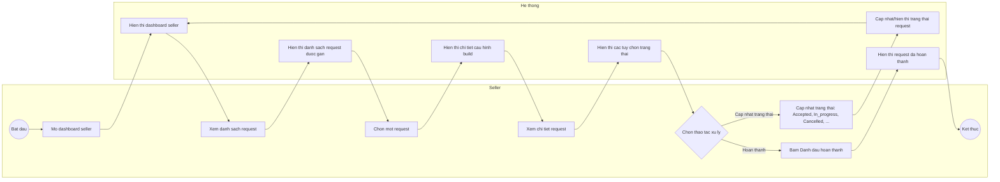
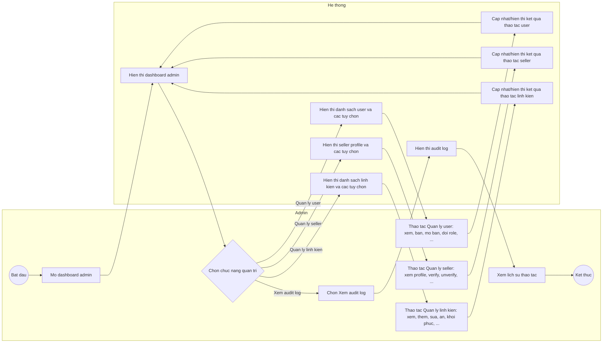
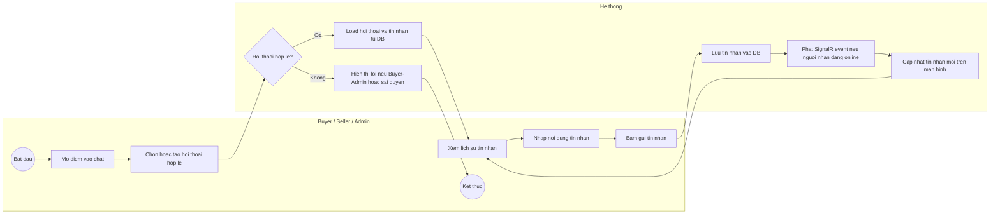

# Custom Keyboard Builder - Activity Diagrams

Tai lieu nay tao Activity Diagram theo 4 muc chinh trong FHD:

- 1. Tai khoan.
- 2. Buyer - Tao va gui build.
- 3. Seller - Xu ly request.
- 4. Admin - Quan tri.

Phan nay bat dau voi muc `1. Tai khoan`.

## AD-01: Tai Khoan

Activity Diagram nay duoc trinh bay theo dang swimlane gom `Nguoi dung` va `He thong`, anh xa truc tiep cac chuc nang FHD:

- `1.1 Dang ky`
- `1.2 Dang nhap`
- `1.3 Dang xuat`
- `1.4 Xem profile tai khoan`

```mermaid
flowchart LR
    subgraph UserLane["Nguoi dung"]
        Start((Bat dau))
        OpenApp[Mo ung dung]
        HasAccount{Da co tai khoan?}
        ChooseRegister[Chon Dang ky]
        InputRegister[Nhap thong tin dang ky]
        ClickRegister[Bam nut Dang ky]
        ChooseLogin[Chon Dang nhap]
        InputLogin[Nhap email va password]
        ClickLogin[Bam nut Dang nhap]
        OpenUserMenu[Mo user menu goc tren phai]
        ChooseAccountInfo[Bam Profile settings]
        ReadAccountInfo[Xem profile tai khoan cua minh]
        ContinueUse[Tiep tuc su dung ung dung]
        ClickLogout[Bam Dang xuat]
        End((Ket thuc))
    end

    subgraph SystemLane["He thong"]
        ShowRegisterForm[Hien thi man hinh dang ky]
        CheckRegister{Thong tin dang ky hop le?}
        ShowRegisterError[Hien thi loi dang ky]
        ShowRegisterSuccess[Hien thi dang ky thanh cong]
        ShowLoginForm[Hien thi man hinh dang nhap]
        CheckLogin{Thong tin dang nhap hop le?}
        ShowLoginError[Hien thi loi dang nhap]
        ShowDashboard[Hien thi man hinh theo role]
        ShowAccountInfo[Hien thi username, email, phone, role, status va user id]
        ShowLoginAfterLogout[Quay ve man hinh dang nhap]
    end

    Start --> OpenApp --> HasAccount

    HasAccount -- Chua co --> ChooseRegister --> ShowRegisterForm --> InputRegister --> ClickRegister --> CheckRegister
    CheckRegister -- Khong --> ShowRegisterError --> InputRegister
    CheckRegister -- Co --> ShowRegisterSuccess --> ShowLoginForm

    HasAccount -- Da co --> ChooseLogin --> ShowLoginForm
    ShowLoginForm --> InputLogin --> ClickLogin --> CheckLogin
    CheckLogin -- Khong --> ShowLoginError --> InputLogin
    CheckLogin -- Co --> ShowDashboard

    ShowDashboard --> OpenUserMenu --> ChooseAccountInfo
    ChooseAccountInfo --> ShowAccountInfo --> ReadAccountInfo --> ContinueUse
    ContinueUse --> ClickLogout --> ShowLoginAfterLogout --> End
```

### Mo Ta Luong

| Buoc | Hoat dong | FHD |
| --- | --- | --- |
| 1 | Nguoi dung mo ung dung va quyet dinh dang ky hoac dang nhap. | 1. Tai khoan |
| 2 | Neu chua co tai khoan, nguoi dung chon dang ky. | 1.1 Dang ky |
| 3 | He thong hien thi man hinh dang ky. | 1.1 Dang ky |
| 4 | Nguoi dung nhap thong tin dang ky va bam nut dang ky. | 1.1 Dang ky |
| 5 | He thong kiem tra thong tin dang ky; neu khong hop le thi hien thong bao loi. | 1.1 Dang ky |
| 6 | Neu dang ky thanh cong, he thong hien thong bao thanh cong va chuyen sang man hinh dang nhap. | 1.1, 1.2 |
| 7 | Nguoi dung nhap email/password va bam dang nhap. | 1.2 Dang nhap |
| 8 | He thong kiem tra thong tin dang nhap; neu khong hop le thi hien thong bao loi. | 1.2 Dang nhap |
| 9 | Neu dang nhap thanh cong, he thong hien thi man hinh theo role. | 1.2 Dang nhap |
| 10 | Nguoi dung mo user menu goc tren phai va bam Profile settings. | 1.4 Xem profile tai khoan |
| 11 | He thong hien thi username, email, phone, role, status va user id cua chinh nguoi dung. | 1.4 Xem profile tai khoan |
| 12 | Nguoi dung bam dang xuat. | 1.3 Dang xuat |
| 13 | He thong quay ve man hinh dang nhap va ket thuc phien su dung. | 1.3 Dang xuat |

### Ghi Chu

- Activity Diagram nay chi mo ta thao tac nguoi dung nhin thay tren UI.
- Khong the hien cac xu ly ky thuat ben trong nhu token, API, database, hash password hoac phan quyen he thong.
- Sau khi dang nhap thanh cong, nguoi dung se di tiep sang activity diagram rieng cua role tuong ung: Buyer, Seller hoac Admin.

## AD-02: Buyer - Tao Va Gui Build

Activity Diagram nay duoc trinh bay theo dang swimlane gom `Buyer` va `He thong`, anh xa truc tiep cac chuc nang FHD:

- `2.1 Xem dashboard buyer`
- `2.2 Xem danh sach build`
- `2.3 Tao build moi`
- `2.4 Chon linh kien`
- `2.4.1 Chon layout`
- `2.4.2 Chon case`
- `2.4.3 Chon PCB`
- `2.4.4 Chon plate`
- `2.4.5 Chon switch`
- `2.4.6 Chon keycap`
- `2.4.7 Chon stabilizer`
- `2.4.8 Chon mod/phu kien`
- `2.5 Xem tong gia`
- `2.6 Luu build`
- `2.7 Chon seller`
- `2.8 Gui request`
- `2.9 Theo doi request`

```mermaid
flowchart LR
    subgraph BuyerLane["Buyer"]
        StartBuyer((Bat dau))
        OpenBuyerDashboard[Mo dashboard buyer]
        ChooseHomeAction{Chon hanh dong chinh}
        ViewBuildList[Chon xem danh sach build]
        ChooseSavedBuild[Chon mot build da luu]
        ChooseBuildAction{Chon thao tac voi build}
        ClickNewBuild[Bam Tao build moi]
        SelectLayout[Chon layout]
        ChooseComponentCategory[Chon All/Case/PCB/Plate/Switch/Mod]
        SearchComponent[Nhap ten linh kien de tim nhanh neu can]
        SelectMoreComponents[Chon linh kien trong danh sach hien thi]
        SelectMod[Chon mod/phu kien neu co]
        ReviewPrice[Xem tong gia]
        ClickSaveBuild[Bam Luu build]
        ChoosePostSaveAction{Chon thao tac tiep theo}
        ChooseSeller[Chon seller]
        ClickSendRequest[Bam Gui request]
        ViewRequestStatus[Theo doi trang thai request]
        EndBuyer((Ket thuc))
    end

    subgraph SystemLane["He thong"]
        ShowBuyerDashboard[Hien thi dashboard buyer voi 2 lua chon lon: Xem build va Tao build moi]
        ShowBuildList[Hien thi danh sach build da luu tu tren xuong duoi]
        ShowBuildDetail[Hien thi chi tiet build da chon]
        LoadSavedBuild[Nap build da chon vao man hinh tao build]
        StartEmptyBuild[Khoi tao build moi rong]
        ShowBuildWizard[Hien thi man hinh tao build]
        ShowLayoutOptions[Hien thi danh sach layout]
        ShowAllComponentOptions[Hien thi tat ca linh kien kha dung sau khi co layout]
        FilterComponentOptions[Loc linh kien theo nhom hoac tu khoa tim kiem]
        ShowModOptions[Hien thi mod/phu kien va o ghi chu]
        CalculatePrice[Cap nhat tong gia tam tinh]
        BuildComplete{Thong tin build da day du?}
        ShowBuildError[Hien thi thong bao thieu thong tin]
        SaveBuild[Hien thi build da duoc luu va cap nhat danh sach build]
        ShowSellerList[Hien thi danh sach seller kha dung]
        SellerSelected{Da chon seller?}
        ShowSellerError[Hien thi thong bao chua chon seller]
        CreateRequest[Hien thi thong bao gui request thanh cong]
        ShowRequestStatus[Hien thi trang thai request]
    end

    StartBuyer --> OpenBuyerDashboard --> ShowBuyerDashboard
    ShowBuyerDashboard --> ChooseHomeAction
    ChooseHomeAction -- Xem build --> ViewBuildList --> ShowBuildList
    ShowBuildList --> ChooseSavedBuild --> ShowBuildDetail --> ChooseBuildAction
    ChooseBuildAction -- Tiep tuc chinh sua --> LoadSavedBuild --> ShowBuildWizard
    ChooseBuildAction -- Gui request --> ShowSellerList
    ChooseHomeAction -- Tao build moi --> ClickNewBuild --> StartEmptyBuild --> ShowBuildWizard

    ShowBuildWizard --> ShowLayoutOptions --> SelectLayout --> ShowAllComponentOptions
    ShowAllComponentOptions --> ChooseComponentCategory --> FilterComponentOptions
    FilterComponentOptions --> SearchComponent --> FilterComponentOptions
    FilterComponentOptions --> SelectMoreComponents --> ShowModOptions
    ShowModOptions --> SelectMod --> CalculatePrice --> ReviewPrice

    ReviewPrice --> ClickSaveBuild --> BuildComplete
    BuildComplete -- Khong --> ShowBuildError --> ShowBuildWizard
    BuildComplete -- Co --> SaveBuild --> ChoosePostSaveAction
    ChoosePostSaveAction -- Xem lai danh sach build --> ShowBuildList
    ChoosePostSaveAction -- Tiep tuc chinh sua --> ShowBuildWizard
    ChoosePostSaveAction -- Gui request --> ShowSellerList

    ShowSellerList --> ChooseSeller --> SellerSelected
    SellerSelected -- Khong --> ShowSellerError --> ShowSellerList
    SellerSelected -- Co --> ClickSendRequest --> CreateRequest
    CreateRequest --> ShowRequestStatus --> ViewRequestStatus --> EndBuyer
```

### Mo Ta Luong

| Buoc | Hoat dong | FHD |
| --- | --- | --- |
| 1 | Buyer mo dashboard buyer. | 2.1 Xem dashboard buyer |
| 2 | He thong hien thi dashboard voi 2 lua chon lon: xem build da tao hoac tao build moi. | 2.1, 2.2, 2.3 |
| 3 | Neu chon xem build, he thong hien thi danh sach build da luu tu tren xuong duoi. | 2.2 Xem danh sach build |
| 4 | Buyer chon mot build trong danh sach de xem chi tiet. | 2.2 Xem danh sach build |
| 5 | He thong hien thi chi tiet build va cho buyer tiep tuc chinh sua hoac gui request. | 2.2, 2.6, 2.8 |
| 6 | Neu buyer chon tiep tuc chinh sua, he thong nap build da chon vao man hinh tao build. | 2.3, 2.4 |
| 7 | Neu buyer chon tao build moi, he thong khoi tao build rong va hien thi man hinh tao build. | 2.3 Tao build moi |
| 8 | Buyer chon layout truoc de he thong co co so loc case, PCB va plate. | 2.4.1 Chon layout |
| 9 | Sau khi co layout, he thong hien tat ca linh kien kha dung trong vung chon linh kien. | 2.4, 2.4.2-2.4.8 |
| 10 | Buyer dung thanh ngang All/Case/PCB/Plate/Switch/Mod de loc nhom linh kien. | 2.4, 2.4.2-2.4.8 |
| 11 | Buyer nhap tu khoa vao o search de tim nhanh theo ten, vi du Neo65 hien case/PCB/plate lien quan. | 2.4, 2.4.2-2.4.8 |
| 12 | Buyer chon linh kien, chon mod/phu kien neu co va xem tong gia tam tinh. | 2.4, 2.5 |
| 13 | Buyer xem tong gia va bam luu build. | 2.5, 2.6 |
| 14 | Neu build thieu thong tin, he thong hien thong bao de buyer bo sung. | 2.4, 2.6 |
| 15 | Neu build day du, he thong hien thi build da duoc luu va cap nhat danh sach build. | 2.6 Luu build |
| 16 | Sau khi build da luu, buyer co the quay lai danh sach build, tiep tuc chinh sua hoac chon gui request. | 2.2, 2.4, 2.6, 2.8 |
| 17 | He thong hien thi danh sach seller kha dung khi buyer muon gui request tu build da luu. | 2.7 Chon seller |
| 18 | Buyer chon seller. | 2.7 Chon seller |
| 19 | Neu chua chon seller, he thong hien thong bao loi. | 2.7 Chon seller |
| 20 | Buyer bam gui request. | 2.8 Gui request |
| 21 | He thong hien thi thong bao gui request thanh cong. | 2.8 Gui request |
| 22 | Buyer theo doi trang thai request. | 2.9 Theo doi request |

### Ghi Chu

- Activity Diagram nay chi the hien cac thao tac Buyer nhin thay va thuc hien tren UI.
- Cac buoc hien thi danh sach kha dung chi mo ta trai nghiem nguoi dung, khong mo ta logic loc du lieu ben trong.
- Buoc gui request duoc thuc hien tren build da luu; neu buyer dang tao/sua build trong configurator thi can luu build truoc khi gui.
- Trang thai request hien cho Buyer gom: Pending, Accepted, In_progress, Completed, Cancelled.

## AD-03: Seller - Xu Ly Request

Activity Diagram nay duoc trinh bay theo dang swimlane gom `Seller` va `He thong`, anh xa truc tiep cac chuc nang FHD:

- `3.1 Xem dashboard seller`
- `3.2 Xem danh sach request`
- `3.3 Xem chi tiet request`
- `3.4 Cap nhat trang thai`
- `3.5 Danh dau hoan thanh`

### Mo Ta Luong

| Buoc | Hoat dong | FHD |
| --- | --- | --- |
| 1 | Seller mo dashboard seller. | 3.1 Xem dashboard seller |
| 2 | He thong hien thi tong quan cac request duoc gui den. | 3.1 Xem dashboard seller |
| 3 | Seller xem danh sach request. | 3.2 Xem danh sach request |
| 4 | He thong hien thi danh sach request duoc gan cho seller. | 3.2 Xem danh sach request |
| 5 | Seller chon mot request de xem chi tiet. | 3.3 Xem chi tiet request |
| 6 | He thong hien thi layout, linh kien, mod, ghi chu va tong gia snapshot. | 3.3 Xem chi tiet request |
| 7 | Seller chon cap nhat trang thai request. | 3.4 Cap nhat trang thai |
| 8 | He thong hien thi cac tuy chon trang thai va cap nhat ket qua sau khi seller chon. | 3.4 Cap nhat trang thai |
| 9 | Seller bam danh dau hoan thanh khi request da xu ly xong. | 3.5 Danh dau hoan thanh |
| 10 | He thong hien thi request da hoan thanh. | 3.5 Danh dau hoan thanh |

### Ghi Chu

- Activity Diagram nay chi mo ta thao tac Seller nhin thay va thuc hien tren UI.
- Cac trang thai request dung theo FHD: Pending, Accepted, In_progress, Completed, Cancelled.
- Diagram khong mo ta co che realtime hay xu ly ky thuat ben trong.

## AD-04: Admin - Quan Tri

Activity Diagram nay duoc trinh bay theo dang swimlane gom `Admin` va `He thong`, anh xa truc tiep cac chuc nang FHD:

- `4.1 Xem dashboard admin`
- `4.2 Quan ly user`
- `4.2.1 Xem danh sach user`
- `4.2.2 Ban user`
- `4.2.3 Mo ban user`
- `4.2.4 Doi role user`
- `4.3 Quan ly seller`
- `4.3.1 Xem seller profile`
- `4.3.2 Tao/cap nhat seller profile`
- `4.3.3 Verify seller`
- `4.3.4 Unverify seller`
- `4.4 Quan ly linh kien`
- `4.4.1 Xem danh sach linh kien`
- `4.4.2 Them linh kien`
- `4.4.3 Sua linh kien`
- `4.4.4 An linh kien`
- `4.4.5 Khoi phuc linh kien`
- `4.5 Xem audit log`

### Mo Ta Luong

| Buoc | Hoat dong | FHD |
| --- | --- | --- |
| 1 | Admin mo dashboard admin. | 4.1 Xem dashboard admin |
| 2 | He thong hien thi tong quan nguoi dung, seller va linh kien. | 4.1 Xem dashboard admin |
| 3 | Admin chon quan ly user. | 4.2 Quan ly user |
| 4 | He thong hien thi danh sach user. | 4.2.1 Xem danh sach user |
| 5 | Admin chon thao tac user: ban, mo ban, doi role, ... | 4.2.2, 4.2.3, 4.2.4 |
| 6 | He thong hien thi form hoac tuy chon thao tac user. | 4.2 Quan ly user |
| 7 | Admin nhap/cap nhat thong tin neu can va bam luu/cap nhat. | 4.2 Quan ly user |
| 8 | Neu thong tin user khong hop le, he thong hien thi thong bao loi. | 4.2 Quan ly user |
| 9 | Neu thanh cong, he thong cap nhat danh sach user va hien thong bao thanh cong. | 4.2.1-4.2.4 |
| 10 | Admin chon quan ly seller. | 4.3 Quan ly seller |
| 11 | He thong hien thi danh sach seller va seller profile. | 4.3.1 Xem seller profile |
| 12 | Admin chon thao tac seller: cap nhat profile, verify, unverify, ... | 4.3.2, 4.3.3, 4.3.4 |
| 13 | Neu thong tin seller khong hop le, he thong hien thi thong bao loi. | 4.3 Quan ly seller |
| 14 | Neu thanh cong, he thong cap nhat danh sach seller va hien thong bao thanh cong. | 4.3.1-4.3.4 |
| 15 | Admin chon quan ly linh kien. | 4.4 Quan ly linh kien |
| 16 | He thong hien thi danh sach linh kien. | 4.4.1 Xem danh sach linh kien |
| 17 | Admin chon thao tac linh kien: them, sua, an, khoi phuc, ... | 4.4.2, 4.4.3, 4.4.4, 4.4.5 |
| 18 | Neu thong tin linh kien khong hop le, he thong hien thi thong bao loi. | 4.4 Quan ly linh kien |
| 19 | Neu thanh cong, he thong cap nhat danh sach linh kien va hien thong bao thanh cong. | 4.4.1-4.4.5 |
| 20 | Admin chon xem audit log. | 4.5 Xem audit log |
| 21 | He thong hien thi lich su thao tac quan trong. | 4.5 Xem audit log |

### Ghi Chu

- Activity Diagram nay rut gon cac thao tac lap lai bang dau `...` de tranh so do qua dai.
- Cac thao tac user, seller va linh kien van duoc mapping day du trong bang mo ta luong.
- Diagram chi mo ta hanh dong tren UI va phan hoi cua he thong, khong mo ta xu ly ky thuat ben trong.

## AD-05: Chat Realtime Buyer-Seller Va Seller-Admin

Activity Diagram nay mo ta phase phu chat realtime. Chat chi ho tro Buyer-Seller va Seller-Admin; khong co Buyer-Admin. Phase nay khong co unread count, online/offline indicator hoac typing indicator.

### Mo Ta Luong

| Buoc | Hoat dong | FHD |
| --- | --- | --- |
| 1 | Buyer bam chuot phai vao seller hoac mo chat tu request/build detail. | 5.1 |
| 2 | Seller mo chat voi buyer tu request detail hoac mo chat voi admin tu seller dashboard. | 5.2, 5.3 |
| 3 | Admin mo chat voi seller tu man quan ly seller. | 5.4 |
| 4 | He thong kiem tra conversation co seller va dung cap Buyer-Seller hoac Seller-Admin. | 5.1-5.4 |
| 5 | Neu la Buyer-Admin hoac sai quyen, he thong tu choi mo/gui chat. | 5.1-5.4 |
| 6 | He thong load lich su tin nhan tu DB. | 5.1-5.4 |
| 7 | Nguoi dung nhap va gui tin nhan. | 5.1-5.4 |
| 8 | He thong luu tin nhan vao DB truoc. | 5.1-5.4 |
| 9 | He thong phat SignalR event cho nguoi nhan neu app nguoi nhan dang online. | 5.1-5.4 |
| 10 | Neu nguoi nhan offline, nguoi nhan se thay tin nhan khi mo app/chat va load lai DB. | 5.1-5.4 |

### Kiem Tra Frontend Theo Role

| Role | UI phai co | UI khong duoc co |
| --- | --- | --- |
| Buyer | Lenh `Nhan tin` tren seller hop le trong seller picker/list hoac request/build detail co seller. | Nut chat Admin, chat Buyer khac, chat seller khong hop le. |
| Seller | Lenh chat buyer tu request detail cua seller; lenh chat admin tu dashboard/menu ho tro. | Chat buyer khong thuoc request cua seller, chat seller khac. |
| Admin | Lenh chat seller trong tab Sellers. | Chat buyer trong tab Users, chat admin khac. |

### Ghi Chu

- SignalR chi la kenh day realtime sau khi DB da luu tin nhan.
- Khong can hien thi unread, online/offline hay typing indicator trong phase phu nay.
- Chat khong thay doi status request va khong sua build goc.
- UI chi an/hien nut theo role de tranh thao tac sai, nhung service van phai validate lai tat ca dieu kien chat.
