# Custom Keyboard Builder - Class Diagram Theo FHD

Tai lieu nay tao Class Diagram o muc thiet ke lop nghiep vu dua tren FHD. Khac voi ERD, class diagram nay khong tap trung vao bang/cot database, ma tap trung vao:

- Lop nguoi dung va hanh vi theo role.
- Lop dieu phoi chuc nang theo 4 nhom FHD.
- Lop nghiep vu cho build keyboard, request, seller va admin.
- Quan he giua cac lop trong ung dung.

## Khac Nhau Giua ERD Va Class Diagram Nay

| ERD | Class Diagram |
| --- | --- |
| Mo ta bang, cot, khoa chinh, khoa ngoai. | Mo ta lop, thuoc tinh chinh, phuong thuc va quan he hanh vi. |
| Tap trung vao luu tru du lieu. | Tap trung vao cach he thong thuc hien chuc nang trong FHD. |
| Co cac bang nhu `users`, `builds`, `build_requests`. | Co cac lop nhu `AccountService`, `BuildConfigurator`, `SellerRequestManager`, `AdminConsole`. |
| Phu hop de thiet ke database. | Phu hop de thiet ke code, UI workflow va nghiep vu. |

## Class Diagram Tong Quan

```mermaid
classDiagram
    direction LR

    class User {
        <<abstract>>
        +userId
        +username
        +email
        +phone
        +isActive
        +viewOwnProfile()
        +logout()
    }

    class Buyer {
        +openBuyerDashboard()
        +createKeyboardBuild()
        +sendBuildRequest()
        +trackRequest()
    }

    class Seller {
        +openSellerDashboard()
        +viewAssignedRequests()
        +updateRequestStatus()
        +markRequestCompleted()
    }

    class Admin {
        +openAdminDashboard()
        +manageUsers()
        +manageSellers()
        +manageComponents()
        +viewAuditLog()
    }

    User <|-- Buyer
    User <|-- Seller
    User <|-- Admin

    class AccountService {
        +register()
        +login()
        +logout()
        +getAccountInfo()
    }

    class BuyerDashboard {
        +showHomeActions()
        +showSavedBuilds()
        +openBuildDetail()
        +loadBuildForEditing()
        +showSentRequests()
        +startNewBuild()
        +openAccountMenu()
    }

    class BuildConfigurator {
        +startEmptyBuild()
        +loadExistingBuild()
        +selectLayout()
        +selectCase()
        +selectPCB()
        +selectPlate()
        +selectSwitch()
        +selectKeycap()
        +selectStabilizer()
        +selectMods()
        +saveBuild()
    }

    class ComponentCatalog {
        +showAvailableLayouts()
        +showAllAvailableComponents()
        +filterByCategory()
        +searchByName()
        +showAvailableComponents()
        +hideUnavailableComponent()
        +restoreComponent()
    }

    class AccountMenu {
        +showProfileSettings()
        +showOwnProfile()
        +logout()
    }

    class BuildService {
        +validateBuild()
        +calculateBuildTotal()
        +saveBuild()
    }

    class SellerDirectory {
        +showAvailableSellers()
        +openForBuild()
        +selectSeller()
    }

    class RequestTracker {
        +prepareRequestFromSavedBuild()
        +sendRequest()
        +showRequestStatus()
        +refreshStatus()
    }

    class SellerDashboard {
        +showAssignedRequests()
        +openRequestDetail()
    }

    class SellerRequestManager {
        +acceptRequest()
        +markIn_progress()
        +cancelRequest()
        +completeRequest()
    }

    class AdminConsole {
        +showAdminDashboard()
        +openUserManagement()
        +openSellerManagement()
        +openComponentManagement()
        +openAuditLog()
    }

    class UserManager {
        +showUsers()
        +banUser()
        +unbanUser()
        +changeUserRole()
    }

    class SellerManager {
        +showSellerProfile()
        +updateSellerProfile()
        +verifySeller()
        +unverifySeller()
    }

    class ComponentManager {
        +showComponents()
        +addComponent()
        +editComponent()
        +hideComponent()
        +restoreComponent()
    }

    class AuditLogViewer {
        +showAuditLogs()
    }

    class ChatService {
        +openConversation()
        +sendMessage()
        +getConversationHistory()
        +publishSignalREvent()
    }

    class KeyboardBuild {
        +buildId
        +name
        +status
        +totalPrice
        +addComponent()
        +addMod()
        +calculateTotal()
        +save()
    }

    class KeyboardComponent {
        <<abstract>>
        +name
        +price
        +isAvailable
    }

    class Layout
    class Case
    class PCB
    class Plate
    class Switch
    class KeycapSet
    class Stabilizer
    class BuildMod

    KeyboardComponent <|-- Case
    KeyboardComponent <|-- PCB
    KeyboardComponent <|-- Plate
    KeyboardComponent <|-- Switch
    KeyboardComponent <|-- KeycapSet
    KeyboardComponent <|-- Stabilizer

    KeyboardBuild "1" o-- "1" Layout
    KeyboardBuild "1" o-- "0..1" Case
    KeyboardBuild "1" o-- "0..1" PCB
    KeyboardBuild "1" o-- "0..1" Plate
    KeyboardBuild "1" o-- "0..1" Switch
    KeyboardBuild "1" o-- "0..1" KeycapSet
    KeyboardBuild "1" o-- "0..1" Stabilizer
    KeyboardBuild "1" o-- "0..*" BuildMod

    class BuildRequest {
        +requestId
        +status
        +note
        +requestedAt
        +acceptedAt
        +completedAt
        +send()
        +changeStatus()
        +complete()
        +cancel()
    }

    class SellerProfile {
        +shopName
        +phone
        +address
        +isVerified
    }

    class AuditLogEntry {
        +action
        +changedAt
        +oldValue
        +newValue
    }

    class ChatConversation {
        +conversationId
        +sellerUserId
        +buyerId
        +adminUserId
        +buildRequestId
        +createdAt
        +updatedAt
    }

    class ChatMessage {
        +messageId
        +messageText
        +sentAt
    }

    Buyer --> BuyerDashboard
    BuyerDashboard --> BuildConfigurator
    BuildConfigurator --> ComponentCatalog
    BuildConfigurator --> BuildService
    BuildConfigurator --> KeyboardBuild
    BuyerDashboard --> SellerDirectory
    BuyerDashboard --> RequestTracker
    BuyerDashboard --> ChatService
    BuyerDashboard --> AccountMenu
    RequestTracker --> BuildRequest
    SellerDirectory --> SellerProfile
    AccountMenu --> User

    Seller --> SellerDashboard
    SellerDashboard --> SellerRequestManager
    SellerDashboard --> ChatService
    SellerDashboard --> BuildRequest
    SellerRequestManager --> BuildRequest

    Admin --> AdminConsole
    AdminConsole --> UserManager
    AdminConsole --> SellerManager
    AdminConsole --> ComponentManager
    AdminConsole --> AuditLogViewer
    AdminConsole --> ChatService
    UserManager --> User
    SellerManager --> SellerProfile
    ComponentManager --> KeyboardComponent
    AuditLogViewer --> AuditLogEntry

    AccountService --> User
    BuildRequest "1" --> "1" KeyboardBuild
    BuildRequest "1" --> "1" Buyer
    BuildRequest "1" --> "1" Seller
    ChatService --> ChatConversation
    ChatConversation "1" o-- "0..*" ChatMessage
    ChatConversation "1" --> "1" Seller
    ChatConversation "1" --> "0..1" Buyer
    ChatConversation "1" --> "0..1" Admin
```

## Mapping Class Diagram Theo FHD

### 1. Tai Khoan

| FHD | Lop chinh | Vai tro |
| --- | --- | --- |
| 1.1 Dang ky | `AccountService`, `User` | Tao tai khoan nguoi dung. |
| 1.2 Dang nhap | `AccountService`, `User` | Xac thuc nguoi dung va xac dinh role. |
| 1.3 Dang xuat | `AccountService`, `User` | Ket thuc phien su dung. |
| 1.4 Xem profile tai khoan | `User`, `AccountMenu` | Hien thi username, email, phone, role, status va user id cua chinh nguoi dung. |

### 2. Buyer - Tao Va Gui Build

| FHD | Lop chinh | Vai tro |
| --- | --- | --- |
| 2.1 Xem dashboard buyer | `BuyerDashboard` | Hien hai hanh dong chinh: xem build da tao va tao build moi. |
| 2.2 Xem danh sach build | `BuyerDashboard`, `KeyboardBuild` | Quan ly danh sach build cua buyer, mo chi tiet build va nap build cu de chinh sua. |
| 2.3 Tao build moi | `BuildConfigurator`, `KeyboardBuild` | Khoi tao build rong de bat dau flow tao build. |
| 2.4 Chon linh kien | `BuildConfigurator`, `ComponentCatalog` | Dieu phoi viec chon linh kien bang thanh nhom All/Case/PCB/Plate/Switch/Mod va o search theo ten. |
| 2.4.1-2.4.8 | `Layout`, `Case`, `PCB`, `Plate`, `Switch`, `KeycapSet`, `Stabilizer`, `BuildMod` | Cac doi tuong duoc buyer chon. |
| 2.5 Xem tong gia | `BuildService`, `KeyboardBuild` | Tinh va hien tong gia build. |
| 2.6 Luu build | `BuildConfigurator`, `KeyboardBuild` | Luu cau hinh build. |
| 2.7 Chon seller | `BuyerDashboard`, `SellerDirectory`, `SellerProfile` | Mo panel/danh sach seller tu chi tiet build da luu va chon seller kha dung. |
| 2.8 Gui request | `RequestTracker`, `BuildRequest` | Tao request tu build da luu, luu snapshot va gui yeu cau build den seller. |
| 2.9 Theo doi request | `BuyerDashboard`, `RequestTracker`, `BuildRequest` | Theo doi status request trong man request da gui cua Buyer. |

### 3. Seller - Xu Ly Request

| FHD | Lop chinh | Vai tro |
| --- | --- | --- |
| 3.1 Xem dashboard seller | `SellerDashboard` | Hien tong quan request cua seller. |
| 3.2 Xem danh sach request | `SellerDashboard`, `BuildRequest` | Hien cac request duoc gan. |
| 3.3 Xem chi tiet request | `SellerDashboard`, `BuildRequest`, `KeyboardBuild` | Xem cau hinh build trong request. |
| 3.4 Cap nhat trang thai | `SellerRequestManager`, `BuildRequest` | Doi status request. |
| 3.5 Danh dau hoan thanh | `SellerRequestManager`, `BuildRequest` | Chuyen request sang Completed. |

### 4. Admin - Quan Tri

| FHD | Lop chinh | Vai tro |
| --- | --- | --- |
| 4.1 Xem dashboard admin | `AdminConsole` | Hien tong quan quan tri. |
| 4.2 Quan ly user | `UserManager`, `User` | Xem, ban, mo ban, doi role user. |
| 4.3 Quan ly seller | `SellerManager`, `SellerProfile` | Xem/cap nhat/verify/unverify seller. |
| 4.4 Quan ly linh kien | `ComponentManager`, `KeyboardComponent` | Them, sua, an, khoi phuc linh kien. |
| 4.5 Xem audit log | `AuditLogViewer`, `AuditLogEntry` | Xem lich su thao tac. |

### 5. Chat Realtime

| FHD | Lop chinh | Vai tro |
| --- | --- | --- |
| 5.1 Buyer chat voi seller | `BuyerDashboard`, `ChatService`, `ChatConversation`, `ChatMessage` | Mo chat voi seller va gui/nhan tin nhan. |
| 5.2 Seller chat voi buyer | `SellerDashboard`, `ChatService`, `ChatConversation`, `ChatMessage` | Seller trao doi voi buyer theo request/build. |
| 5.3 Seller chat voi admin | `SellerDashboard`, `ChatService`, `ChatConversation`, `ChatMessage` | Seller trao doi voi admin ve ho so/shop/tai khoan. |
| 5.4 Admin chat voi seller | `AdminConsole`, `ChatService`, `ChatConversation`, `ChatMessage` | Admin ho tro seller qua chat. |

## Ghi Chu

- Class diagram nay co chu y khac ERD: `BuyerDashboard`, `BuildConfigurator`, `RequestTracker`, `SellerRequestManager`, `AdminConsole` la cac lop dieu phoi hanh vi, khong phai bang database.
- `Layout` la lua chon bat buoc cua build flow; `Case`, `PCB`, `Plate`, `Switch`, `KeycapSet`, `Stabilizer` la cac component duoc hien trong catalog. Chi tiet cot du lieu da nam o ERD.
- Sau thay doi Phase 4, `SellerDirectory` va `RequestTracker` duoc kich hoat tu `BuyerDashboard`/chi tiet build da luu trong Phase 5; chung khong thay the `BuildConfigurator`.
- Seller trong Phase 6 lam viec voi `BuildRequest` va snapshot cua request, khong sua truc tiep `KeyboardBuild` goc cua buyer.
- Phase phu chat them `ChatService`; conversation luon co seller va chi cho Buyer-Seller hoac Seller-Admin, khong co Buyer-Admin.
- Neu can code WPF theo MVVM, cac lop dashboard/configurator/manager co the duoc chuyen thanh `ViewModel` hoac `Service` tuong ung.
