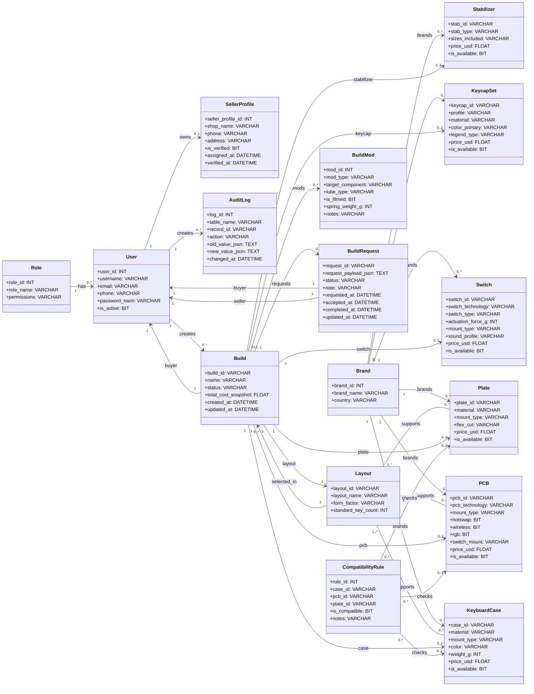

# Custom Keyboard Builder - Class Diagram Report Style

Tai lieu nay tao Class Diagram theo phong cach bao cao UML gan voi domain/data model. Khac voi file `Custom_Keyboard_Class_Diagram.md` dang thien ve lop nghiep vu/service, file nay tap trung vao:

- Cac lop thuc the chinh trong he thong.
- Thuoc tinh va kieu du lieu.
- Quan he va boi so giua cac lop.
- Cach trinh bay gan voi mau class diagram trong bao cao.

## Class Diagram

## Giai Thich Quan He Chinh

| Quan he | Y nghia |
| --- | --- |
| `Role 1 - 0..* User` | Mot role co nhieu user; moi user thuoc mot role. |
| `User 1 - 0..1 SellerProfile` | User chi co seller profile khi duoc phan quyen seller. |
| `User 1 - 0..* Build` | Buyer co the tao nhieu build. |
| `Build 1 - 0..* BuildRequest` | Mot build co the duoc gui thanh request. |
| `BuildRequest 1 - 1 User buyer/seller` | Request luon co buyer gui va seller nhan. |
| `Build 1 - 0..1 Component` | Moi build co the gan tung loai linh kien: case, PCB, plate, switch, keycap, stabilizer. |
| `Layout - Component` | Layout quy dinh nhung case, PCB, plate nao co the ho tro. |
| `CompatibilityRule - Case/PCB/Plate` | Rule dung de xac dinh do tuong thich giua case, PCB va plate; technology/mount cua switch duoc kiem tra truc tiep bang thuoc tinh cua PCB va switch trong service. |
| `User 1 - 0..* AuditLog` | User, dac biet la admin, co the tao nhieu log thao tac. |

## Mapping Voi FHD

| Nhom FHD | Lop lien quan |
| --- | --- |
| 1. Tai khoan | `User`, `Role` |
| 2. Buyer - Tao va gui build | `Build`, `Layout`, `KeyboardCase`, `PCB`, `Plate`, `Switch`, `KeycapSet`, `Stabilizer`, `BuildMod`, `BuildRequest` |
| 3. Seller - Xu ly request | `BuildRequest`, `Build`, `User`, `SellerProfile` |
| 4. Admin - Quan tri | `User`, `Role`, `SellerProfile`, cac lop linh kien, `AuditLog` |

## Ghi Chu

- File nay co chu dich giong class diagram trong bao cao, nen thuoc tinh va kieu du lieu duoc ghi ro.
- Cac bang trung gian trong ERD nhu `case_layouts`, `pcb_layouts`, `plate_layouts` duoc bieu dien bang quan he `supports` giua `Layout` va linh kien.
- File `Custom_Keyboard_Class_Diagram.md` van duoc giu rieng de mo ta lop nghiep vu/service theo FHD.
