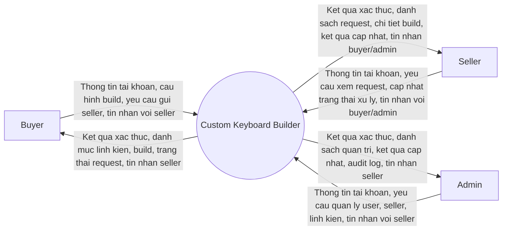

# Custom Keyboard Builder - DFD Muc Ngu Canh

Tai lieu nay mo ta Data Flow Diagram muc ngu canh cho du an Custom Keyboard Builder. O muc nay, he thong duoc xem nhu mot tien trinh duy nhat, chi the hien cac tac nhan ngoai va cac luong du lieu tong quat di vao/ra khoi he thong.

DFD muc ngu canh khong dua kho du lieu, module con, database, API, MQTT, controller, DTO hay chi tiet man hinh vao so do.

## DFD Muc Ngu Canh

## Tac Nhan Ngoai

| Tac nhan | Vai tro |
| --- | --- |
| Buyer | Dang nhap, tao cau hinh keyboard build, luu build, chon seller, gui request, theo doi trang thai va chat voi seller. |
| Seller | Dang nhap, xem request duoc gan, xem chi tiet build, cap nhat trang thai request va chat voi buyer/admin. |
| Admin | Dang nhap, quan ly user, seller, danh muc linh kien, xem audit log va chat voi seller. |

## Luong Du Lieu Tong Quat

| Ma | Nguon | Dich | Luong du lieu |
| --- | --- | --- | --- |
| C1 | Buyer | Custom Keyboard Builder | Thong tin dang ky/dang nhap, lua chon linh kien, thong tin build, yeu cau gui seller, tin nhan gui seller |
| C2 | Custom Keyboard Builder | Buyer | Ket qua xac thuc, danh muc linh kien kha dung, build da luu, request/trang thai request, tin nhan tu seller |
| C3 | Seller | Custom Keyboard Builder | Thong tin dang nhap, yeu cau xem danh sach/chi tiet request, trang thai request moi, tin nhan gui buyer/admin |
| C4 | Custom Keyboard Builder | Seller | Ket qua xac thuc, danh sach request duoc gan, chi tiet build snapshot, ket qua cap nhat trang thai, tin nhan tu buyer/admin |
| C5 | Admin | Custom Keyboard Builder | Thong tin dang nhap, yeu cau quan ly user/seller/linh kien, xem audit log, tin nhan gui seller |
| C6 | Custom Keyboard Builder | Admin | Ket qua xac thuc, danh sach user/seller/linh kien, ket qua cap nhat, audit log, tin nhan tu seller |

## Ranh Gioi Muc Ngu Canh

- Chi co mot tien trinh trung tam la `Custom Keyboard Builder`.
- Khong the hien kho du lieu noi bo.
- Khong tach cac tien trinh con nhu quan ly build, quan ly request hay quan tri.
- Khong the hien chi tiet ky thuat nhu database, API, MQTT/SignalR, backend service hay topic realtime.
- Chat truc tiep chi ho tro Buyer-Seller va Seller-Admin; khong co Buyer-Admin.
