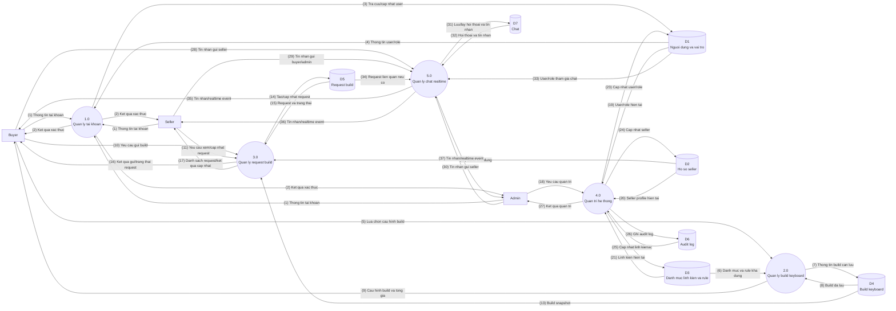

# Custom Keyboard Builder - DFD Muc Dinh Level 0

Tai lieu nay phan ra he thong trong DFD muc ngu canh thanh cac tien trinh xu ly du lieu chinh. Level 0 chi giu muc tong quan, tranh dua tung thao tac UI nhu "chon layout", "xem dashboard", "bam luu" vao so do.

## Cac Tien Trinh Chinh

| Ma tien trinh | Ten tien trinh | Y nghia |
| --- | --- | --- |
| 1.0 | Quan ly tai khoan | Xu ly dang ky, dang nhap, dang xuat va thong tin tai khoan. |
| 2.0 | Quan ly build keyboard | Xu ly cau hinh build, lay danh muc linh kien, tinh tong gia va luu build. |
| 3.0 | Quan ly request build | Xu ly viec buyer gui request cho seller va seller cap nhat trang thai. |
| 4.0 | Quan tri he thong | Xu ly quan ly user, seller, linh kien va audit log. |
| 5.0 | Quan ly chat realtime | Xu ly hoi thoai Buyer-Seller va Seller-Admin, luu tin nhan va phat realtime SignalR. |

## Cac Kho Du Lieu

| Ma kho | Ten kho du lieu | Noi dung tong quat |
| --- | --- | --- |
| D1 | Nguoi dung va vai tro | User, role, trang thai active/banned. |
| D2 | Ho so seller | Seller profile, trang thai verified/unverified. |
| D3 | Danh muc linh kien va rule | Layout, case, PCB, plate, switch, keycap, stabilizer, brand va compatibility rule. |
| D4 | Build keyboard | Cau hinh build da luu, tong gia snapshot, mod/phu kien. |
| D5 | Request build | Request buyer gui seller, payload snapshot va trang thai xu ly. |
| D6 | Audit log | Lich su thao tac quan tri va cac thay doi quan trong. |
| D7 | Chat | Hoi thoai va tin nhan giua buyer-seller hoac seller-admin. |

## DFD Level 0

## Chu Thich Luong Du Lieu Level 0

| So | Nguon | Dich | Luong du lieu |
| --- | --- | --- | --- |
| (1) | Buyer/Seller/Admin | 1.0 Quan ly tai khoan | Thong tin dang ky/dang nhap/dang xuat hoac yeu cau xem tai khoan |
| (2) | 1.0 Quan ly tai khoan | Buyer/Seller/Admin | Ket qua xac thuc, thong tin tai khoan va role |
| (3) | 1.0 Quan ly tai khoan | D1 | Yeu cau tao, kiem tra hoac cap nhat tai khoan |
| (4) | D1 | 1.0 Quan ly tai khoan | Thong tin user, role, trang thai active |
| (5) | Buyer | 2.0 Quan ly build keyboard | Lua chon layout, linh kien, mod/phu kien va ghi chu build |
| (6) | D3 | 2.0 Quan ly build keyboard | Danh muc linh kien kha dung va rule tuong thich |
| (7) | 2.0 Quan ly build keyboard | D4 | Build can luu, tong gia snapshot va cau hinh linh kien |
| (8) | D4 | 2.0 Quan ly build keyboard | Build da luu hoac danh sach build cua buyer |
| (9) | 2.0 Quan ly build keyboard | Buyer | Cau hinh build hop le, tong gia, ket qua luu build |
| (10) | Buyer | 3.0 Quan ly request build | Ma build, seller duoc chon va ghi chu request |
| (11) | Seller | 3.0 Quan ly request build | Yeu cau xem request hoac trang thai request moi |
| (12) | D2 | 3.0 Quan ly request build | Danh sach seller verified/active |
| (13) | D4 | 3.0 Quan ly request build | Build snapshot dung de tao request |
| (14) | 3.0 Quan ly request build | D5 | Request moi hoac request da cap nhat trang thai |
| (15) | D5 | 3.0 Quan ly request build | Danh sach request, chi tiet request va trang thai hien tai |
| (16) | 3.0 Quan ly request build | Buyer | Ket qua gui request va trang thai request |
| (17) | 3.0 Quan ly request build | Seller | Danh sach request, chi tiet request va ket qua cap nhat |
| (18) | Admin | 4.0 Quan tri he thong | Yeu cau quan ly user, seller, linh kien hoac xem audit |
| (19) | D1 | 4.0 Quan tri he thong | Danh sach user va role |
| (20) | D2 | 4.0 Quan tri he thong | Seller profile va trang thai verify |
| (21) | D3 | 4.0 Quan tri he thong | Danh sach linh kien va rule hien tai |
| (22) | D6 | 4.0 Quan tri he thong | Audit log hien tai |
| (23) | 4.0 Quan tri he thong | D1 | User/role/trang thai active da cap nhat |
| (24) | 4.0 Quan tri he thong | D2 | Seller profile/trang thai verify da cap nhat |
| (25) | 4.0 Quan tri he thong | D3 | Linh kien/rule da them, sua, an hoac khoi phuc |
| (26) | 4.0 Quan tri he thong | D6 | Ban ghi audit log moi |
| (27) | 4.0 Quan tri he thong | Admin | Ket qua quan tri va danh sach hien thi |
| (28) | Buyer | 5.0 Quan ly chat realtime | Tin nhan buyer gui seller trong conversation hop le |
| (29) | Seller | 5.0 Quan ly chat realtime | Tin nhan seller gui buyer hoac admin |
| (30) | Admin | 5.0 Quan ly chat realtime | Tin nhan admin gui seller |
| (31) | 5.0 Quan ly chat realtime | D7 | Yeu cau luu/lay hoi thoai va tin nhan |
| (32) | D7 | 5.0 Quan ly chat realtime | Hoi thoai va tin nhan da luu |
| (33) | D1 | 5.0 Quan ly chat realtime | User, role va trang thai active cua nguoi tham gia chat |
| (34) | D5 | 5.0 Quan ly chat realtime | Request lien quan neu conversation gan voi don build |
| (35) | 5.0 Quan ly chat realtime | Buyer | Tin nhan tu seller hoac event realtime |
| (36) | 5.0 Quan ly chat realtime | Seller | Tin nhan tu buyer/admin hoac event realtime |
| (37) | 5.0 Quan ly chat realtime | Admin | Tin nhan tu seller hoac event realtime |

## Doi Chieu Voi DFD Muc Ngu Canh

| Tac nhan | Luong o muc ngu canh | Duoc tach o Level 0 thanh |
| --- | --- | --- |
| Buyer | Tai khoan, cau hinh build, request, trang thai va chat voi seller | 1.0 Quan ly tai khoan, 2.0 Quan ly build keyboard, 3.0 Quan ly request build, 5.0 Quan ly chat realtime |
| Seller | Tai khoan, xem/cap nhat request va chat voi buyer/admin | 1.0 Quan ly tai khoan, 3.0 Quan ly request build, 5.0 Quan ly chat realtime |
| Admin | Tai khoan, quan tri user/seller/linh kien/audit log va chat voi seller | 1.0 Quan ly tai khoan, 4.0 Quan tri he thong, 5.0 Quan ly chat realtime |

## Ranh Gioi Level 0

- Level 0 chi the hien cac tien trinh xu ly du lieu lon.
- Khong tach tung thao tac UI nhu xem dashboard, bam nut luu, chon layout hay chon case.
- Khong dua chi tiet database table/column vao so do; chi dung kho du lieu tong quat.
- Cac tien trinh phuc tap se duoc phan ra o Level 1 hoac Level 2.
- 5.0 khong cho Buyer chat truc tiep Admin; moi conversation phai co Seller.
