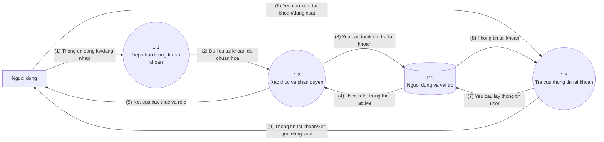
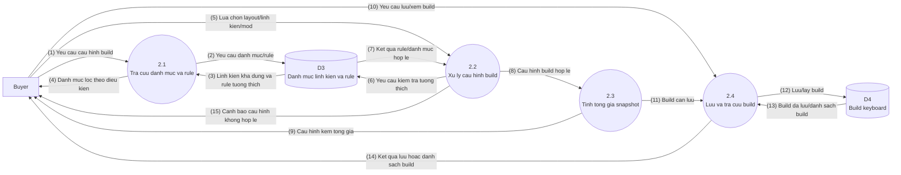
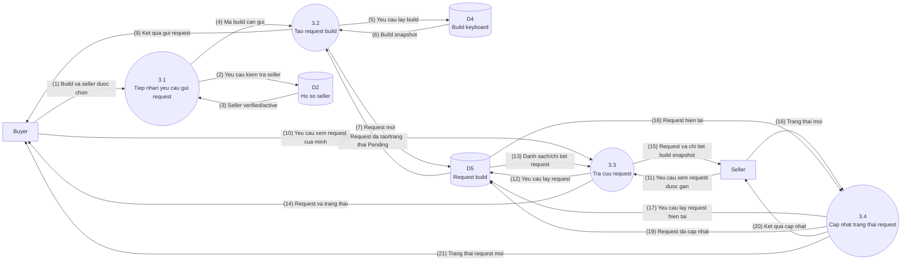
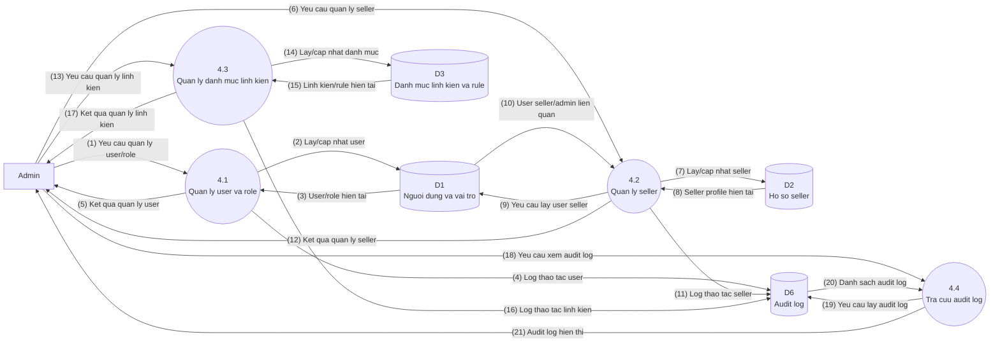
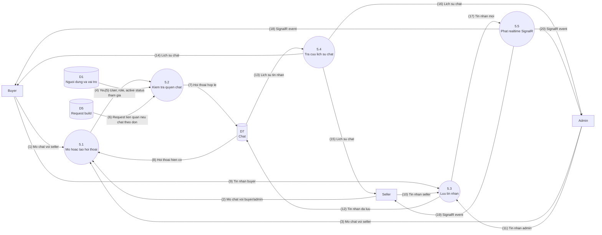

# Custom Keyboard Builder - DFD Duoi Muc Dinh Level 1

Tai lieu nay phan ra cac tien trinh chinh trong DFD Level 0 thanh cac tien trinh con theo xu ly du lieu. Khac voi FHD, Level 1 khong liet ke tung thao tac UI rieng le. Cac man hinh nhu dashboard, danh sach build, danh sach request chi la cach hien thi ket qua cua cac luong tra cuu du lieu.

Quy uoc:

- Moi mui ten la mot luong du lieu mot chieu.
- Khong dung mui ten "phan ra" trong so do DFD.
- Ten tien trinh la dong tu xu ly du lieu, khong phai ten nut bam hay ten man hinh.
- Cac kho du lieu giu cung ma voi DFD Level 0.

## DFD Level 1 - 1.0 Quan Ly Tai Khoan

### Chu Thich Luong Du Lieu

| So | Nguon | Dich | Luong du lieu |
| --- | --- | --- | --- |
| (1) | Nguoi dung | 1.1 Tiep nhan thong tin tai khoan | Username/email/password/thong tin dang ky hoac dang nhap |
| (2) | 1.1 Tiep nhan thong tin tai khoan | 1.2 Xac thuc va phan quyen | Du lieu tai khoan da chuan hoa |
| (3) | 1.2 Xac thuc va phan quyen | D1 | Yeu cau tao tai khoan moi hoac kiem tra tai khoan |
| (4) | D1 | 1.2 Xac thuc va phan quyen | User, role, password hash, trang thai active |
| (5) | 1.2 Xac thuc va phan quyen | Nguoi dung | Ket qua dang ky/dang nhap va man hinh theo role |
| (6) | Nguoi dung | 1.3 Tra cuu thong tin tai khoan | Yeu cau xem thong tin tai khoan hoac dang xuat |
| (7) | 1.3 Tra cuu thong tin tai khoan | D1 | Yeu cau lay thong tin user |
| (8) | D1 | 1.3 Tra cuu thong tin tai khoan | Ten, email, phone, role, trang thai |
| (9) | 1.3 Tra cuu thong tin tai khoan | Nguoi dung | Thong tin tai khoan hien thi hoac ket qua dang xuat |

## DFD Level 1 - 2.0 Quan Ly Build Keyboard

### Chu Thich Luong Du Lieu

| So | Nguon | Dich | Luong du lieu |
| --- | --- | --- | --- |
| (1) | Buyer | 2.1 Tra cuu danh muc va rule | Yeu cau bat dau cau hinh build hoac lay danh muc linh kien |
| (2) | 2.1 Tra cuu danh muc va rule | D3 | Yeu cau danh sach layout, linh kien, rule tuong thich |
| (3) | D3 | 2.1 Tra cuu danh muc va rule | Linh kien available, layout, brand, compatibility rule |
| (4) | 2.1 Tra cuu danh muc va rule | Buyer | Danh muc linh kien duoc loc de hien thi |
| (5) | Buyer | 2.2 Xu ly cau hinh build | Layout, case, PCB, plate, switch, keycap, stabilizer, mod, ghi chu |
| (6) | 2.2 Xu ly cau hinh build | D3 | Yeu cau kiem tra rule tuong thich va trang thai available |
| (7) | D3 | 2.2 Xu ly cau hinh build | Ket qua rule va linh kien hop le/khong hop le |
| (8) | 2.2 Xu ly cau hinh build | 2.3 Tinh tong gia snapshot | Cau hinh build da duoc kiem tra |
| (9) | 2.3 Tinh tong gia snapshot | Buyer | Tong gia snapshot va cau hinh tam thoi |
| (10) | Buyer | 2.4 Luu va tra cuu build | Yeu cau luu build, xem danh sach build hoac xem build da luu |
| (11) | 2.3 Tinh tong gia snapshot | 2.4 Luu va tra cuu build | Build can luu kem tong gia snapshot |
| (12) | 2.4 Luu va tra cuu build | D4 | Thong tin build can luu hoac yeu cau lay build |
| (13) | D4 | 2.4 Luu va tra cuu build | Build da luu, danh sach build cua buyer |
| (14) | 2.4 Luu va tra cuu build | Buyer | Ket qua luu build, danh sach build hoac chi tiet build |
| (15) | 2.2 Xu ly cau hinh build | Buyer | Canh bao hoac thong bao loi khi cau hinh khong hop le |

## DFD Level 1 - 3.0 Quan Ly Request Build

### Chu Thich Luong Du Lieu

| So | Nguon | Dich | Luong du lieu |
| --- | --- | --- | --- |
| (1) | Buyer | 3.1 Tiep nhan yeu cau gui request | Ma build, seller duoc chon, ghi chu request |
| (2) | 3.1 Tiep nhan yeu cau gui request | D2 | Yeu cau kiem tra seller verified/active |
| (3) | D2 | 3.1 Tiep nhan yeu cau gui request | Thong tin seller kha dung |
| (4) | 3.1 Tiep nhan yeu cau gui request | 3.2 Tao request build | Ma build, buyer, seller, ghi chu |
| (5) | 3.2 Tao request build | D4 | Yeu cau lay build da luu |
| (6) | D4 | 3.2 Tao request build | Build snapshot va tong gia tai thoi diem gui |
| (7) | 3.2 Tao request build | D5 | Request build moi |
| (8) | D5 | 3.2 Tao request build | Request da tao voi trang thai Pending |
| (9) | 3.2 Tao request build | Buyer | Ket qua gui request |
| (10) | Buyer | 3.3 Tra cuu request | Yeu cau xem request/trang thai cua buyer |
| (11) | Seller | 3.3 Tra cuu request | Yeu cau xem request duoc gan cho seller |
| (12) | 3.3 Tra cuu request | D5 | Yeu cau lay danh sach/chi tiet request |
| (13) | D5 | 3.3 Tra cuu request | Request, status, payload snapshot |
| (14) | 3.3 Tra cuu request | Buyer | Danh sach request va trang thai |
| (15) | 3.3 Tra cuu request | Seller | Danh sach request va chi tiet build snapshot |
| (16) | Seller | 3.4 Cap nhat trang thai request | Trang thai moi: Accepted, In_progress, Completed, Cancelled |
| (17) | 3.4 Cap nhat trang thai request | D5 | Yeu cau lay request hien tai |
| (18) | D5 | 3.4 Cap nhat trang thai request | Request hien tai |
| (19) | 3.4 Cap nhat trang thai request | D5 | Request sau khi cap nhat status/time |
| (20) | 3.4 Cap nhat trang thai request | Seller | Ket qua cap nhat request |
| (21) | 3.4 Cap nhat trang thai request | Buyer | Trang thai request moi de buyer theo doi |

## DFD Level 1 - 4.0 Quan Tri He Thong

### Chu Thich Luong Du Lieu

| So | Nguon | Dich | Luong du lieu |
| --- | --- | --- | --- |
| (1) | Admin | 4.1 Quan ly user va role | Yeu cau xem user, ban/mo ban, doi role |
| (2) | 4.1 Quan ly user va role | D1 | Yeu cau lay/cap nhat user, role, is_active |
| (3) | D1 | 4.1 Quan ly user va role | User/role hien tai |
| (4) | 4.1 Quan ly user va role | D6 | Log thao tac user |
| (5) | 4.1 Quan ly user va role | Admin | Ket qua quan ly user |
| (6) | Admin | 4.2 Quan ly seller | Yeu cau xem/cap nhat/verify/unverify seller |
| (7) | 4.2 Quan ly seller | D2 | Yeu cau lay/cap nhat seller profile |
| (8) | D2 | 4.2 Quan ly seller | Seller profile hien tai |
| (9) | 4.2 Quan ly seller | D1 | Yeu cau lay user gan voi seller |
| (10) | D1 | 4.2 Quan ly seller | User seller/admin lien quan |
| (11) | 4.2 Quan ly seller | D6 | Log thao tac seller |
| (12) | 4.2 Quan ly seller | Admin | Ket qua quan ly seller |
| (13) | Admin | 4.3 Quan ly danh muc linh kien | Yeu cau them/sua/an/khoi phuc linh kien hoac rule |
| (14) | 4.3 Quan ly danh muc linh kien | D3 | Yeu cau lay/cap nhat danh muc linh kien |
| (15) | D3 | 4.3 Quan ly danh muc linh kien | Danh muc/rule hien tai |
| (16) | 4.3 Quan ly danh muc linh kien | D6 | Log thao tac linh kien |
| (17) | 4.3 Quan ly danh muc linh kien | Admin | Ket qua quan ly linh kien |
| (18) | Admin | 4.4 Tra cuu audit log | Yeu cau xem audit log |
| (19) | 4.4 Tra cuu audit log | D6 | Yeu cau lay audit log |
| (20) | D6 | 4.4 Tra cuu audit log | Danh sach audit log |
| (21) | 4.4 Tra cuu audit log | Admin | Audit log hien thi |

## DFD Level 1 - 5.0 Quan Ly Chat Realtime

### Chu Thich Luong Du Lieu

| So | Nguon | Dich | Luong du lieu |
| --- | --- | --- | --- |
| (1) | Buyer | 5.1 Mo hoac tao hoi thoai | Yeu cau mo chat voi seller da chon/request lien quan |
| (2) | Seller | 5.1 Mo hoac tao hoi thoai | Yeu cau mo chat voi buyer hoac admin |
| (3) | Admin | 5.1 Mo hoac tao hoi thoai | Yeu cau mo chat voi seller |
| (4) | 5.1 Mo hoac tao hoi thoai | 5.2 Kiem tra quyen chat | Buyer/seller/admin id va request id neu co |
| (5) | D1 | 5.2 Kiem tra quyen chat | User, role va active status |
| (6) | D5 | 5.2 Kiem tra quyen chat | Request lien quan de xac nhan buyer-seller hop le neu chat theo don |
| (7) | 5.2 Kiem tra quyen chat | D7 | Hoi thoai moi hop le: seller-buyer hoac seller-admin |
| (8) | D7 | 5.1 Mo hoac tao hoi thoai | Hoi thoai hien co |
| (9) | Buyer | 5.3 Luu tin nhan | Noi dung tin nhan buyer gui seller |
| (10) | Seller | 5.3 Luu tin nhan | Noi dung tin nhan seller gui buyer/admin |
| (11) | Admin | 5.3 Luu tin nhan | Noi dung tin nhan admin gui seller |
| (12) | 5.3 Luu tin nhan | D7 | Tin nhan da luu voi sender va sent_at |
| (13) | D7 | 5.4 Tra cuu lich su chat | Danh sach tin nhan theo hoi thoai |
| (14) | 5.4 Tra cuu lich su chat | Buyer | Lich su chat voi seller |
| (15) | 5.4 Tra cuu lich su chat | Seller | Lich su chat voi buyer/admin |
| (16) | 5.4 Tra cuu lich su chat | Admin | Lich su chat voi seller |
| (17) | 5.3 Luu tin nhan | 5.5 Phat realtime SignalR | Tin nhan moi da duoc luu DB |
| (18) | 5.5 Phat realtime SignalR | Buyer | Event tin nhan moi neu buyer dang online |
| (19) | 5.5 Phat realtime SignalR | Seller | Event tin nhan moi neu seller dang online |
| (20) | 5.5 Phat realtime SignalR | Admin | Event tin nhan moi neu admin dang online |

Ghi chu: 5.2 phai chan chat Buyer-Admin. Phase phu nay khong xu ly unread count, online/offline indicator hay typing indicator.

## Kiem Tra Can Bang Voi Level 0

| Tien trinh Level 0 | Cac tien trinh Level 1 |
| --- | --- |
| 1.0 Quan ly tai khoan | 1.1 Tiep nhan thong tin tai khoan, 1.2 Xac thuc va phan quyen, 1.3 Tra cuu thong tin tai khoan |
| 2.0 Quan ly build keyboard | 2.1 Tra cuu danh muc va rule, 2.2 Xu ly cau hinh build, 2.3 Tinh tong gia snapshot, 2.4 Luu va tra cuu build |
| 3.0 Quan ly request build | 3.1 Tiep nhan yeu cau gui request, 3.2 Tao request build, 3.3 Tra cuu request, 3.4 Cap nhat trang thai request |
| 4.0 Quan tri he thong | 4.1 Quan ly user va role, 4.2 Quan ly seller, 4.3 Quan ly danh muc linh kien, 4.4 Tra cuu audit log |
| 5.0 Quan ly chat realtime | 5.1 Mo hoac tao hoi thoai, 5.2 Kiem tra quyen chat, 5.3 Luu tin nhan, 5.4 Tra cuu lich su chat, 5.5 Phat realtime SignalR |
