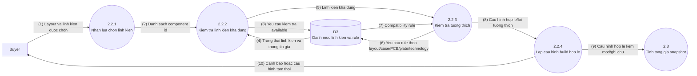
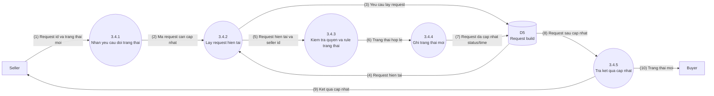
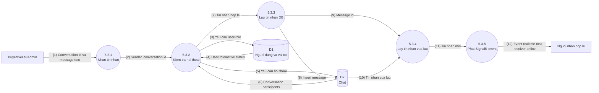

# Custom Keyboard Builder - DFD Duoi Muc Dinh Level 2

Tai lieu nay chi phan ra cac tien trinh Level 1 co luong du lieu phuc tap. Khong can bung tat ca tien trinh Level 1 thanh Level 2, vi nhu vay DFD se bi trung lap voi FHD va activity diagram.

Trong pham vi MVP, chi nen bung Level 2 cho:

- `2.2 Xu ly cau hinh build`: vi co nhieu nhom linh kien, can kiem tra available va compatibility.
- `3.4 Cap nhat trang thai request`: vi co rule trang thai va can cap nhat request theo dung actor.
- `5.3 Luu tin nhan`: phase phu chat can kiem tra nguoi tham gia, luu DB truoc va phat SignalR sau.

Nhung tien trinh quan tri CRUD nhu ban user, verify seller, an linh kien da du ro o FHD/use case va Level 1, khong can tach tiep o DFD Level 2 neu bao cao khong yeu cau.

## DFD Level 2 - 2.2 Xu Ly Cau Hinh Build

### Chu Thich Luong Du Lieu

| So | Nguon | Dich | Luong du lieu |
| --- | --- | --- | --- |
| (1) | Buyer | 2.2.1 Nhan lua chon linh kien | Layout, case, PCB, plate, switch, keycap, stabilizer, mod/phu kien, ghi chu |
| (2) | 2.2.1 Nhan lua chon linh kien | 2.2.2 Kiem tra linh kien kha dung | Danh sach component id va layout duoc chon |
| (3) | 2.2.2 Kiem tra linh kien kha dung | D3 | Yeu cau kiem tra `is_available` va thong tin linh kien |
| (4) | D3 | 2.2.2 Kiem tra linh kien kha dung | Trang thai available, brand, gia, thong tin component |
| (5) | 2.2.2 Kiem tra linh kien kha dung | 2.2.3 Kiem tra tuong thich | Cac linh kien con kha dung |
| (6) | 2.2.3 Kiem tra tuong thich | D3 | Yeu cau compatibility rule theo layout, case, PCB, plate, PCB technology, switch technology va `pcb.switch_mount` khop voi `switch.mount_type` |
| (7) | D3 | 2.2.3 Kiem tra tuong thich | Rule hop le/khong hop le va ghi chu |
| (8) | 2.2.3 Kiem tra tuong thich | 2.2.4 Lap cau hinh build hop le | Ket qua kiem tra va loi neu co |
| (9) | 2.2.4 Lap cau hinh build hop le | 2.3 Tinh tong gia snapshot | Cau hinh build hop le kem mod/phu kien |
| (10) | 2.2.4 Lap cau hinh build hop le | Buyer | Cau hinh tam thoi, canh bao hoac thong bao loi tuong thich |

## DFD Level 2 - 3.4 Cap Nhat Trang Thai Request

### Chu Thich Luong Du Lieu

| So | Nguon | Dich | Luong du lieu |
| --- | --- | --- | --- |
| (1) | Seller | 3.4.1 Nhan yeu cau doi trang thai | Request id, status moi, seller hien tai |
| (2) | 3.4.1 Nhan yeu cau doi trang thai | 3.4.2 Lay request hien tai | Ma request can cap nhat |
| (3) | 3.4.2 Lay request hien tai | D5 | Yeu cau lay request hien tai |
| (4) | D5 | 3.4.2 Lay request hien tai | Request hien tai, buyer id, seller id, status hien tai |
| (5) | 3.4.2 Lay request hien tai | 3.4.3 Kiem tra quyen va rule trang thai | Request hien tai va seller thuc hien |
| (6) | 3.4.3 Kiem tra quyen va rule trang thai | 3.4.4 Ghi trang thai moi | Status moi hop le va cac moc thoi gian can cap nhat |
| (7) | 3.4.4 Ghi trang thai moi | D5 | Request da cap nhat status, updated_at, accepted_at/completed_at neu co |
| (8) | D5 | 3.4.5 Tra ket qua cap nhat | Request sau cap nhat |
| (9) | 3.4.5 Tra ket qua cap nhat | Seller | Ket qua cap nhat request |
| (10) | 3.4.5 Tra ket qua cap nhat | Buyer | Trang thai request moi de buyer theo doi |

## Rule Trang Thai Request

| Trang thai hien tai | Trang thai co the chuyen | Ghi chu |
| --- | --- | --- |
| Pending | Accepted, Cancelled | Seller nhan request hoac huy request neu khong xu ly. |
| Accepted | In_progress, Cancelled | Seller bat dau xu ly hoac huy neu co ly do. |
| In_progress | Completed, Cancelled | Seller hoan thanh hoac huy khi khong the tiep tuc. |
| Completed | Khong chuyen tiep | Trang thai ket thuc. |
| Cancelled | Khong chuyen tiep | Trang thai ket thuc. |

## DFD Level 2 - 5.3 Luu Tin Nhan Chat

### Chu Thich Luong Du Lieu

| So | Nguon | Dich | Luong du lieu |
| --- | --- | --- | --- |
| (1) | Buyer/Seller/Admin | 5.3.1 Nhan tin nhan | Conversation id va noi dung tin nhan |
| (2) | 5.3.1 Nhan tin nhan | 5.3.2 Kiem tra hoi thoai | Sender id, conversation id |
| (3) | 5.3.2 Kiem tra hoi thoai | D1 | Yeu cau user/role/active status |
| (4) | D1 | 5.3.2 Kiem tra hoi thoai | User/role/active status cua sender |
| (5) | 5.3.2 Kiem tra hoi thoai | D7 | Yeu cau lay conversation participants |
| (6) | D7 | 5.3.2 Kiem tra hoi thoai | Seller-buyer hoac seller-admin participants |
| (7) | 5.3.2 Kiem tra hoi thoai | 5.3.3 Luu tin nhan DB | Tin nhan hop le, khong phai Buyer-Admin |
| (8) | 5.3.3 Luu tin nhan DB | D7 | Tin nhan moi duoc insert |
| (9) | 5.3.3 Luu tin nhan DB | 5.3.4 Lay tin nhan vua luu | Message id |
| (10) | D7 | 5.3.4 Lay tin nhan vua luu | Tin nhan vua luu kem sent_at |
| (11) | 5.3.4 Lay tin nhan vua luu | 5.3.5 Phat SignalR event | Tin nhan moi de phat realtime |
| (12) | 5.3.5 Phat SignalR event | Nguoi nhan hop le | Event tin nhan moi neu app nguoi nhan dang online |

## Kiem Tra Can Bang Voi Level 1

| Tien trinh Level 1 | Duoc phan ra o Level 2 | Ly do |
| --- | --- | --- |
| 2.2 Xu ly cau hinh build | 2.2.1 den 2.2.4 | Co nhieu du lieu dau vao va can kiem tra available/compatibility. |
| 3.4 Cap nhat trang thai request | 3.4.1 den 3.4.5 | Co rule trang thai, quyen seller va cap nhat moc thoi gian. |
| 5.3 Luu tin nhan | 5.3.1 den 5.3.5 | Can dam bao chat dung cap nguoi tham gia, luu tin nhan ben vung truoc khi phat realtime. |

## Ghi Chu Ranh Gioi Level 2

- Level 2 khong tach tung linh kien thanh tien trinh rieng. Layout, case, PCB, plate, switch, keycap, stabilizer la du lieu dau vao cua tien trinh cau hinh build; technology cua PCB/switch va mount cua PCB/switch duoc xem la thuoc tinh dung trong rule tuong thich.
- Level 2 khong dua API, MQTT/SignalR endpoint, DTO, controller hay bang/cot chi tiet vao so do.
- SignalR chi phat event sau khi tin nhan da luu DB; neu nguoi nhan offline, nguoi nhan se doc lai lich su chat tu D7 khi mo app.
- Neu can trinh bay them thao tac UI, nen dua vao FHD, use case hoac activity diagram thay vi DFD.
