# Custom Keyboard Builder - Functional Hierarchy Diagram (FHD)

Tai lieu nay mo ta FHD o muc logic/nghiep vu de chot spec voi khach hang, thay co hoac thiet ke UI/UX.

Pham vi cua FHD nay chi gom cac chuc nang ma nguoi dung cuoi nhin thay va thao tac truc tiep tren man hinh. Cac phan ky thuat ben trong nhu API, MQTT, database, validation server, authorization guard va luu tru du lieu khong duoc dua vao so do chuc nang nguoi dung.

## FHD Tong Quan

```mermaid
flowchart TD
    A["0. Custom Keyboard Builder"]

    A --> B["1. Tai khoan"]
    A --> C["2. Buyer - Tao va gui build"]
    A --> D["3. Seller - Xu ly request"]
    A --> E["4. Admin - Quan tri"]
    A --> F["5. Chat realtime"]

    B --> B1["1.1 Dang ky"]
    B --> B2["1.2 Dang nhap"]
    B --> B3["1.3 Dang xuat"]
    B --> B4["1.4 Xem thong tin tai khoan"]

    C --> C1["2.1 Xem dashboard buyer"]
    C --> C2["2.2 Xem danh sach build"]
    C --> C3["2.3 Tao build moi"]
    C --> C4["2.4 Chon linh kien"]
    C --> C5["2.5 Xem tong gia"]
    C --> C6["2.6 Luu build"]
    C --> C7["2.7 Chon seller"]
    C --> C8["2.8 Gui request"]
    C --> C9["2.9 Theo doi request"]

    C4 --> C41["2.4.1 Chon layout"]
    C4 --> C42["2.4.2 Chon case"]
    C4 --> C43["2.4.3 Chon PCB"]
    C4 --> C44["2.4.4 Chon plate"]
    C4 --> C45["2.4.5 Chon switch"]
    C4 --> C46["2.4.6 Chon keycap"]
    C4 --> C47["2.4.7 Chon stabilizer"]
    C4 --> C48["2.4.8 Chon mod/phu kien"]

    D --> D1["3.1 Xem dashboard seller"]
    D --> D2["3.2 Xem danh sach request"]
    D --> D3["3.3 Xem chi tiet request"]
    D --> D4["3.4 Cap nhat trang thai"]
    D --> D5["3.5 Danh dau hoan thanh"]

    E --> E1["4.1 Xem dashboard admin"]
    E --> E2["4.2 Quan ly user"]
    E --> E3["4.3 Quan ly seller"]
    E --> E4["4.4 Quan ly linh kien"]
    E --> E5["4.5 Xem audit log"]

    E2 --> E21["4.2.1 Xem danh sach user"]
    E2 --> E22["4.2.2 Ban user"]
    E2 --> E23["4.2.3 Mo ban user"]
    E2 --> E24["4.2.4 Doi role user"]

    E3 --> E31["4.3.1 Xem seller profile"]
    E3 --> E32["4.3.2 Tao/cap nhat seller profile"]
    E3 --> E33["4.3.3 Verify seller"]
    E3 --> E34["4.3.4 Unverify seller"]

    E4 --> E41["4.4.1 Xem danh sach linh kien"]
    E4 --> E42["4.4.2 Them linh kien"]
    E4 --> E43["4.4.3 Sua linh kien"]
    E4 --> E44["4.4.4 An linh kien"]
    E4 --> E45["4.4.5 Khoi phuc linh kien"]

    F --> F1["5.1 Buyer chat voi seller"]
    F --> F2["5.2 Seller chat voi buyer"]
    F --> F3["5.3 Seller chat voi admin"]
    F --> F4["5.4 Admin chat voi seller"]
```

## Nguyen Tac Chot FHD Muc Nguoi Dung

- Chi the hien chuc nang co tren man hinh de nguoi dung xem, chon, nhap, bam, gui hoac cap nhat.
- Khong dua cac module ky thuat vao FHD: API, database, MQTT, JWT, hash password, topic realtime, DTO, server-side validation.
- Neu mot logic ky thuat tao ra trai nghiem tren UI thi chi ghi phan nguoi dung thay duoc. Vi du: thay vi "Compatibility API", ghi "Xem canh bao linh kien khong phu hop" neu man hinh co hien canh bao.
- FHD nay dung de phuc vu UI/UX va nghiem thu nghiep vu, khong phai tai lieu kien truc he thong.

## Phan Cap Chuc Nang Chi Tiet

### 1. Tai khoan

| Ma | Chuc nang | Mo ta thao tac nguoi dung |
| --- | --- | --- |
| 1.1 | Dang ky | Nguoi dung nhap thong tin tai khoan va bam dang ky. |
| 1.2 | Dang nhap | Nguoi dung nhap email/password va bam dang nhap. |
| 1.3 | Dang xuat | Nguoi dung bam dang xuat khoi ung dung. |
| 1.4 | Xem thong tin tai khoan | Nguoi dung xem ten, email, so dien thoai va vai tro hien tai. |

### 2. Buyer - Tao va gui build

| Ma | Chuc nang | Mo ta thao tac nguoi dung |
| --- | --- | --- |
| 2.1 | Xem dashboard buyer | Buyer xem tong quan build da tao va request da gui. |
| 2.2 | Xem danh sach build | Buyer xem cac build da luu, trang thai gui request va thong tin tom tat. |
| 2.3 | Tao build moi | Buyer bam tao build moi de bat dau flow cau hinh ban phim. |
| 2.4 | Chon linh kien | Buyer chon tung nhom linh kien tren man hinh cau hinh build. |
| 2.4.1 | Chon layout | Buyer chon layout ban phim mong muon. |
| 2.4.2 | Chon case | Buyer chon case trong danh sach case hien co. |
| 2.4.3 | Chon PCB | Buyer chon PCB trong danh sach PCB hien co. |
| 2.4.4 | Chon plate | Buyer chon plate trong danh sach plate hien co. |
| 2.4.5 | Chon switch | Buyer chon switch trong danh sach switch hien co. |
| 2.4.6 | Chon keycap | Buyer chon bo keycap trong danh sach keycap hien co. |
| 2.4.7 | Chon stabilizer | Buyer chon stabilizer trong danh sach stabilizer hien co. |
| 2.4.8 | Chon mod/phu kien | Buyer chon mod co ban nhu lube, film, spring hoac nhap ghi chu neu co. |
| 2.5 | Xem tong gia | Buyer xem tong gia tam tinh cua build tren man hinh. |
| 2.6 | Luu build | Buyer bam luu build de giu lai cau hinh da chon. |
| 2.7 | Chon seller | Buyer chon seller phu hop tu danh sach seller kha dung. |
| 2.8 | Gui request | Buyer bam gui request build cho seller da chon. |
| 2.9 | Theo doi request | Buyer xem trang thai request: Pending, Accepted, In_progress, Completed, Cancelled. |

### 3. Seller - Xu ly request

| Ma | Chuc nang | Mo ta thao tac nguoi dung |
| --- | --- | --- |
| 3.1 | Xem dashboard seller | Seller xem tong quan cac request duoc gui den. |
| 3.2 | Xem danh sach request | Seller xem danh sach request, thoi gian gui, buyer va trang thai hien tai. |
| 3.3 | Xem chi tiet request | Seller mo request de xem layout, linh kien, mod, ghi chu va tong gia snapshot. |
| 3.4 | Cap nhat trang thai | Seller chon trang thai moi cho request: Accepted, In_progress, Cancelled. |
| 3.5 | Danh dau hoan thanh | Seller bam hoan thanh de cap nhat request sang Completed. |

### 4. Admin - Quan tri

| Ma | Chuc nang | Mo ta thao tac nguoi dung |
| --- | --- | --- |
| 4.1 | Xem dashboard admin | Admin xem tong quan nguoi dung, seller va linh kien. |
| 4.2 | Quan ly user | Admin thao tac tren danh sach tai khoan nguoi dung. |
| 4.2.1 | Xem danh sach user | Admin xem username, email, phone, role va trang thai active. |
| 4.2.2 | Ban user | Admin bam ban user de khoa tai khoan. |
| 4.2.3 | Mo ban user | Admin bam mo ban de kich hoat lai tai khoan. |
| 4.2.4 | Doi role user | Admin doi vai tro user giua buyer, seller va admin neu duoc phep. |
| 4.3 | Quan ly seller | Admin quan ly thong tin va trang thai seller. |
| 4.3.1 | Xem seller profile | Admin xem thong tin shop, phone, address va trang thai verify. |
| 4.3.2 | Tao/cap nhat seller profile | Admin nhap hoac sua thong tin ho so seller. |
| 4.3.3 | Verify seller | Admin bam verify de cho seller xuat hien trong danh sach buyer co the chon. |
| 4.3.4 | Unverify seller | Admin bam unverify de tam an seller khoi danh sach buyer co the chon. |
| 4.4 | Quan ly linh kien | Admin thao tac tren danh muc linh kien. |
| 4.4.1 | Xem danh sach linh kien | Admin xem danh sach brand, layout, switch, keycap, case, PCB, plate va stabilizer. |
| 4.4.2 | Them linh kien | Admin bam them moi va nhap thong tin linh kien. |
| 4.4.3 | Sua linh kien | Admin sua thong tin linh kien da co. |
| 4.4.4 | An linh kien | Admin an linh kien de buyer khong con thay trong danh sach chon. |
| 4.4.5 | Khoi phuc linh kien | Admin khoi phuc linh kien de buyer co the thay lai. |
| 4.5 | Xem audit log | Admin xem lich su cac thao tac quan trong trong he thong. |

### 5. Chat realtime

| Ma | Chuc nang | Mo ta thao tac nguoi dung |
| --- | --- | --- |
| 5.1 | Buyer chat voi seller | Buyer bam chuot phai vao seller hoac mo tu request/build detail de nhan tin voi seller da chon. |
| 5.2 | Seller chat voi buyer | Seller mo hoi thoai voi buyer trong request/build detail va trao doi ve don build. |
| 5.3 | Seller chat voi admin | Seller mo hoi thoai voi admin de hoi ve ho so, verify hoac van de tai khoan/shop. |
| 5.4 | Admin chat voi seller | Admin mo hoi thoai voi seller tu man quan ly seller de ho tro seller. |

Ghi chu: He thong khong co chat truc tiep Buyer-Admin. Chat khong yeu cau unread count, online/offline indicator hoac typing indicator trong phase phu nay.

Ghi chu frontend: Buyer chi thay chat voi seller hop le; Seller chi thay chat voi buyer trong request cua minh va chat voi admin; Admin chi thay chat voi seller trong man quan ly seller. Service van phai validate lai cac dieu kien nay, khong dua vao UI lam lop bao ve duy nhat.

## Trang Thai Hien Thi Cho Nguoi Dung

| Doi tuong | Trang thai hien thi | Y nghia tren UI |
| --- | --- | --- |
| User | Active | Tai khoan dang duoc su dung. |
| User | Banned | Tai khoan bi khoa. |
| Seller | Verified | Seller duoc phep nhan request tu buyer. |
| Seller | Unverified | Seller chua duoc phep xuat hien cho buyer chon. |
| Linh kien | Available | Linh kien dang hien cho buyer chon. |
| Linh kien | Hidden | Linh kien bi an khoi man hinh buyer. |
| Request | Pending | Buyer da gui, seller chua nhan. |
| Request | Accepted | Seller da nhan request. |
| Request | In_progress | Seller dang xu ly request. |
| Request | Completed | Seller da hoan thanh request. |
| Request | Cancelled | Request da bi huy. |

## Ranh Gioi Khong Dua Vao FHD Nay

- Khong the hien Backend API, endpoint, DTO, service, repository.
- Khong the hien database, bang, cot, khoa chinh, khoa ngoai.
- Khong the hien MQTT topic, publish, subscribe, reconnect.
- Khong the hien co che tinh gia ben trong, validate ben trong hoac phan quyen ky thuat.
- Khong the hien seed data, migration, hash password, JWT/token.
- Khong the hien cac buoc xu ly tu dong neu nguoi dung khong thay va khong thao tac truc tiep.
