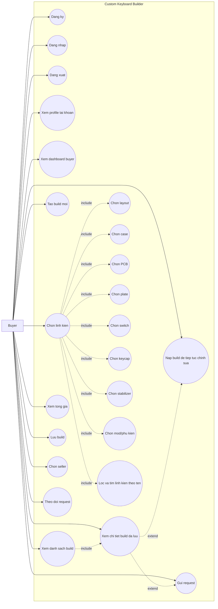
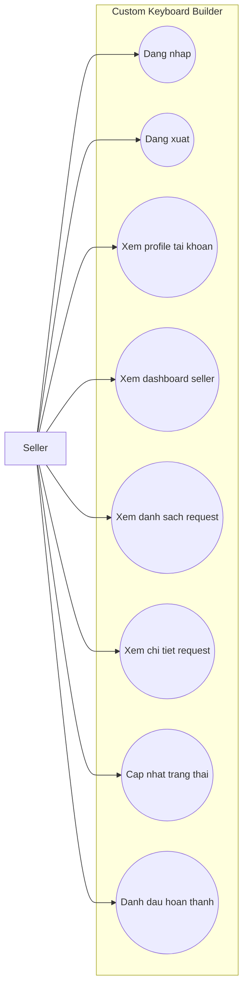
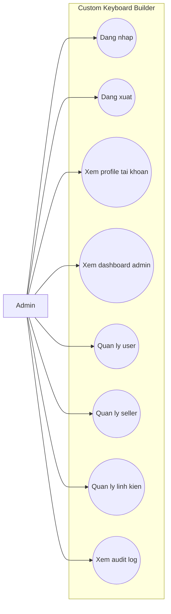
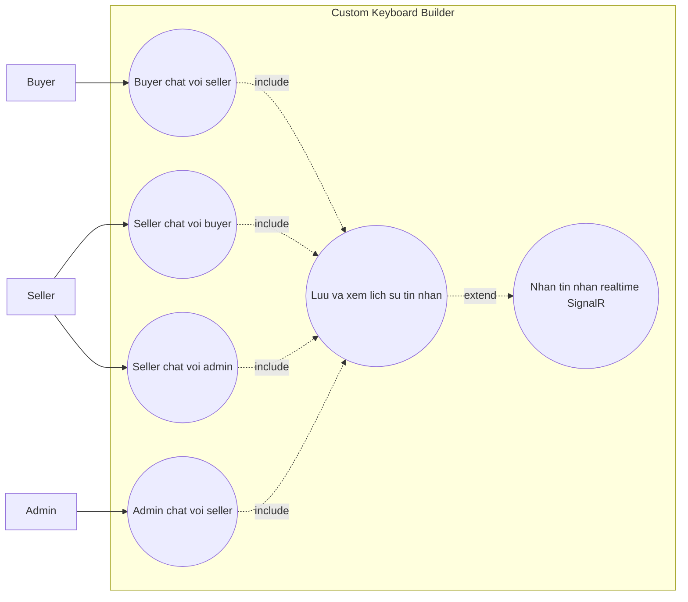

# Custom Keyboard Builder - Use Cases Theo 3 Role

Tai lieu nay tao 3 use case chinh tu FHD muc nguoi dung cuoi:

- Buyer - Tao va gui build.
- Seller - Xu ly request.
- Admin - Quan tri he thong.
- Phase phu - Chat realtime Buyer-Seller va Seller-Admin.

Nhom `1. Tai khoan` la chuc nang dung chung. Trong 3 use case rieng theo role, `Dang nhap`, `Dang xuat` va `Xem profile tai khoan` duoc gan cho ca Buyer, Seller, Admin. Rieng `Dang ky` duoc dua vao UC Buyer la luong nguoi dung tu tao tai khoan; Seller/Admin thuong duoc Admin phan quyen hoac cap san tai khoan nen khong dat trong luong chinh cua Seller/Admin.

## UC-01: Buyer Tao Va Gui Build Keyboard

| Muc | Noi dung |
| --- | --- |
| Actor chinh | Buyer |
| Muc tieu | Buyer tao cau hinh ban phim custom, luu build, chon seller va gui request build. |
| Tien dieu kien | Buyer co tai khoan hop le va dang nhap vao ung dung. |
| Hau dieu kien | Build duoc luu; request duoc gui cho seller; buyer co the theo doi trang thai request. |

### Luong Chinh

| Buoc | Thao tac cua Buyer | Chuc nang FHD |
| --- | --- | --- |
| 1 | Buyer dang ky tai khoan neu chua co tai khoan. | 1.1 Dang ky |
| 2 | Buyer dang nhap vao ung dung. | 1.2 Dang nhap |
| 3 | Buyer vao dashboard buyer va thay 2 lua chon lon: xem build da tao hoac tao build moi. | 2.1, 2.2, 2.3 |
| 4 | Neu chon xem build, buyer xem danh sach build da luu tu tren xuong duoi. | 2.2 Xem danh sach build |
| 5 | Buyer chon mot build de xem chi tiet. | 2.2 Xem danh sach build |
| 6 | Tu chi tiet build, buyer co the nap build vao configurator de tiep tuc chinh sua. | 2.2, 2.4 |
| 7 | Neu chon tao build moi, buyer bat dau voi mot build rong. | 2.3 Tao build moi |
| 8 | Buyer chon layout ban phim truoc. | 2.4.1 Chon layout |
| 9 | Sau khi co layout, buyer xem tat ca linh kien kha dung trong vung chon linh kien. | 2.4 Chon linh kien |
| 10 | Buyer dung thanh ngang All/Case/PCB/Plate/Switch/Mod de loc nhom linh kien. | 2.4, 2.4.2-2.4.8 |
| 11 | Buyer dung o search de tra nhanh theo ten/id, vi du Neo65 hien case/PCB/plate lien quan. | 2.4, 2.4.2-2.4.8 |
| 12 | Buyer chon case. | 2.4.2 Chon case |
| 13 | Buyer chon PCB. | 2.4.3 Chon PCB |
| 14 | Buyer chon plate. | 2.4.4 Chon plate |
| 15 | Buyer chon switch. | 2.4.5 Chon switch |
| 16 | Buyer chon keycap. | 2.4.6 Chon keycap |
| 17 | Buyer chon stabilizer. | 2.4.7 Chon stabilizer |
| 18 | Buyer chon mod/phu kien hoac nhap ghi chu neu co. | 2.4.8 Chon mod/phu kien |
| 19 | Buyer xem tong gia tam tinh cua build. | 2.5 Xem tong gia |
| 20 | Buyer bam luu build, build xuat hien trong danh sach build da luu. | 2.6 Luu build |
| 21 | Khi muon gui request, buyer mo chi tiet build da luu va chon hanh dong gui request. | 2.2, 2.8 |
| 22 | Buyer chon seller trong danh sach seller kha dung. | 2.7 Chon seller |
| 23 | Buyer nhap note neu co va bam gui request build. | 2.8 Gui request |
| 24 | Buyer theo doi trang thai request trong danh sach request da gui. | 2.9 Theo doi request |
| 25 | Buyer co the mo user menu de xem profile tai khoan hoac dang xuat khi ket thuc su dung. | 1.3, 1.4 |

### Luong Phu / Ngoai Le

| Tinh huong | Xu ly tren UI | Chuc nang FHD |
| --- | --- | --- |
| Buyer chua muon gui request | Buyer chi luu build va quay lai danh sach build. | 2.2, 2.6 |
| Buyer muon xem build cu | Buyer chon `Xem build`, chon mot build trong danh sach va xem chi tiet. | 2.2 |
| Buyer muon doi cau hinh build cu | Buyer nap build da luu vao configurator va chon lai linh kien mong muon. | 2.2, 2.4, 2.4.1-2.4.8 |
| Buyer muon tim linh kien nhanh | Buyer nhap tu khoa vao o search hoac chon nhom Case/PCB/Plate/Switch/Mod tren thanh ngang. | 2.4, 2.4.2-2.4.8 |
| Buyer muon doi cau hinh build moi | Buyer quay lai cac buoc chon linh kien va chon lai thanh phan mong muon. | 2.4, 2.4.1-2.4.8 |
| Buyer muon doi seller | Buyer quay lai man hinh chon seller va chon seller khac. | 2.7 |
| Buyer muon gui request tu build da luu | Buyer mo chi tiet build da luu va chon gui request cho seller. | 2.2, 2.7, 2.8 |
| Buyer sua build sau khi da gui request | Request da gui van giu snapshot tai thoi diem gui; neu muon gui cau hinh moi, buyer gui request moi tu build da luu. | 2.6, 2.8, 2.9 |
| Buyer can xem tien do | Buyer mo danh sach request/build de xem trang thai hien tai. | 2.1, 2.2, 2.9 |

### Mapping Day Du FHD Cho Buyer

| Nhom | Ma FHD duoc bao phu |
| --- | --- |
| Tai khoan dung chung | 1.1, 1.2, 1.3, 1.4 |
| Buyer | 2.1, 2.2, 2.3, 2.4, 2.4.1, 2.4.2, 2.4.3, 2.4.4, 2.4.5, 2.4.6, 2.4.7, 2.4.8, 2.5, 2.6, 2.7, 2.8, 2.9 |

## UC-02: Seller Xu Ly Request Build

| Muc | Noi dung |
| --- | --- |
| Actor chinh | Seller |
| Muc tieu | Seller xem request duoc gui den, xem chi tiet cau hinh build va cap nhat trang thai xu ly. |
| Tien dieu kien | Seller co tai khoan hop le, da dang nhap va duoc phep nhan request. |
| Hau dieu kien | Request duoc cap nhat trang thai; neu hoan thanh thi request hien trang thai Completed. |

### Luong Chinh

| Buoc | Thao tac cua Seller | Chuc nang FHD |
| --- | --- | --- |
| 1 | Seller dang nhap vao ung dung. | 1.2 Dang nhap |
| 2 | Seller mo user menu de xem profile tai khoan neu can kiem tra ho so ca nhan. | 1.4 Xem profile tai khoan |
| 3 | Seller vao dashboard seller. | 3.1 Xem dashboard seller |
| 4 | Seller xem danh sach request duoc gui den. | 3.2 Xem danh sach request |
| 5 | Seller mo mot request de xem chi tiet. | 3.3 Xem chi tiet request |
| 6 | Seller cap nhat trang thai request sang Accepted khi nhan request. | 3.4 Cap nhat trang thai |
| 7 | Seller cap nhat trang thai request sang In_progress khi bat dau xu ly. | 3.4 Cap nhat trang thai |
| 8 | Seller co the cap nhat trang thai request sang Cancelled neu request bi huy. | 3.4 Cap nhat trang thai |
| 9 | Seller bam danh dau hoan thanh khi da xu ly xong. | 3.5 Danh dau hoan thanh |
| 10 | Seller dang xuat khi ket thuc su dung. | 1.3 Dang xuat |

### Luong Phu / Ngoai Le

| Tinh huong | Xu ly tren UI | Chuc nang FHD |
| --- | --- | --- |
| Seller chua co request moi | Seller van xem dashboard va danh sach request hien co. | 3.1, 3.2 |
| Seller can kiem tra cau hinh truoc khi nhan | Seller mo chi tiet request de xem layout, linh kien, mod, ghi chu va tong gia snapshot. | 3.3 |
| Request khong the tiep tuc xu ly | Seller cap nhat trang thai sang Cancelled. | 3.4 |
| Request da xu ly xong | Seller bam hoan thanh de chuyen trang thai sang Completed. | 3.5 |

### Mapping Day Du FHD Cho Seller

| Nhom | Ma FHD duoc bao phu |
| --- | --- |
| Tai khoan dung chung | 1.2, 1.3, 1.4 |
| Seller | 3.1, 3.2, 3.3, 3.4, 3.5 |

Ghi chu: Seller khong tu dang ky role seller trong luong chinh. Neu seller chua co tai khoan, nguoi dung co the di qua `1.1 Dang ky` nhu mot tai khoan thong thuong, sau do Admin phan quyen seller trong UC-03.

## UC-03: Admin Quan Tri User, Seller Va Linh Kien

| Muc | Noi dung |
| --- | --- |
| Actor chinh | Admin |
| Muc tieu | Admin quan ly tai khoan user, ho so seller, danh muc linh kien va xem lich su thao tac. |
| Tien dieu kien | Admin co tai khoan hop le va dang nhap vao ung dung. |
| Hau dieu kien | Thong tin user, seller hoac linh kien duoc cap nhat theo thao tac cua admin; admin co the xem lai audit log. |

### Luong Chinh

| Buoc | Thao tac cua Admin | Chuc nang FHD |
| --- | --- | --- |
| 1 | Admin dang nhap vao ung dung. | 1.2 Dang nhap |
| 2 | Admin mo user menu de xem profile tai khoan neu can kiem tra ho so ca nhan. | 1.4 Xem profile tai khoan |
| 3 | Admin vao dashboard admin. | 4.1 Xem dashboard admin |
| 4 | Admin mo man hinh quan ly user. | 4.2 Quan ly user |
| 5 | Admin xem danh sach user. | 4.2.1 Xem danh sach user |
| 6 | Admin ban user khi can khoa tai khoan. | 4.2.2 Ban user |
| 7 | Admin mo ban user khi can kich hoat lai tai khoan. | 4.2.3 Mo ban user |
| 8 | Admin doi role user khi can phan quyen. | 4.2.4 Doi role user |
| 9 | Admin mo man hinh quan ly seller. | 4.3 Quan ly seller |
| 10 | Admin xem seller profile. | 4.3.1 Xem seller profile |
| 11 | Admin tao hoac cap nhat seller profile. | 4.3.2 Tao/cap nhat seller profile |
| 12 | Admin verify seller de seller co the xuat hien cho buyer chon. | 4.3.3 Verify seller |
| 13 | Admin unverify seller neu seller chua du dieu kien nhan request. | 4.3.4 Unverify seller |
| 14 | Admin mo man hinh quan ly linh kien. | 4.4 Quan ly linh kien |
| 15 | Admin xem danh sach linh kien. | 4.4.1 Xem danh sach linh kien |
| 16 | Admin them linh kien moi. | 4.4.2 Them linh kien |
| 17 | Admin sua thong tin linh kien. | 4.4.3 Sua linh kien |
| 18 | Admin an linh kien de buyer khong con thay trong danh sach chon. | 4.4.4 An linh kien |
| 19 | Admin khoi phuc linh kien de buyer co the thay lai. | 4.4.5 Khoi phuc linh kien |
| 20 | Admin xem audit log. | 4.5 Xem audit log |
| 21 | Admin dang xuat khi ket thuc su dung. | 1.3 Dang xuat |

### Luong Phu / Ngoai Le

| Tinh huong | Xu ly tren UI | Chuc nang FHD |
| --- | --- | --- |
| Admin chi can xem thong tin | Admin xem dashboard, danh sach user, seller, linh kien hoac audit log ma khong sua. | 4.1, 4.2.1, 4.3.1, 4.4.1, 4.5 |
| User bi khoa nham | Admin mo ban user. | 4.2.3 |
| Buyer duoc nang thanh seller | Admin doi role user, tao/cap nhat seller profile va verify seller. | 4.2.4, 4.3.2, 4.3.3 |
| Seller khong con du dieu kien nhan request | Admin unverify seller hoac doi role user neu can. | 4.3.4, 4.2.4 |
| Linh kien het hang hoac khong muon hien thi | Admin an linh kien. | 4.4.4 |
| Linh kien duoc ban lai | Admin khoi phuc linh kien. | 4.4.5 |

### Mapping Day Du FHD Cho Admin

| Nhom | Ma FHD duoc bao phu |
| --- | --- |
| Tai khoan dung chung | 1.2, 1.3, 1.4 |
| Admin | 4.1, 4.2, 4.2.1, 4.2.2, 4.2.3, 4.2.4, 4.3, 4.3.1, 4.3.2, 4.3.3, 4.3.4, 4.4, 4.4.1, 4.4.2, 4.4.3, 4.4.4, 4.4.5, 4.5 |

Ghi chu: Tai khoan admin thuong duoc cap san nen luong chinh bat dau tu `1.2 Dang nhap`. Neu he thong cho phep tao admin qua man hinh dang ky thi co the gan them `1.1 Dang ky`, nhung dieu nay khong phai luong chinh cua Admin trong MVP.

## UC-04: Chat Realtime Buyer-Seller Va Seller-Admin

| Muc | Noi dung |
| --- | --- |
| Actor chinh | Buyer, Seller, Admin |
| Muc tieu | Cho Buyer-Seller va Seller-Admin trao doi tin nhan trong app, co realtime SignalR khi ca hai ben online. |
| Tien dieu kien | Nguoi gui da dang nhap; conversation phai co seller; Buyer-Admin truc tiep khong hop le. |
| Hau dieu kien | Tin nhan duoc luu vao DB; nguoi nhan online thay tin moi qua SignalR; nguoi nhan offline xem lai khi mo app/chat. |

### Luong Chinh

| Buoc | Thao tac | Chuc nang FHD |
| --- | --- | --- |
| 1 | Buyer mo chat voi seller tu danh sach seller hoac request/build detail. | 5.1 |
| 2 | Seller mo chat voi buyer tu request detail. | 5.2 |
| 3 | Seller mo chat voi admin tu dashboard seller. | 5.3 |
| 4 | Admin mo chat voi seller tu man quan ly seller. | 5.4 |
| 5 | He thong load conversation va lich su tin nhan tu DB. | 5.1-5.4 |
| 6 | Nguoi dung nhap va gui tin nhan. | 5.1-5.4 |
| 7 | He thong kiem tra cap chat hop le, luu tin nhan vao DB. | 5.1-5.4 |
| 8 | Neu nguoi nhan dang online, he thong day SignalR event de cap nhat UI ngay. | 5.1-5.4 |
| 9 | Neu nguoi nhan offline, nguoi nhan se thay tin nhan khi mo app/chat va load lai lich su. | 5.1-5.4 |

### Luong Phu / Ngoai Le

| Tinh huong | Xu ly tren UI | Chuc nang FHD |
| --- | --- | --- |
| Buyer muon chat truc tiep Admin | He thong khong cho tao conversation Buyer-Admin. | 5.1-5.4 |
| Nguoi nhan offline | Tin nhan van luu DB; khong co indicator online/offline trong phase phu. | 5.1-5.4 |
| SignalR mat ket noi | App van gui/nhan qua DB; realtime event co the mat nhung lich su chat khong mat. | 5.1-5.4 |
| User inactive/bi ban | UI khong cho mo/gui chat; service tu choi neu request goi truc tiep. | 5.1-5.4 |
| Tin nhan rong | Nut gui bi disable hoac service tu choi luu. | 5.1-5.4 |
| Sender khong thuoc conversation | Service tu choi gui tin va UI hien loi. | 5.1-5.4 |

### Ma Tran Quyen Chat Va Diem Vao Frontend

| Cap chat | Diem vao frontend | Dieu kien | Ket qua |
| --- | --- | --- | --- |
| Buyer -> Seller | Buyer right-click seller trong seller picker/list hoac mo tu request/build detail co seller. | Buyer active, Seller active va role Seller; seller verified neu mo tu seller picker. | Mo hoac tao conversation Buyer-Seller. |
| Seller -> Buyer | Seller mo tu request detail cua request duoc gan cho seller. | Seller active; request thuoc seller; buyer la buyer cua request. | Mo hoac tao conversation Buyer-Seller. |
| Seller -> Admin | Seller mo tu dashboard/menu ho tro. | Seller active; admin active, role Admin. | Mo hoac tao conversation Seller-Admin. |
| Admin -> Seller | Admin mo tu tab Sellers trong Admin dashboard. | Admin active; selected seller la role Seller, active, co seller profile. | Mo hoac tao conversation Seller-Admin. |
| Buyer -> Admin | Khong co nut/context menu. | Bi chan o service/DB neu co loi goi truc tiep. | Khong tao conversation. |
| Admin -> Buyer | Khong co nut/context menu trong tab Users. | Bi chan o service/DB neu co loi goi truc tiep. | Khong tao conversation. |

### Mapping Day Du FHD Cho Chat

| Nhom | Ma FHD duoc bao phu |
| --- | --- |
| Chat realtime | 5.1, 5.2, 5.3, 5.4 |

## Bang Doi Chieu Bao Phu FHD

| Ma FHD | Chuc nang | Use case bao phu |
| --- | --- | --- |
| 1.1 | Dang ky | UC-01; Seller co the di qua dang ky tai khoan thong thuong truoc khi duoc Admin phan quyen; Admin thuong duoc cap san tai khoan |
| 1.2 | Dang nhap | UC-01, UC-02, UC-03 |
| 1.3 | Dang xuat | UC-01, UC-02, UC-03 |
| 1.4 | Xem profile tai khoan | UC-01, UC-02, UC-03 |
| 2.1 | Xem dashboard buyer | UC-01 |
| 2.2 | Xem danh sach build | UC-01 |
| 2.3 | Tao build moi | UC-01 |
| 2.4 | Chon linh kien | UC-01 |
| 2.4.1 | Chon layout | UC-01 |
| 2.4.2 | Chon case | UC-01 |
| 2.4.3 | Chon PCB | UC-01 |
| 2.4.4 | Chon plate | UC-01 |
| 2.4.5 | Chon switch | UC-01 |
| 2.4.6 | Chon keycap | UC-01 |
| 2.4.7 | Chon stabilizer | UC-01 |
| 2.4.8 | Chon mod/phu kien | UC-01 |
| 2.5 | Xem tong gia | UC-01 |
| 2.6 | Luu build | UC-01 |
| 2.7 | Chon seller | UC-01 |
| 2.8 | Gui request | UC-01 |
| 2.9 | Theo doi request | UC-01 |
| 3.1 | Xem dashboard seller | UC-02 |
| 3.2 | Xem danh sach request | UC-02 |
| 3.3 | Xem chi tiet request | UC-02 |
| 3.4 | Cap nhat trang thai | UC-02 |
| 3.5 | Danh dau hoan thanh | UC-02 |
| 4.1 | Xem dashboard admin | UC-03 |
| 4.2 | Quan ly user | UC-03 |
| 4.2.1 | Xem danh sach user | UC-03 |
| 4.2.2 | Ban user | UC-03 |
| 4.2.3 | Mo ban user | UC-03 |
| 4.2.4 | Doi role user | UC-03 |
| 4.3 | Quan ly seller | UC-03 |
| 4.3.1 | Xem seller profile | UC-03 |
| 4.3.2 | Tao/cap nhat seller profile | UC-03 |
| 4.3.3 | Verify seller | UC-03 |
| 4.3.4 | Unverify seller | UC-03 |
| 4.4 | Quan ly linh kien | UC-03 |
| 4.4.1 | Xem danh sach linh kien | UC-03 |
| 4.4.2 | Them linh kien | UC-03 |
| 4.4.3 | Sua linh kien | UC-03 |
| 4.4.4 | An linh kien | UC-03 |
| 4.4.5 | Khoi phuc linh kien | UC-03 |
| 4.5 | Xem audit log | UC-03 |
| 5.1 | Buyer chat voi seller | UC-04 |
| 5.2 | Seller chat voi buyer | UC-04 |
| 5.3 | Seller chat voi admin | UC-04 |
| 5.4 | Admin chat voi seller | UC-04 |
