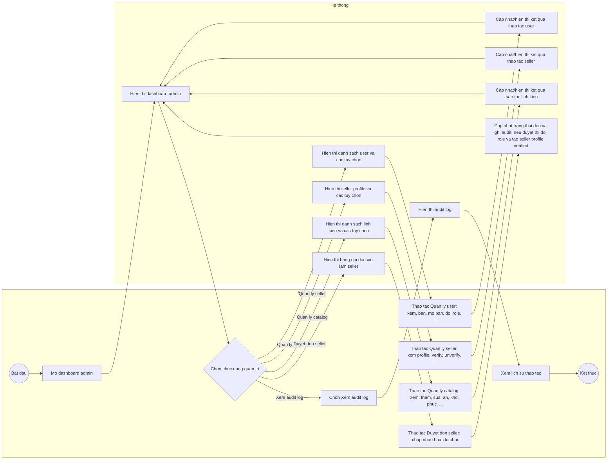
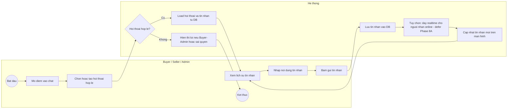

# Custom Keyboard Builder - Activity Diagrams Refactor

Tai lieu nay mo ta Activity Diagram theo ERD/FHD refactor trong `Documents_Refactor` (mo hinh kit-based): buyer chon mot keyboard kit roi them switch/keycap/stabilizer/accessory va mod. Tai lieu da bo sung Device Layer de mo phong tram QC keyboard truoc khi seller hoan thanh request. Anh xa 6 nhom chuc nang trong FHD refactor:

- 1. Tai khoan.
- 2. Buyer - Tao build tu kit va gui request.
- 3. Seller - Xu ly request.
- 4. Admin - Quan tri.
- 5. Chat.
- 6. Device/QC - Kiem tra keyboard.

Phan nay bat dau voi muc `1. Tai khoan`.

## AD-01: Tai Khoan

Activity Diagram nay duoc trinh bay theo dang swimlane gom `Nguoi dung` va `He thong`, anh xa truc tiep cac chuc nang FHD:

- `1.1 Dang ky`
- `1.2 Dang nhap`
- `1.3 Dang xuat`
- `1.4 Xem profile tai khoan`

```mermaid
flowchart LR
    subgraph UserLane["Nguoi dung"]
        Start((Bat dau))
        OpenApp[Mo ung dung]
        HasAccount{Da co tai khoan?}
        ChooseRegister[Buyer chon Dang ky]
        InputRegister[Buyer nhap thong tin dang ky]
        ClickRegister[Buyer bam nut Dang ky]
        ChooseLogin[Chon Dang nhap]
        InputLogin[Nhap email va password]
        ClickLogin[Bam nut Dang nhap]
        OpenUserMenu[Mo user menu goc tren phai]
        ChooseAccountInfo[Bam Profile settings]
        ReadAccountInfo[Xem profile tai khoan cua minh]
        ContinueUse[Tiep tuc su dung ung dung]
        ClickLogout[Bam Dang xuat]
        End((Ket thuc))
    end

    subgraph SystemLane["He thong"]
        ShowRegisterForm[Hien thi man hinh dang ky]
        CheckRegister{Thong tin dang ky hop le?}
        ShowRegisterError[Hien thi loi dang ky]
        ShowRegisterSuccess[Hien thi dang ky thanh cong]
        ShowLoginForm[Hien thi man hinh dang nhap]
        CheckLogin{Thong tin dang nhap hop le?}
        ShowLoginError[Hien thi loi dang nhap]
        ShowDashboard[Hien thi man hinh theo role]
        ShowAccountInfo[Hien thi username, email, phone, role, status va user id]
        ShowLoginAfterLogout[Quay ve man hinh dang nhap]
    end

    Start --> OpenApp --> HasAccount

    HasAccount -- Chua co --> ChooseRegister --> ShowRegisterForm --> InputRegister --> ClickRegister --> CheckRegister
    CheckRegister -- Khong --> ShowRegisterError --> InputRegister
    CheckRegister -- Co --> ShowRegisterSuccess --> ShowLoginForm

    HasAccount -- Da co --> ChooseLogin --> ShowLoginForm
    ShowLoginForm --> InputLogin --> ClickLogin --> CheckLogin
    CheckLogin -- Khong --> ShowLoginError --> InputLogin
    CheckLogin -- Co --> ShowDashboard

    ShowDashboard --> OpenUserMenu --> ChooseAccountInfo
    ChooseAccountInfo --> ShowAccountInfo --> ReadAccountInfo --> ContinueUse
    ContinueUse --> ClickLogout --> ShowLoginAfterLogout --> End
```

### Mo Ta Luong

| Buoc | Hoat dong | FHD |
| --- | --- | --- |
| 1 | Nguoi dung mo ung dung va quyet dinh dang ky hoac dang nhap. | 1. Tai khoan |
| 2 | Neu la Buyer chua co tai khoan, Buyer chon dang ky. | 1.1 Dang ky |
| 3 | He thong hien thi man hinh dang ky. | 1.1 Dang ky |
| 4 | Buyer nhap thong tin dang ky va bam nut dang ky. | 1.1 Dang ky |
| 5 | He thong kiem tra thong tin dang ky; neu khong hop le thi hien thong bao loi. | 1.1 Dang ky |
| 6 | Neu dang ky thanh cong, he thong hien thong bao thanh cong va chuyen sang man hinh dang nhap. | 1.1, 1.2 |
| 7 | Nguoi dung nhap email/password va bam dang nhap. | 1.2 Dang nhap |
| 8 | He thong kiem tra thong tin dang nhap; neu khong hop le thi hien thong bao loi. | 1.2 Dang nhap |
| 9 | Neu dang nhap thanh cong, he thong hien thi man hinh theo role. | 1.2 Dang nhap |
| 10 | Nguoi dung mo user menu goc tren phai va bam Profile settings. | 1.4 Xem profile tai khoan |
| 11 | He thong hien thi username, email, phone, role, status va user id cua chinh nguoi dung. | 1.4 Xem profile tai khoan |
| 12 | Nguoi dung bam dang xuat. | 1.3 Dang xuat |
| 13 | He thong quay ve man hinh dang nhap va ket thuc phien su dung. | 1.3 Dang xuat |

### Ghi Chu

- Activity Diagram nay chi mo ta thao tac nguoi dung nhin thay tren UI.
- Dang ky moi tu UI la self-register cho Buyer; Seller/Admin dang nhap bang tai khoan/role duoc quan tri trong he thong.
- Khong the hien cac xu ly ky thuat ben trong nhu token, API, database, hash password hoac phan quyen he thong.
- Sau khi dang nhap thanh cong, nguoi dung se di tiep sang activity diagram rieng cua role tuong ung: Buyer, Seller hoac Admin.

## AD-02: Buyer - Tao Va Gui Build

Activity Diagram nay duoc trinh bay theo dang swimlane gom `Buyer` va `He thong`, anh xa truc tiep cac chuc nang FHD:

- `2.1 Xem dashboard buyer`
- `2.2 Xem danh sach build`
- `2.3 Tao build moi`
- `2.4 Chon keyboard kit`
- `2.5 Them linh kien vao build (switch/keycap/stabilizer/accessory + mod preset)`
- `2.6 Xem canh bao tuong thich`
- `2.7 Xem tong gia`
- `2.8 Luu build`
- `2.9 Chon seller`
- `2.10 Gui request`
- `2.11 Theo doi request`
- `2.12 Luu tru build`
- `2.13 Dang ky tro thanh seller`

```mermaid
flowchart LR
    subgraph BuyerLane["Buyer"]
        StartBuyer((Bat dau))
        OpenBuyerDashboard[Mo dashboard buyer]
        ChooseHomeAction{Chon hanh dong chinh}
        ViewBuildList[Chon xem danh sach build]
        ChooseSavedBuild[Chon mot build da luu]
        ChooseBuildAction{Chon thao tac voi build}
        ClickArchive[Bam Luu tru build]
        ClickNewBuild[Bam Tao build moi]
        SelectKit[Chon keyboard kit]
        AddSwitch[Them switch va so luong switch]
        AddParts[Them keycap, stabilizer, accessory]
        AddMods[Them mod preset, mod Switch co so switch, Spring swap 30 den 76g]
        ReviewWarnings[Xem canh bao tuong thich]
        ReviewPrice[Xem tong gia tam tinh]
        ClickSaveBuild[Bam Luu build]
        ChoosePostSaveAction{Chon thao tac tiep theo}
        ChooseSeller[Chon seller verified]
        ClickSendRequest[Bam Gui request]
        ViewRequestStatus[Theo doi trang thai request]
        OpenQcSummary[Mo tom tat QC neu seller da test]
        ReadQcSummary[Xem so phim pass/warning/fail, latency va do on]
        OpenRegisterSeller[Chon Dang ky Seller]
        SubmitApplication[Gui don xin lam seller]
        ViewApplicationStatus[Xem trang thai don]
        EndBuyer((Ket thuc))
    end

    subgraph SystemLane["He thong"]
        ShowBuyerDashboard[Hien thi dashboard buyer: build cua toi va quy trinh]
        ShowBuildList[Hien thi danh sach build theo kit, tong gia va trang thai]
        ShowBuildDetail[Hien thi chi tiet build da chon]
        LoadBuildToConfigurator[Nap build da chon vao configurator]
        ArchiveBuild[An build khoi danh sach chinh]
        StartEmptyBuild[Khoi tao build moi rong]
        ShowKitOptions[Hien thi danh sach kit kha dung]
        ApplyKitConstraints[Kit dat layout, PCB technology, switch mount va so switch can]
        ShowPartOptions[Hien thi switch/keycap/stabilizer/accessory tuong thich kit]
        ShowModOptions[Hien thi mod preset va o ghi chu]
        ValidateBuild[Kiem tra tuong thich: tech va mount khop kit, du so switch]
        CalculateTotal[Cap nhat tong gia snapshot]
        BuildComplete{Build hop le?}
        ShowBuildError[Hien thi loi/canh bao build]
        SaveBuild[Luu build, cap nhat danh sach, trang thai Saved]
        ShowSellerList[Hien thi danh sach seller verified active]
        SellerSelected{Da chon seller?}
        ShowSellerError[Hien thi thong bao chua chon seller]
        CreateRequest[Tao request Pending va gui den seller]
        ShowRequestStatus[Hien thi trang thai request]
        LoadQcSummary[Load tom tat QC gan voi request]
        ShowRegisterSellerForm[Hien thi form dang ky seller]
        SaveApplication[Luu don Pending cho admin duyet]
        ShowApplicationStatus[Hien thi trang thai don: Pending/Approved/Rejected]
    end

    StartBuyer --> OpenBuyerDashboard --> ShowBuyerDashboard
    ShowBuyerDashboard --> ChooseHomeAction
    ChooseHomeAction -- Xem build --> ViewBuildList --> ShowBuildList
    ShowBuildList --> ChooseSavedBuild --> ShowBuildDetail --> ChooseBuildAction
    ChooseBuildAction -- Mo trong configurator --> LoadBuildToConfigurator --> ShowPartOptions
    ChooseBuildAction -- Gui request --> ShowSellerList
    ChooseBuildAction -- Luu tru --> ClickArchive --> ArchiveBuild --> ShowBuildList
    ChooseHomeAction -- Tao build moi --> ClickNewBuild --> StartEmptyBuild --> ShowKitOptions

    ShowKitOptions --> SelectKit --> ApplyKitConstraints --> ShowPartOptions
    ShowPartOptions --> AddSwitch --> AddParts --> AddMods --> ShowModOptions
    ShowModOptions --> ValidateBuild --> CalculateTotal --> ReviewWarnings
    ReviewWarnings --> ReviewPrice --> ClickSaveBuild --> BuildComplete
    BuildComplete -- Khong --> ShowBuildError --> ShowPartOptions
    BuildComplete -- Co --> SaveBuild --> ChoosePostSaveAction
    ChoosePostSaveAction -- Xem lai danh sach build --> ShowBuildList
    ChoosePostSaveAction -- Tiep tuc chinh sua --> ShowPartOptions
    ChoosePostSaveAction -- Gui request --> ShowSellerList

    ShowSellerList --> ChooseSeller --> SellerSelected
    SellerSelected -- Khong --> ShowSellerError --> ShowSellerList
    SellerSelected -- Co --> ClickSendRequest --> CreateRequest
    CreateRequest --> ShowRequestStatus --> ViewRequestStatus --> OpenQcSummary --> LoadQcSummary --> ReadQcSummary --> EndBuyer

    ChooseHomeAction -- Dang ky Seller --> OpenRegisterSeller --> ShowRegisterSellerForm
    ShowRegisterSellerForm --> SubmitApplication --> SaveApplication --> ShowApplicationStatus
    ShowApplicationStatus --> ViewApplicationStatus --> EndBuyer
```

### Mo Ta Luong

| Buoc | Hoat dong | FHD |
| --- | --- | --- |
| 1 | Buyer mo dashboard buyer. | 2.1 |
| 2 | He thong hien thi dashboard (build cua toi va quy trinh) voi nav Trang chu / Build cua toi / Tao build moi / Request da gui / Dang ky Seller. | 2.1, 2.2 |
| 3 | Buyer chon Build cua toi de xem danh sach build da luu theo kit, tong gia va trang thai. | 2.2 |
| 4 | Buyer chon mot build de mo trong configurator hoac luu tru. | 2.2, 2.12 |
| 5 | Buyer chon Tao build moi de bat dau build rong. | 2.3 |
| 6 | Buyer chon keyboard kit; kit quyet dinh layout, PCB technology, switch mount va so switch can. | 2.4 |
| 7 | Buyer them switch va so luong (hoac dung so luong kit), keycap, stabilizer, accessory. | 2.5 |
| 8 | Buyer them mod preset; mod Switch co so switch can mod, Spring swap chon gram 30 den 76. | 2.5 |
| 9 | He thong hien canh bao tuong thich: switch technology/mount khop kit, du so switch, keycap/stab hop layout. | 2.6 |
| 10 | Buyer xem tong gia tam tinh cap nhat truc tiep. | 2.7 |
| 11 | Buyer bam Luu build; neu thieu thong tin hoac co loi nghiem trong, he thong chan va hien loi. | 2.8 |
| 12 | He thong luu build, cap nhat danh sach va dat trang thai Saved. | 2.8 |
| 13 | Buyer chon seller verified de gui request tu build da luu. | 2.9 |
| 14 | Buyer bam Gui request; neu chua chon seller, he thong hien loi. | 2.9, 2.10 |
| 15 | He thong tao request Pending va gui den seller. | 2.10 |
| 16 | Buyer theo doi trang thai request o muc Request da gui; neu seller da chay QC, Buyer co the xem tom tat QC cua request. | 2.11, 6.7 |
| 17 | Buyer co the luu tru build khong con can khoi danh sach chinh. | 2.12 |
| 18 | Buyer co the chon Dang ky Seller, nhap ten shop/phone/dia chi/ghi chu va gui don. | 2.13 |
| 19 | He thong luu don Pending va hien trang thai don (Pending/Approved/Rejected) cho admin duyet. | 2.13 |

### Ghi Chu

- Activity Diagram nay chi the hien cac thao tac Buyer nhin thay va thuc hien tren UI.
- Theo ERD refactor, buyer chon mot keyboard kit (da gom case/PCB/plate/foam/cable) roi them switch/keycap/stabilizer/accessory va mod preset; khong chon case/PCB/plate rieng le.
- Buoc gui request thuc hien tren build da luu va chi chon duoc seller verified active; neu dang sua build trong configurator thi can luu build truoc khi gui.
- Trang thai build: Draft, Saved, Requested, Archived. Trang thai request hien cho Buyer: Pending, Accepted, In_progress, Completed, Cancelled. Ket qua QC hien theo request gom tong phim Pass/Warning/Fail, latency va noise; chi tiet tung phim chu yeu phuc vu Seller.

## AD-03: Seller - Xu Ly Request

Activity Diagram nay duoc trinh bay theo dang swimlane gom `Seller` va `He thong`, anh xa truc tiep cac chuc nang FHD:

- `3.1 Xem dashboard seller`
- `3.2 Xem danh sach request`
- `3.3 Xem chi tiet request`
- `3.4 Chap nhan request`
- `3.5 Cap nhat dang xu ly`
- `3.6 Hoan thanh request`
- `3.7 Huy request`
- `3.8 Bat dau QC test`
- `3.9 Xem ket qua QC tung phim`
- `3.10 Xac nhan hoan thanh sau QC`

```mermaid
flowchart LR
    subgraph SellerLane["Seller"]
        StartSeller((Bat dau))
        OpenSellerDashboard[Mo dashboard seller]
        ViewRequestList[Xem danh sach request]
        ChooseRequest[Chon mot request]
        ViewRequestDetail[Xem chi tiet request]
        ChooseStatusAction{Chon thao tac xu ly}
        UpdateStatus[Cap nhat trang thai: Chap nhan, Bat dau lam, Huy]
        StartQc[Bam Bat dau QC test]
        ReviewQc[Xem ket qua QC tung phim]
        FixIssue[Khac phuc phim loi va test lai]
        MarkCompleted[Bam Xac nhan hoan thanh sau QC]
        EndSeller((Ket thuc))
    end

    subgraph SystemLane["He thong"]
        ShowSellerDashboard[Hien thi dashboard seller]
        ShowRequestList[Hien thi danh sach request duoc gan]
        ShowRequestDetail[Hien thi chi tiet cau hinh build]
        ShowStatusOptions[Hien thi cac tuy chon trang thai]
        UpdateRequestStatus[Cap nhat/hien thi trang thai request]
        GetOrCreateQcStation[Tao/lay device QC_STATION mo phong]
        StartQcSession[Tao device_test_session]
        ReceiveTelemetry[Nhan telemetry tung phim qua MQTT hoac fallback]
        SaveKeyResults[Luu device_key_test_results]
        CompleteQcSession[Tong hop pass/warning/fail, latency, noise]
        QcPassed{Co loi fail nghiem trong?}
        ShowQcFailed[Hien thi phim loi: NoSignal, WrongKey, Chatter, StuckKey, HighLatency, TooNoisy]
        AllowComplete[Cho phep seller xac nhan hoan thanh]
        ShowCompleted[Hien thi request da hoan thanh]
    end

    StartSeller --> OpenSellerDashboard --> ShowSellerDashboard
    ShowSellerDashboard --> ViewRequestList --> ShowRequestList
    ShowRequestList --> ChooseRequest --> ShowRequestDetail --> ViewRequestDetail
    ViewRequestDetail --> ShowStatusOptions --> ChooseStatusAction

    ChooseStatusAction -- Cap nhat trang thai --> UpdateStatus --> UpdateRequestStatus --> ShowSellerDashboard
    ChooseStatusAction -- Bat dau QC --> StartQc --> GetOrCreateQcStation --> StartQcSession --> ReceiveTelemetry --> SaveKeyResults --> CompleteQcSession --> ReviewQc --> QcPassed
    QcPassed -- Co --> ShowQcFailed --> FixIssue --> StartQc
    QcPassed -- Khong --> AllowComplete --> MarkCompleted --> ShowCompleted --> EndSeller
```

### Mo Ta Luong

| Buoc | Hoat dong | FHD |
| --- | --- | --- |
| 1 | Seller mo dashboard seller. | 3.1 Xem dashboard seller |
| 2 | He thong hien thi tong quan cac request duoc gui den. | 3.1 Xem dashboard seller |
| 3 | Seller xem danh sach request. | 3.2 Xem danh sach request |
| 4 | He thong hien thi danh sach request duoc gan cho seller. | 3.2 Xem danh sach request |
| 5 | Seller chon mot request de xem chi tiet. | 3.3 Xem chi tiet request |
| 6 | He thong hien thi kit, build items, mod, ghi chu va tong gia snapshot. | 3.3 |
| 7 | Seller chon thao tac theo trang thai hien tai: Chap nhan, Bat dau lam, Bat dau QC, Hoan thanh sau QC hoac Huy. | 3.4, 3.5, 3.6, 3.7, 3.8 |
| 8 | He thong cap nhat trang thai request theo state machine va hien ket qua. | 3.4, 3.5, 3.7 |
| 9 | Khi request dang In_progress, Seller bat dau QC test. | 3.8, 6.2 |
| 10 | He thong tao/lay device QC_STATION, tao phien QC va nhan telemetry tung phim. | 6.1, 6.2, 6.3, 6.4, 6.5 |
| 11 | He thong luu ket qua tung phim va tong hop phien QC. | 6.6, 6.7 |
| 12 | Seller xem phim nao loi NoSignal, WrongKey, Chatter/double click, StuckKey, HighLatency hoac TooNoisy. | 3.9, 6.6 |
| 13 | Neu co loi fail nghiem trong, Seller khac phuc va chay QC lai. | 3.8, 3.9 |
| 14 | Neu QC dat hoac chi con warning chap nhan duoc, Seller xac nhan hoan thanh request. | 3.10, 3.6 |
| 15 | He thong hien thi request da hoan thanh. | 3.6 |

### Ghi Chu

- Activity Diagram nay chi mo ta thao tac Seller nhin thay va thuc hien tren UI.
- Cac trang thai request dung theo FHD: Pending, Accepted, In_progress, Completed, Cancelled.
- QC chi ap dung khi request dang In_progress. Device Layer dung du lieu mo phong, MQTT la duong chinh de gui telemetry; fallback in-process chi dung khi MQTT tat/khong kha dung hoac khi test.
- Chatter/double click chi tinh khi co chu ky press-release hoan tat; StuckKey la truong hop release_signal_detected=false va khong can bounce_count.

## AD-04: Admin - Quan Tri

Activity Diagram nay duoc trinh bay theo dang swimlane gom `Admin` va `He thong`, anh xa truc tiep cac chuc nang FHD. Cac thao tac chi tiet trong tung nhom duoc mo ta bang loi van, khong tao ma FHD cap `x.x.x`:

- `4.1 Xem dashboard admin`
- `4.2 Quan ly user`
- `4.3 Quan ly seller profile`
- `4.4 Quan ly catalog`
- `4.5 Xem audit log`
- `4.6 Duyet don xin lam seller`

### Mo Ta Luong

| Buoc | Hoat dong | FHD |
| --- | --- | --- |
| 1 | Admin mo dashboard admin. | 4.1 Xem dashboard admin |
| 2 | He thong hien thi tong quan nguoi dung, seller va linh kien. | 4.1 Xem dashboard admin |
| 3 | Admin chon quan ly user. | 4.2 Quan ly user |
| 4 | He thong hien thi danh sach user. | 4.2 Quan ly user |
| 5 | Admin chon thao tac user: ban, mo ban, doi role, ... | 4.2 Quan ly user |
| 6 | He thong hien thi form hoac tuy chon thao tac user. | 4.2 Quan ly user |
| 7 | Admin nhap/cap nhat thong tin neu can va bam luu/cap nhat. | 4.2 Quan ly user |
| 8 | Neu thong tin user khong hop le, he thong hien thi thong bao loi. | 4.2 Quan ly user |
| 9 | Neu thanh cong, he thong cap nhat danh sach user va hien thong bao thanh cong. | 4.2 Quan ly user |
| 10 | Admin chon quan ly seller profile. | 4.3 Quan ly seller profile |
| 11 | He thong hien thi danh sach seller va seller profile. | 4.3 Quan ly seller profile |
| 12 | Admin chon thao tac seller: cap nhat profile, verify, unverify, ... | 4.3 Quan ly seller profile |
| 13 | Neu thong tin seller khong hop le, he thong hien thi thong bao loi. | 4.3 Quan ly seller profile |
| 14 | Neu thanh cong, he thong cap nhat danh sach seller va hien thong bao thanh cong. | 4.3 Quan ly seller profile |
| 15 | Admin chon quan ly catalog. | 4.4 Quan ly catalog |
| 16 | He thong hien thi danh sach catalog/linh kien. | 4.4 Quan ly catalog |
| 17 | Admin chon thao tac catalog: them, sua, an, khoi phuc, ... | 4.4 Quan ly catalog |
| 18 | Neu thong tin catalog khong hop le, he thong hien thi thong bao loi. | 4.4 Quan ly catalog |
| 19 | Neu thanh cong, he thong cap nhat danh sach catalog va hien thong bao thanh cong. | 4.4 Quan ly catalog |
| 20 | Admin chon xem audit log. | 4.5 Xem audit log |
| 21 | He thong hien thi lich su thao tac quan trong. | 4.5 Xem audit log |
| 22 | Admin chon Duyet don xin lam seller va xem hang doi don dang Pending. | 4.6 Duyet don xin lam seller |
| 23 | Admin chap nhan (buyer -> seller verified, tao profile, doi role) hoac tu choi; he thong cap nhat trang thai don va ghi audit. | 4.6 Duyet don xin lam seller |

### Ghi Chu

- Activity Diagram nay rut gon cac thao tac lap lai bang dau `...` de tranh so do qua dai.
- Cac thao tac user, seller va linh kien van duoc mapping day du trong bang mo ta luong.
- Duyet don xin lam seller (4.6): khi chap nhan, he thong doi role buyer -> seller, tao seller profile verified va ghi audit; chuc nang nay lien quan UC-03 va FHD 4.6.
- Diagram chi mo ta hanh dong tren UI va phan hoi cua he thong, khong mo ta xu ly ky thuat ben trong.

## AD-05: Chat Buyer-Seller Va Seller-Admin

Activity Diagram nay mo ta chat giua cac role. Chat chi ho tro Buyer-Seller va Seller-Admin; khong co Buyer-Admin. Chat hoat dong theo DB (luu/lay tin nhan); realtime push la phase phu (defer Phase 8A). Phase nay khong co unread count, online/offline indicator hoac typing indicator.

### Mo Ta Luong

| Buoc | Hoat dong | FHD |
| --- | --- | --- |
| 1 | Buyer mo tab Chat, chon seller hop le trong danh sach va mo hoi thoai. | 5.1 |
| 2 | Seller mo tab Chat, chon buyer hoac admin hop le theo quyen va mo hoi thoai. | 5.2, 5.3 |
| 3 | Admin mo tab Chat, chon seller hop le va mo hoi thoai. | 5.4 |
| 4 | He thong kiem tra conversation co seller va dung cap Buyer-Seller hoac Seller-Admin. | 5.1-5.4 |
| 5 | Neu la Buyer-Admin hoac sai quyen, he thong tu choi mo/gui chat. | 5.1-5.4 |
| 6 | He thong load lich su tin nhan tu DB. | 5.1-5.4 |
| 7 | Nguoi dung nhap va gui tin nhan. | 5.1-5.4 |
| 8 | He thong luu tin nhan vao DB truoc. | 5.1-5.4 |
| 9 | (Tuy chon, defer Phase 8A) He thong day realtime cho nguoi nhan online; hien tai chat dua vao DB. | 5.1-5.4 |
| 10 | Neu nguoi nhan offline, nguoi nhan se thay tin nhan khi mo app/chat va load lai DB. | 5.1-5.4 |

### Kiem Tra Frontend Theo Role

| Role | UI phai co | UI khong duoc co |
| --- | --- | --- |
| Buyer | Tab Chat co danh sach seller hop le va lenh mo hoi thoai voi seller. | Nut chat Admin, chat Buyer khac, chat seller khong hop le. |
| Seller | Tab Chat co danh sach buyer/admin hop le theo quyen va lenh mo hoi thoai. | Chat buyer khong thuoc request cua seller, chat seller khac. |
| Admin | Tab Chat co danh sach seller hop le va lenh mo hoi thoai voi seller. | Chat buyer trong tab Users, chat admin khac. |

### Ghi Chu

- Realtime push cho chat hien defer (Phase 8A); chat hoat dong theo DB: nguoi nhan thay tin nhan khi mo hoac lam moi chat. Realtime request/status da trien khai qua MQTT (Phase 8).
- Khong can hien thi unread, online/offline hay typing indicator trong phase phu nay.
- Chat khong thay doi status request va khong sua build goc.
- UI chi an/hien nut theo role de tranh thao tac sai, nhung service van phai validate lai tat ca dieu kien chat.

## AD-06: Device/QC - Kiem Tra Keyboard

Activity Diagram nay mo ta luong Device Layer mo phong cho request dang `In_progress`. Device khong phai phan cung that trong phase nay; no sinh telemetry de he thong luu ket qua QC tung phim va tong hop cho Seller/Buyer xem.

```mermaid
flowchart LR
    subgraph SellerLane["Seller"]
        StartQcFlow((Bat dau))
        SelectRequest[Chon request dang In_progress]
        ClickStartQc[Bam Bat dau QC test]
        ReviewSummary[Xem tom tat QC]
        ReviewPerKey[Xem ket qua tung phim]
        Decide{Ket qua chap nhan duoc?}
        FixKeyboard[Khac phuc switch/phim loi]
        ConfirmComplete[Xac nhan hoan thanh request]
        EndQcFlow((Ket thuc))
    end

    subgraph SystemLane["He thong"]
        ValidateRequest{Request hop le de QC?}
        GetOrCreateDevice[Tao/lay QC_STATION cua seller]
        CreateSession[Tao device_test_session Running]
        SelectTransport{MQTT dang bat va broker kha dung?}
        SubscribeTelemetry[Subscriber nhan telemetry]
        DirectFallback[Goi DeviceService in-process fallback]
        PersistKeyResult[Luu device_key_test_results]
        AllKeysDone{Da du total_keys?}
        AggregateSession[Tong hop session Passed/Warning/Failed]
        PersistSummary[Luu tested/pass/warning/fail, latency, noise]
        BlockComplete[Chan hoan thanh va hien phim fail]
        AllowComplete[Cho phep hoan thanh]
    end

    subgraph DeviceLane["Device Simulator"]
        SimulateKeys[Sinh du lieu tung phim theo request_payload_json]
        PublishKeyTelemetry[Publish key telemetry MQTT]
        PublishSessionSummary[Publish session summary]
    end

    StartQcFlow --> SelectRequest --> ClickStartQc --> ValidateRequest
    ValidateRequest -- Khong --> BlockComplete --> ReviewPerKey
    ValidateRequest -- Co --> GetOrCreateDevice --> CreateSession --> SelectTransport
    SelectTransport -- Co --> SimulateKeys --> PublishKeyTelemetry --> SubscribeTelemetry
    SelectTransport -- Khong --> DirectFallback
    SubscribeTelemetry --> PersistKeyResult
    DirectFallback --> PersistKeyResult
    PersistKeyResult --> AllKeysDone
    AllKeysDone -- Chua --> SimulateKeys
    AllKeysDone -- Roi --> PublishSessionSummary --> AggregateSession --> PersistSummary --> ReviewSummary --> ReviewPerKey --> Decide
    Decide -- Khong --> BlockComplete --> FixKeyboard --> ClickStartQc
    Decide -- Co --> AllowComplete --> ConfirmComplete --> EndQcFlow
```

### Mo Ta Luong

| Buoc | Hoat dong | FHD |
| --- | --- | --- |
| 1 | Seller chon request dang In_progress va bat dau QC test. | 3.8, 6.2 |
| 2 | He thong kiem tra request co hop le, tao/lay device QC_STATION cho seller. | 6.1 |
| 3 | He thong tao device_test_session Running, lay total_keys va switch_technology tu request/build payload. | 6.2 |
| 4 | Device simulator sinh du lieu tung phim: signal press/release, latency, press_event_count, bounce_count, hold_duration, noise. | 6.3, 6.4, 6.5 |
| 5 | Neu MQTT bat va broker kha dung, simulator publish telemetry; app subscriber nhan va goi service luu DB. | 6.3 |
| 6 | Neu MQTT tat/khong kha dung hoac dang unit test, he thong dung fallback in-process de luu cung mot model du lieu. | 6.3 |
| 7 | He thong luu device_key_test_results va lap lai den khi tested_keys = total_keys. | 6.6 |
| 8 | He thong tong hop session: pass/warning/fail, latency trung binh/cao nhat, do on trung binh/cao nhat. | 6.7 |
| 9 | Seller xem ket qua tung phim; neu co fail thi sua switch/phim va chay QC lai. | 3.9, 6.6 |
| 10 | Neu ket qua dat, Seller xac nhan hoan thanh request. | 3.10, 3.6 |

### Ghi Chu

- NoSignal dua tren press_signal_detected=false; stuck dua tren release_signal_detected=false.
- Chatter/double click dua tren press_event_count > 1 va/hoac bounce_count > nguong sau khi da co press-release hoan tat.
- HE switch dung nguong latency chat hon, vi du <= 3ms Pass, > 3ms den <= 6ms Warning, > 6ms Fail.
- SQL Server la source of truth; MQTT chi la transport cho telemetry mo phong.
