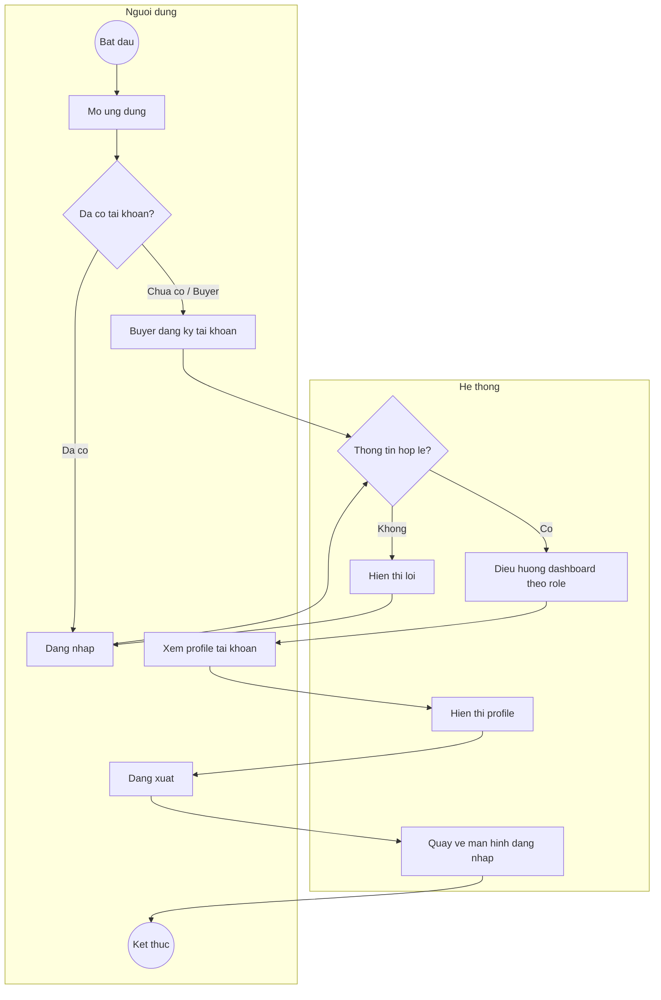
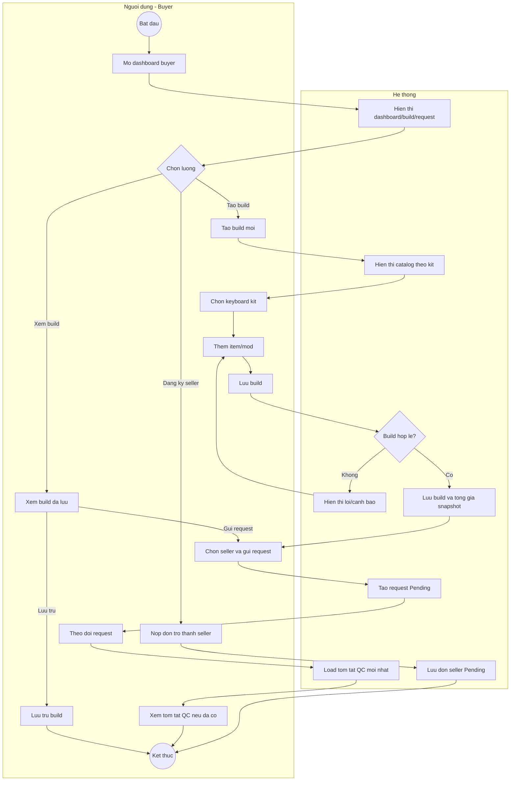
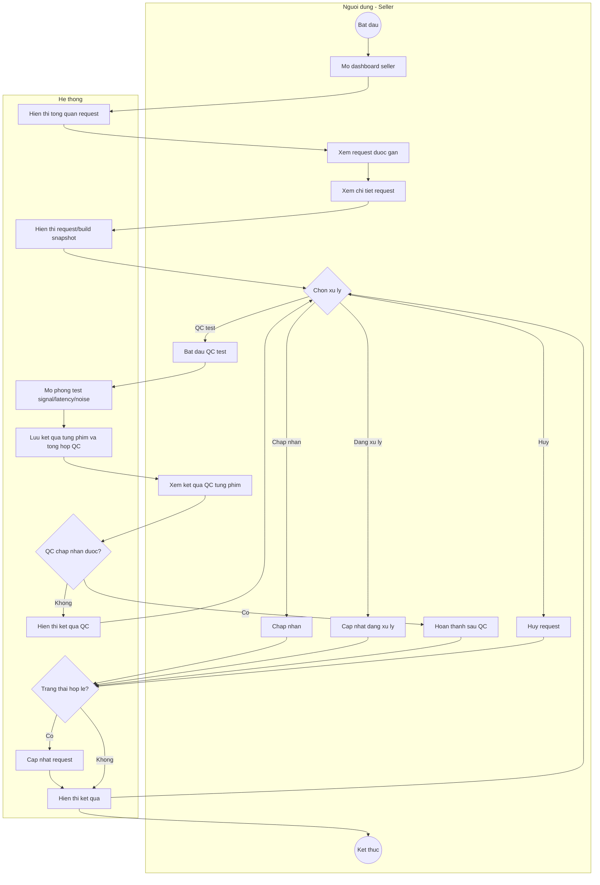
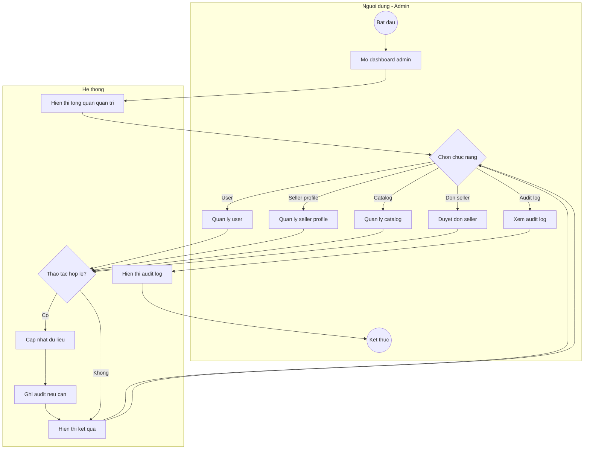
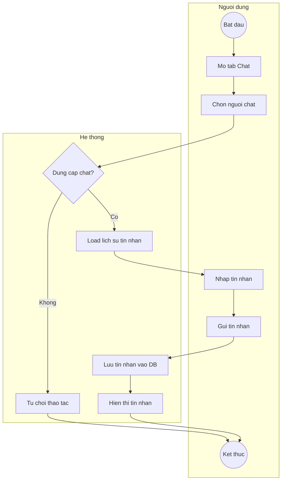
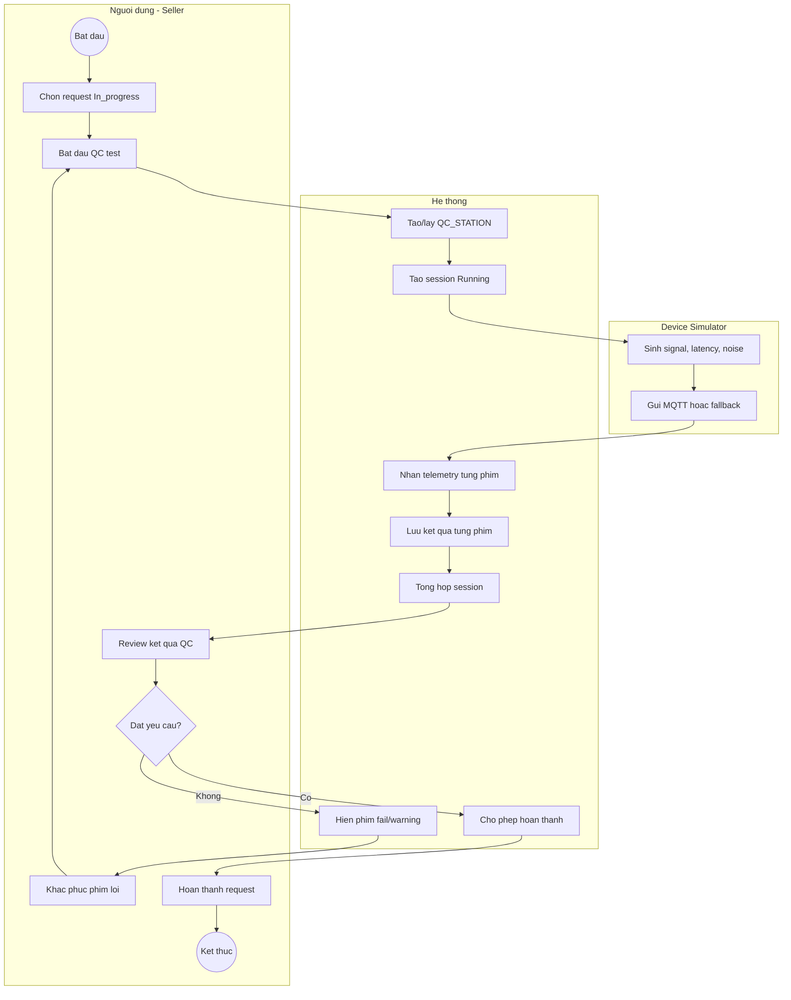

# Custom Keyboard Builder - Activity Diagrams Simplified

Tai lieu nay la ban rut gon cua `Custom_Keyboard_Activity_Diagrams_Refactor.md`.
Muc tieu la de trinh bay nhanh cac luong chinh theo ERD/FHD refactor, giu dung pham vi:

- Buyer tao build tu keyboard kit, gui request va co the nop don tro thanh seller.
- Seller xu ly request duoc gan va chay QC test mo phong truoc khi hoan thanh.
- Admin quan tri user/seller profile/catalog/audit va duyet don seller.
- Chat chi ho tro Buyer-Seller va Seller-Admin/Admin-Seller.
- Device/QC mo phong ket qua test tung phim qua MQTT hoac fallback in-process.

## AD-S01: Tai Khoan

| FHD | Pham vi |
| --- | --- |
| 1.1 | Buyer tu dang ky tai khoan moi. |
| 1.2 | Buyer/Seller/Admin dang nhap. |
| 1.3 | Dang xuat. |
| 1.4 | Xem profile tai khoan. |

## AD-S02: Buyer Tao Build Va Gui Request

| FHD | Pham vi |
| --- | --- |
| 2.1-2.8 | Xem dashboard/build, tao build, chon kit, them item/mod, kiem tra va luu build. |
| 2.9-2.11 | Chon seller verified, gui request, theo doi trang thai va xem tom tat QC neu seller da test. |
| 2.12 | Luu tru build. |
| 2.13 | Nop don tro thanh seller. |
| 6.7 | Buyer xem tom tat session QC da duoc seller chay. |

## AD-S03: Seller Xu Ly Request

| FHD | Pham vi |
| --- | --- |
| 3.1-3.3 | Xem dashboard, danh sach request va chi tiet request. |
| 3.4-3.7 | Chap nhan, cap nhat dang xu ly, hoan thanh hoac huy request. |
| 3.8-3.10 | Bat dau QC, xem ket qua tung phim va xac nhan hoan thanh sau QC. |
| 6.1-6.7 | Tao/lay tram QC, tao session, kiem tra signal/latency/noise va tong hop ket qua. |

## AD-S04: Admin Quan Tri

| FHD | Pham vi |
| --- | --- |
| 4.1 | Xem dashboard admin. |
| 4.2 | Quan ly user va role/active status. |
| 4.3 | Quan ly seller profile va verified status. |
| 4.4 | Quan ly catalog keyboard. |
| 4.5 | Xem audit log. |
| 4.6 | Duyet hoac tu choi don xin lam seller. |

## AD-S05: Chat

| FHD | Pham vi |
| --- | --- |
| 5.1 | Buyer chat voi seller. |
| 5.2 | Seller chat voi buyer. |
| 5.3 | Seller chat voi admin. |
| 5.4 | Admin chat voi seller. |

## AD-S06: Device/QC Kiem Tra Keyboard

| FHD | Pham vi |
| --- | --- |
| 6.1 | Tao hoac lay tram QC mo phong cua seller. |
| 6.2 | Tao phien QC gan voi request dang In_progress. |
| 6.3 | Kiem tra press/release signal, wrong key, no signal. |
| 6.4 | Kiem tra latency tung phim, dac biet phim HE. |
| 6.5 | Kiem tra do on tung phim. |
| 6.6 | Xem ket qua tung phim va failure_type. |
| 6.7 | Tong hop session Passed/Warning/Failed. |

## Bang Kiem Tra Coverage

| Nhom | FHD | Activity diagram bao phu |
| --- | --- | --- |
| Tai khoan | 1.1, 1.2, 1.3, 1.4 | AD-S01 |
| Buyer build/request | 2.1, 2.2, 2.3, 2.4, 2.5, 2.6, 2.7, 2.8, 2.9, 2.10, 2.11, 2.12, 2.13 | AD-S02 |
| Seller request/QC | 3.1, 3.2, 3.3, 3.4, 3.5, 3.6, 3.7, 3.8, 3.9, 3.10 | AD-S03, AD-S06 |
| Admin | 4.1, 4.2, 4.3, 4.4, 4.5, 4.6 | AD-S04 |
| Chat | 5.1, 5.2, 5.3, 5.4 | AD-S05 |
| Device/QC | 6.1, 6.2, 6.3, 6.4, 6.5, 6.6, 6.7 | AD-S03, AD-S06 |

## Ranh Gioi

- Ban rut gon nay khong thay the ban chi tiet; dung de tong quan va trinh bay.
- Khong mo ta tung nut UI, DTO, service method, database column hoac realtime detail.
- Logic validation chi tiet van nam trong `Keyboard_Build_Validation_Logic.md`, DFD Level 2 va code service.
- Device/QC trong phase nay la mo phong du lieu, khong nhung phan cung that; MQTT la transport chinh, fallback in-process chi dung khi MQTT tat/khong kha dung hoac khi test.
