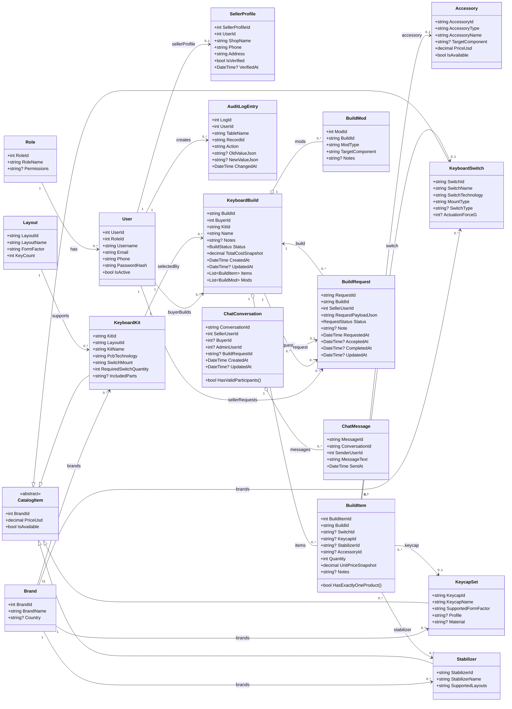
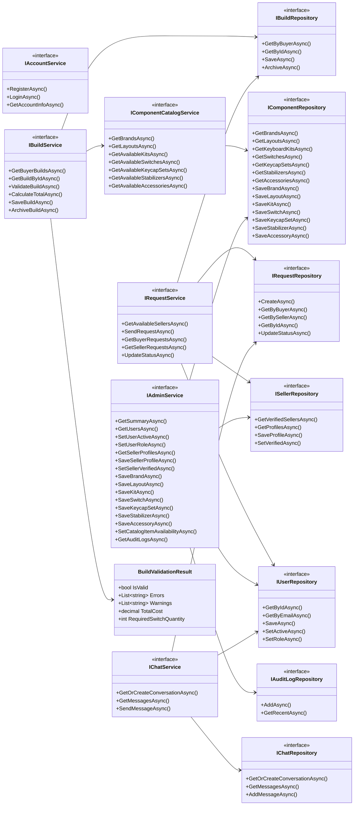
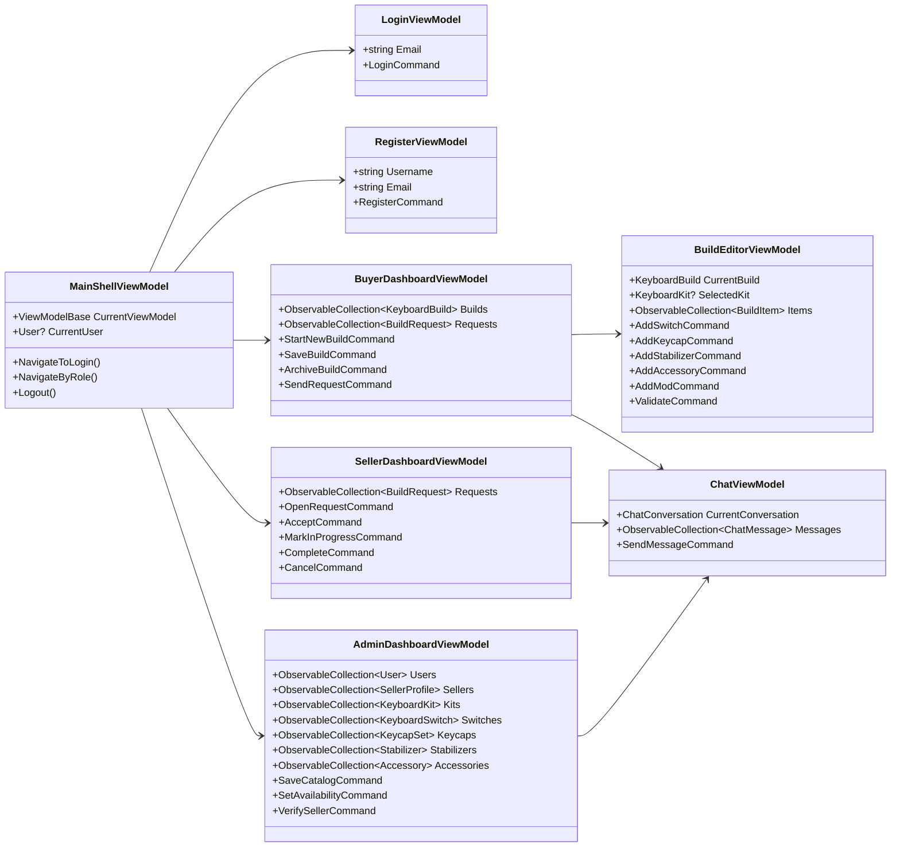

# Custom Keyboard Builder - Class Diagram Refactor

Tai lieu nay la class diagram muc thiet ke code cho refactor theo ERD moi trong `Documents_Refactor`.

Muc tieu cua diagram:

- Lam ro cac lop domain can co sau refactor.
- Lam ro service/repository interface can sua.
- Tranh giu sot model cu: `KeyboardCase`, `Pcb`, `Plate`, `CompatibilityRule`.
- Phu hop voi flow moi: Buyer chon `KeyboardKit`, sau do them switch/keycap/stabilizer/accessory vao `BuildItem`.

## Nguyen Tac Refactor

| Cu | Moi |
| --- | --- |
| Build chon `Layout`, `Case`, `PCB`, `Plate` rieng. | Build chon `KeyboardKit`; kit da gom case/PCB/plate o muc mo ta. |
| Build luu `switch_id`, `keycap_id`, `stab_id` tren bang builds. | Build luu cac add-on qua `BuildItem`. |
| `switch_quantity` nam tren build. | Quantity cua switch nam tren `BuildItem.Quantity`. |
| Compatibility rule case/PCB/plate. | Kiem tra tuong thich theo kit va build items. |
| Inventory/seller price. | Khong co trong phase refactor nay. |

## Domain Model Class Diagram

## Service Va Repository Class Diagram

## MVVM/ViewModel Class Diagram

## Logic Validation Can Nam Trong BuildService

| Nhom | Kiem tra |
| --- | --- |
| Build metadata | Buyer active, ten build khong rong, status hop le. |
| Kit | Kit ton tai, available, co layout hop le, `RequiredSwitchQuantity > 0`. |
| BuildItem | Moi item set dung mot FK san pham; `Quantity > 0`; item ton tai va available. |
| Switch | Switch technology khop kit `PcbTechnology`; switch mount khop kit `SwitchMount`; tong quantity switch >= `RequiredSwitchQuantity`. |
| Keycap | `SupportedFormFactor` phu hop layout/form factor cua kit. |
| Stabilizer | `SupportedLayouts` phu hop layout/form factor cua kit. |
| Accessory | `TargetComponent` nam trong Switch/Stabilizer/Kit/General. |
| Price | `TotalCostSnapshot = kit price + sum(item quantity * unit price snapshot)`. |

## Mapping Voi FHD Refactor

| FHD | Lop chinh |
| --- | --- |
| 1. Tai khoan | `User`, `Role`, `IAccountService`, `LoginViewModel`, `RegisterViewModel` |
| 2. Buyer - Tao build tu kit | `KeyboardBuild`, `KeyboardKit`, `BuildItem`, `BuildMod`, `IBuildService`, `BuyerDashboardViewModel`, `BuildEditorViewModel` |
| 3. Seller - Xu ly request | `BuildRequest`, `IRequestService`, `SellerDashboardViewModel` |
| 4. Admin - Quan tri he thong | `User`, `SellerProfile`, catalog classes, `IAdminService`, `AdminDashboardViewModel`, `AuditLogEntry` |
| 5. Chat | `ChatConversation`, `ChatMessage`, `IChatService`, `ChatViewModel` |

## Cac Lop Cu Can Loai Bo Hoac Thay The Khi Refactor

| Lop/interface hien tai | Huong refactor |
| --- | --- |
| `KeyboardCase` | Bo khoi build flow; thong tin case nam trong `KeyboardKit.IncludedParts`. |
| `Pcb` | Bo khoi build flow; `KeyboardKit.PcbTechnology` va `KeyboardKit.SwitchMount` la du cho validation. |
| `Plate` | Bo khoi build flow; nam trong `KeyboardKit.IncludedParts`. |
| `CompatibilityRule` | Bo; thay bang validation truc tiep giua kit va build items. |
| `KeyboardBuild.SwitchId/KeycapId/StabilizerId` | Bo; thay bang `KeyboardBuild.Items`. |
| `KeyboardBuild.LayoutId` | Bo; layout lay qua `KeyboardKit.LayoutId`. |
| `KeyboardBuild.SwitchQuantity` | Khong tao; quantity nam tren `BuildItem`. |
| `IComponentCatalogService.GetCasesForLayoutAsync` | Bo. |
| `IComponentCatalogService.GetPcbsForLayoutAsync` | Bo. |
| `IComponentCatalogService.GetPlatesForLayoutAsync` | Bo. |
| `IComponentCatalogService.GetCompatibilityRulesAsync` | Bo. |
| `AdminComponentType.Case/Pcb/Plate` | Bo; them `Kit`, `Switch`, `KeycapSet`, `Stabilizer`, `Accessory`. |

## Ghi Chu Trien Khai

- File nay la target class diagram cho refactor, khong phai anh chup code hien tai.
- Nen refactor theo thu tu: domain models -> repository interfaces -> services -> view models -> SQL schema/seed.
- `BuildItem` dung nullable FK theo ERD, nhung trong code nen co helper `HasExactlyOneProduct()` de validation ro rang.
- `BuildRequest` khong luu `BuyerId`; buyer lay qua `Build.BuyerId`.
- Chat conversation luon co seller va dung mot trong `BuyerId` hoac `AdminUserId`.

