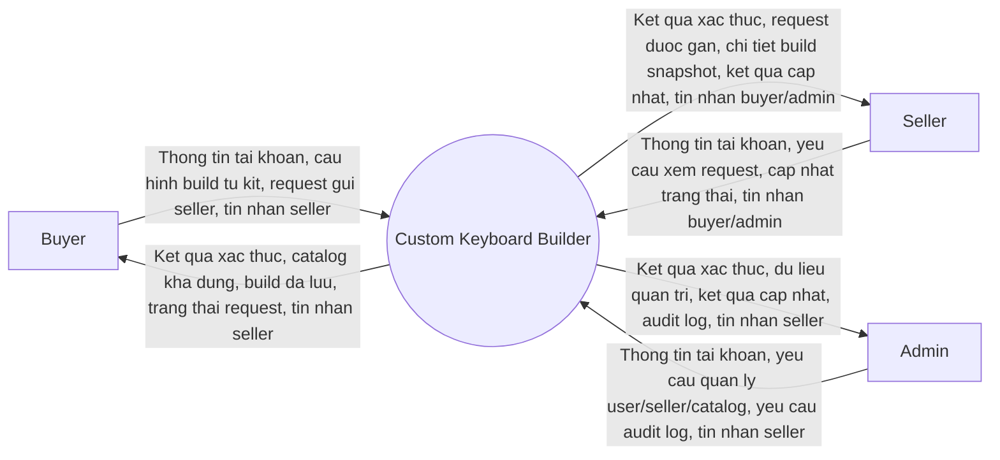
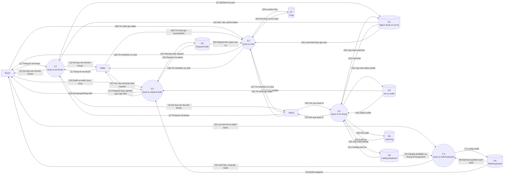

# Custom Keyboard Builder - DFD Context va Level 0 Refactor

Tai lieu nay mo ta DFD muc ngu canh va DFD Level 0 theo ERD refactor. He thong hien duoc thiet ke theo huong buyer chon `keyboard_kits`, sau do them switch, keycap, stabilizer package, accessory va mod note.

Pham vi refactor khong co seller inventory, khong chon case/PCB/plate rieng le, va khong co chat truc tiep Buyer-Admin.

## DFD Muc Ngu Canh

### Tac Nhan Ngoai

| Tac nhan | Vai tro |
| --- | --- |
| Buyer | Dang ky/dang nhap, tao build tu kit, them build items, luu build, gui request, theo doi request va chat voi seller. |
| Seller | Dang nhap, xem request duoc gan, xem chi tiet build, cap nhat trang thai request va chat voi buyer/admin. |
| Admin | Dang nhap, quan ly user, seller profile, catalog, audit log va chat voi seller. |

### Luong Du Lieu Muc Ngu Canh

| Ma | Nguon | Dich | Luong du lieu |
| --- | --- | --- | --- |
| C1 | Buyer | System | Thong tin tai khoan, lua chon kit/build items, build notes, request seller, tin nhan gui seller |
| C2 | System | Buyer | Ket qua xac thuc, catalog available, canh bao tuong thich, tong gia, build/request status, tin nhan seller |
| C3 | Seller | System | Thong tin tai khoan, yeu cau request, status moi, tin nhan gui buyer/admin |
| C4 | System | Seller | Ket qua xac thuc, danh sach request, chi tiet build snapshot, ket qua cap nhat, tin nhan buyer/admin |
| C5 | Admin | System | Thong tin tai khoan, thao tac user/seller/catalog, yeu cau audit, tin nhan gui seller |
| C6 | System | Admin | Ket qua xac thuc, danh sach user/seller/catalog, ket qua cap nhat, audit log, tin nhan seller |

## DFD Level 0

### Cac Tien Trinh Chinh

| Ma | Tien trinh | Y nghia |
| --- | --- | --- |
| 1.0 | Quan ly tai khoan | Xu ly dang ky, dang nhap, dang xuat va tra cuu tai khoan. |
| 2.0 | Quan ly build keyboard | Xu ly catalog, cau hinh build tu kit, kiem tra tuong thich, tinh tong gia va luu build. |
| 3.0 | Quan ly request build | Xu ly buyer gui request cho seller va seller cap nhat trang thai. |
| 4.0 | Quan tri he thong | Xu ly quan ly user, seller profile, catalog va audit log. |
| 5.0 | Quan ly chat | Xu ly hoi thoai Buyer-Seller va Seller-Admin/Admin-Seller. |

### Cac Kho Du Lieu

| Ma | Kho du lieu | Noi dung tong quat |
| --- | --- | --- |
| D1 | Nguoi dung va vai tro | Users, roles, trang thai active. |
| D2 | Ho so seller | Seller profile va trang thai verified. |
| D3 | Catalog keyboard | Brands, layouts, keyboard kits, switches, keycap sets, stabilizers, accessories. |
| D4 | Build keyboard | Builds, build items, build mods va total cost snapshot. |
| D5 | Request build | Build requests, payload snapshot, status va cac moc thoi gian. |
| D6 | Audit log | Lich su thao tac quan trong. |
| D7 | Chat | Chat conversations va chat messages. |

### So Do Level 0

### Chu Thich Luong Du Lieu Level 0

| So | Nguon | Dich | Luong du lieu |
| --- | --- | --- | --- |
| (1) | Buyer/Seller/Admin | 1.0 | Dang ky, dang nhap, dang xuat hoac xem tai khoan |
| (2) | 1.0 | Buyer/Seller/Admin | Ket qua xac thuc, role va thong tin tai khoan |
| (3) | 1.0 | D1 | Yeu cau tao/kiem tra user |
| (4) | D1 | 1.0 | User, role, password hash, active status |
| (5) | Buyer | 2.0 | Kit, switch/keycap/stab/accessory, quantity, mod notes |
| (6) | D3 | 2.0 | Catalog available, layout/form factor, technology, mount type, price |
| (7) | 2.0 | D4 | Build, build items, build mods va total cost snapshot |
| (8) | D4 | 2.0 | Build da luu hoac danh sach build cua buyer |
| (9) | 2.0 | Buyer | Canh bao tuong thich, tong gia, ket qua luu build |
| (10) | Buyer | 3.0 | Build id, seller id, request note |
| (11) | Seller | 3.0 | Yeu cau xem request hoac status moi |
| (12) | D2 | 3.0 | Seller profile verified |
| (13) | D4 | 3.0 | Build snapshot dung de tao request |
| (14) | 3.0 | D5 | Request moi hoac request da cap nhat |
| (15) | D5 | 3.0 | Request, payload snapshot, status |
| (16) | 3.0 | Buyer | Ket qua gui request va status hien tai |
| (17) | 3.0 | Seller | Request duoc gan, chi tiet request, ket qua cap nhat |
| (18) | Admin | 4.0 | Yeu cau quan ly user, seller profile, catalog hoac audit |
| (19) | D1 | 4.0 | User, role va active status |
| (20) | D2 | 4.0 | Seller profile va verified status |
| (21) | D3 | 4.0 | Catalog keyboard hien tai |
| (22) | D6 | 4.0 | Audit log |
| (23) | 4.0 | D1 | User/role/active status da cap nhat |
| (24) | 4.0 | D2 | Seller profile da cap nhat |
| (25) | 4.0 | D3 | Brand/layout/kit/switch/keycap/stab/accessory da cap nhat |
| (26) | 4.0 | D6 | Audit log moi |
| (27) | 4.0 | Admin | Ket qua thao tac quan tri |
| (28) | Buyer | 5.0 | Tin nhan buyer gui seller |
| (29) | Seller | 5.0 | Tin nhan seller gui buyer/admin |
| (30) | Admin | 5.0 | Tin nhan admin gui seller |
| (31) | D1 | 5.0 | User/role/active status cua participant |
| (32) | D5 | 5.0 | Request lien quan neu conversation gan voi request |
| (33) | 5.0 | D7 | Hoi thoai/tin nhan can luu hoac tra cuu |
| (34) | D7 | 5.0 | Hoi thoai va tin nhan da luu |
| (35) | 5.0 | Buyer | Lich su chat hoac tin nhan tu seller |
| (36) | 5.0 | Seller | Lich su chat hoac tin nhan tu buyer/admin |
| (37) | 5.0 | Admin | Lich su chat hoac tin nhan tu seller |

## Ranh Gioi

- DFD Level 0 chi the hien tien trinh xu ly du lieu lon, khong mo ta tung man hinh UI.
- D3 gom catalog keyboard theo ERD refactor, khong co inventory va khong co case/PCB/plate rieng le.
- Cac chi tiet phuc tap duoc bung o Level 1 va Level 2.

