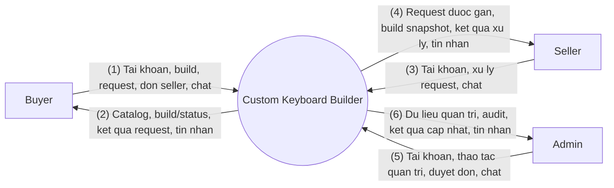
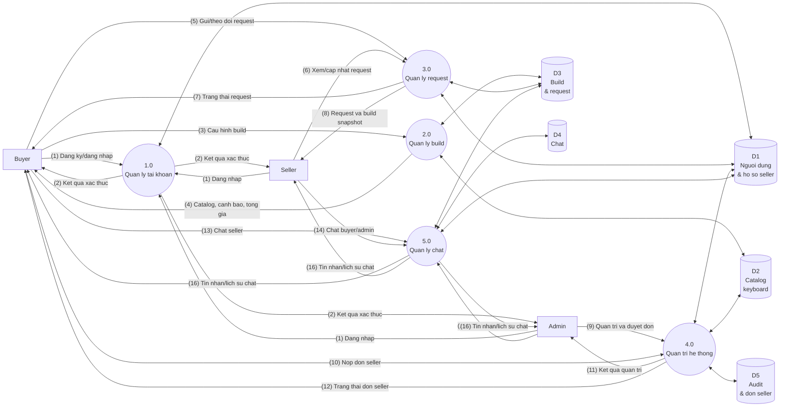

# Custom Keyboard Builder - DFD Context va Level 0 Simplified

Tai lieu nay la ban rut gon cua `Custom_Keyboard_DFD_Context_Level0_Refactor.md`.
Muc tieu la de dua vao bao cao/trinh bay: so do it mui ten, gom luong du lieu theo nhom, nhung van giu dung pham vi ERD/FHD refactor.

Ban chi tiet van nam trong `Custom_Keyboard_DFD_Context_Level0_Refactor.md`.

## Nguyen Tac Rut Gon

- Chi giu 3 tac nhan ngoai: Buyer, Seller, Admin.
- Chi giu 5 tien trinh muc 0 theo FHD: Tai khoan, Build, Request, Quan tri, Chat.
- Gop kho du lieu thanh nhom logic lon thay vi liet ke tat ca bang ERD.
- Luong du lieu tren so do dung nhan ngan; chi tiet duoc giai thich trong bang chu thich.
- Khong the hien tung thao tac UI, cot database, DTO hoac luong realtime.

## DFD Muc Ngu Canh - Rut Gon

### Chu Thich Muc Ngu Canh

| So | Luong du lieu |
| --- | --- |
| (1) | Buyer dang ky/dang nhap, tao build tu kit, gui request, nop don seller va gui tin nhan seller. |
| (2) | He thong tra catalog, canh bao/tong gia, build/request status, trang thai don seller va tin nhan seller. |
| (3) | Seller dang nhap, xem request, cap nhat trang thai request va gui tin nhan buyer/admin. |
| (4) | He thong tra request duoc gan, snapshot build, ket qua cap nhat va tin nhan buyer/admin. |
| (5) | Admin dang nhap, quan ly user/seller/catalog, xem audit, duyet don seller va gui tin nhan seller. |
| (6) | He thong tra dashboard/admin data, audit log, ket qua thao tac va tin nhan seller. |

## DFD Level 0 - Rut Gon

### Tien Trinh Level 0

| Ma | Tien trinh | Noi dung xu ly |
| --- | --- | --- |
| 1.0 | Quan ly tai khoan | Buyer dang ky; Buyer/Seller/Admin dang nhap, dang xuat va xem profile. |
| 2.0 | Quan ly build | Buyer chon kit, them item/mod, kiem tra tuong thich, tinh tong gia va luu build. |
| 3.0 | Quan ly request | Buyer gui build da luu cho seller verified; Seller xem va cap nhat trang thai request. |
| 4.0 | Quan tri he thong | Admin quan ly user, seller profile, catalog, audit log va duyet don xin seller. |
| 5.0 | Quan ly chat | Xu ly hoi thoai Buyer-Seller va Seller-Admin/Admin-Seller. |

### Kho Du Lieu Rut Gon

| Ma | Kho du lieu logic | Gom cac du lieu chinh |
| --- | --- | --- |
| D1 | Nguoi dung & ho so seller | Users, roles, seller profiles, trang thai active/verified. |
| D2 | Catalog keyboard | Brands, layouts, keyboard kits, switches, keycap sets, stabilizers, accessories. |
| D3 | Build & request | Builds, build items, build mods, request build va snapshot. |
| D4 | Chat | Chat conversations va chat messages. |
| D5 | Audit & don seller | Audit logs va seller applications. |

### Chu Thich Luong Du Lieu Level 0

| So | Luong du lieu |
| --- | --- |
| (1) | Thong tin tai khoan/dang nhap cua nguoi dung. |
| (2) | Ket qua xac thuc, role, active status va thong tin profile. |
| (3) | Kit, item, quantity, mod preset, note va yeu cau luu build. |
| (4) | Catalog kha dung, canh bao tuong thich, tong gia va build da luu. |
| (5) | Build id, seller id, note request va yeu cau xem tien do. |
| (6) | Yeu cau xem request duoc gan va status moi cua seller. |
| (7) | Ket qua gui request va trang thai hien tai cho buyer. |
| (8) | Request duoc gan, build snapshot va ket qua cap nhat cho seller. |
| (9) | Thao tac admin voi user, seller profile, catalog, audit va don seller. |
| (10) | Don xin lam seller gom shop name, phone, dia chi va ghi chu. |
| (11) | Ket qua thao tac quan tri va du lieu dashboard/admin. |
| (12) | Trang thai don seller: Pending, Approved hoac Rejected. |
| (13) | Tin nhan buyer gui seller. |
| (14) | Tin nhan seller gui buyer hoac admin. |
| (15) | Tin nhan admin gui seller. |
| (16) | Lich su chat va tin nhan moi tra ve cho nguoi tham gia. |

## Ranh Gioi

- Ban rut gon nay dung cho bao cao tong quan; neu can doi chieu chi tiet tung data store/flow, xem ban refactor day du.
- DFD khong co chat truc tiep Buyer-Admin.
- DFD khong co seller inventory, compatibility rules, case/PCB/plate rieng le; cac phan do da nam trong keyboard kit.
