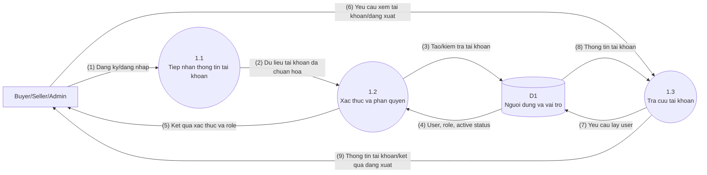
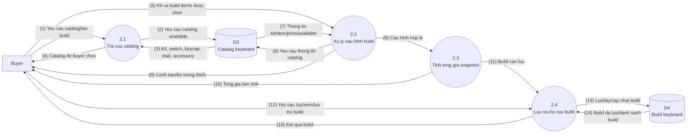
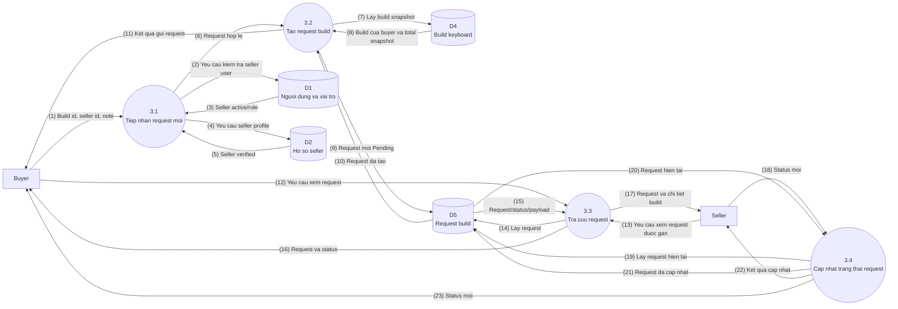
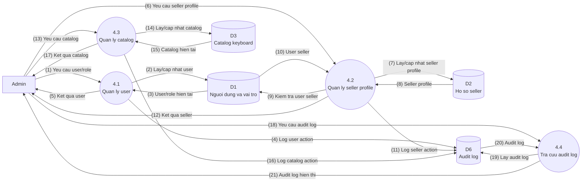
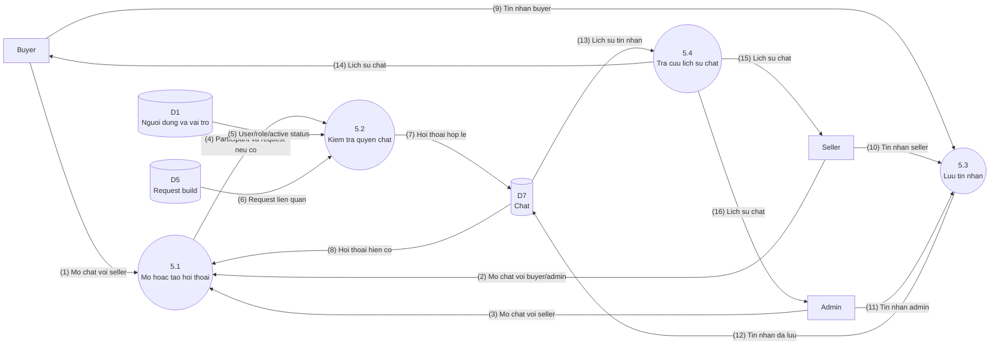

# Custom Keyboard Builder - DFD Level 1 Refactor

Tai lieu nay phan ra cac tien trinh Level 0 thanh cac tien trinh con theo xu ly du lieu. DFD Level 1 van giu muc nghiep vu, khong liet ke tung nut bam UI va khong dua chi tiet database column vao so do.

## DFD Level 1 - 1.0 Quan Ly Tai Khoan

## DFD Level 1 - 2.0 Quan Ly Build Keyboard

## DFD Level 1 - 3.0 Quan Ly Request Build

## DFD Level 1 - 4.0 Quan Tri He Thong

## DFD Level 1 - 5.0 Quan Ly Chat

## Chu Thich Can Bang Level 1

| Tien trinh Level 0 | Tien trinh con Level 1 |
| --- | --- |
| 1.0 Quan ly tai khoan | 1.1 Tiep nhan thong tin tai khoan; 1.2 Xac thuc va phan quyen; 1.3 Tra cuu tai khoan |
| 2.0 Quan ly build keyboard | 2.1 Tra cuu catalog; 2.2 Xu ly cau hinh build; 2.3 Tinh tong gia snapshot; 2.4 Luu va tra cuu build |
| 3.0 Quan ly request build | 3.1 Tiep nhan request moi; 3.2 Tao request build; 3.3 Tra cuu request; 3.4 Cap nhat trang thai request |
| 4.0 Quan tri he thong | 4.1 Quan ly user; 4.2 Quan ly seller profile; 4.3 Quan ly catalog; 4.4 Tra cuu audit log |
| 5.0 Quan ly chat | 5.1 Mo hoac tao hoi thoai; 5.2 Kiem tra quyen chat; 5.3 Luu tin nhan; 5.4 Tra cuu lich su chat |

## Ranh Gioi

- Level 1 khong tach tung thao tac UI nhu bam luu, bam gui request hay filter catalog.
- D3 khong co seller inventory va khong co case/PCB/plate rieng le.
- Chat chi co Buyer-Seller va Seller-Admin/Admin-Seller.

