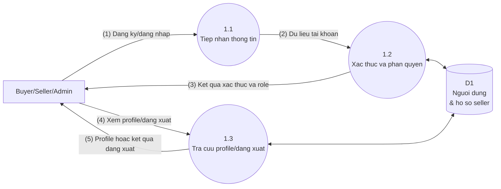
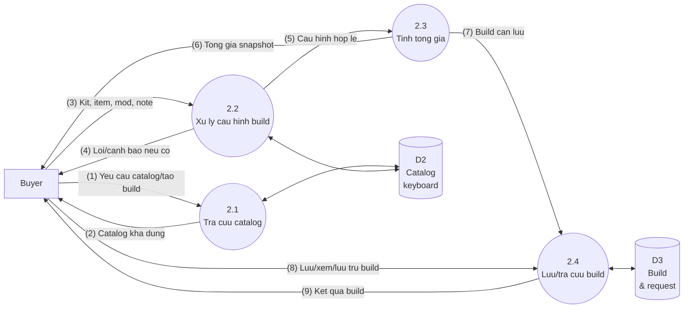
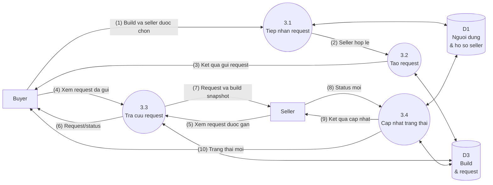
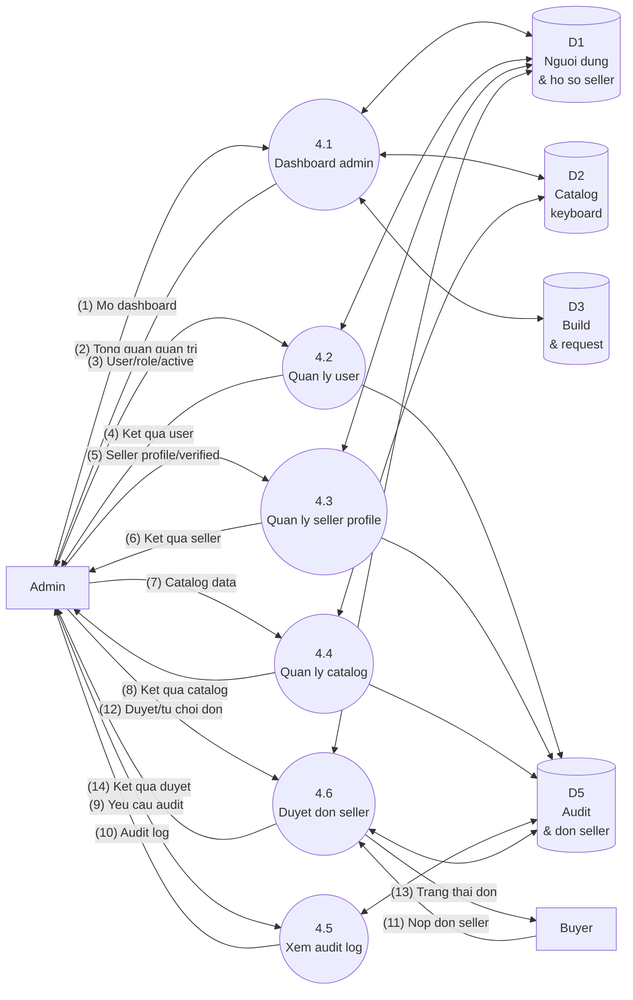
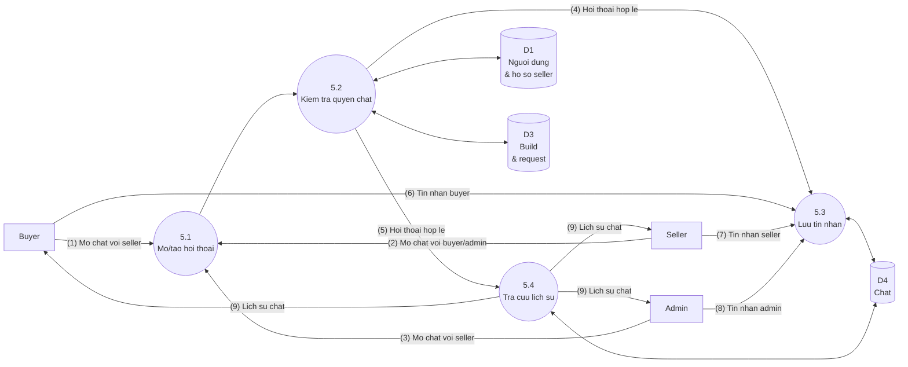
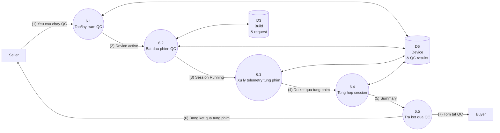

# Custom Keyboard Builder - DFD Level 1 Simplified

Tai lieu nay la ban rut gon cua `Custom_Keyboard_DFD_Level1_Refactor.md`.
Muc tieu la giu dung can bang voi DFD Level 0 rut gon, nhung moi so do Level 1 chi the hien cac xu ly va kho du lieu chinh.

## Quy Uoc Kho Du Lieu Rut Gon

| Ma | Kho du lieu logic | Tuong ung du lieu chinh |
| --- | --- | --- |
| D1 | Nguoi dung & ho so seller | Users, roles, seller profiles, active/verified status. |
| D2 | Catalog keyboard | Brands, layouts, keyboard kits, switches, keycaps, stabilizers, accessories. |
| D3 | Build & request | Builds, build items, build mods, build requests va request snapshot. |
| D4 | Chat | Chat conversations va chat messages. |
| D5 | Audit & don seller | Audit logs va seller applications. |
| D6 | Device & QC results | Devices, device test sessions va per-key QC results. |

## DFD Level 1 - 1.0 Quan Ly Tai Khoan

### Chu Thich

| So | Luong du lieu |
| --- | --- |
| (1) | Buyer dang ky hoac Buyer/Seller/Admin dang nhap. |
| (2) | Username/email/password/phone da chuan hoa. |
| (3) | Ket qua login, role, active status. |
| (4) | Yeu cau xem profile hoac ket thuc phien. |
| (5) | Thong tin profile cua chinh nguoi dung hoac ket qua dang xuat. |

## DFD Level 1 - 2.0 Quan Ly Build Keyboard

### Chu Thich

| So | Luong du lieu |
| --- | --- |
| (1) | Buyer mo catalog hoac bat dau build moi. |
| (2) | Kit, switch, keycap, stabilizer, accessory available va thong tin gia/tuong thich. |
| (3) | Kit duoc chon, item quantity, mod preset, switch mod quantity, spring weight va build notes. |
| (4) | Loi/canh bao: item khong hop kit, thieu switch, mod switch quantity khong hop le. |
| (5) | Cau hinh du dieu kien tinh gia. |
| (6) | Tong gia tam tinh theo catalog va quantity. |
| (7) | Build snapshot can luu. |
| (8) | Yeu cau luu build, xem build hoac archive build. |
| (9) | Build da luu, danh sach build hoac trang thai archive. |

## DFD Level 1 - 3.0 Quan Ly Request Build

### Chu Thich

| So | Luong du lieu |
| --- | --- |
| (1) | Build id, seller id va request note. |
| (2) | Seller active, role Seller va profile verified. |
| (3) | Request moi trang thai Pending hoac loi neu khong hop le. |
| (4) | Buyer xem tien do request da gui. |
| (5) | Seller xem request duoc gan cho minh. |
| (6) | Trang thai request cho Buyer. |
| (7) | Snapshot build va thong tin request cho Seller. |
| (8) | Accepted, In_progress, Completed hoac Cancelled theo state machine. |
| (9) | Ket qua xu ly cho Seller. |
| (10) | Trang thai request moi cho Buyer. |

## DFD Level 1 - 4.0 Quan Tri He Thong

### Chu Thich

| So | Luong du lieu |
| --- | --- |
| (1) | Admin xem tong quan user, seller, catalog va request. |
| (2) | Dashboard admin. |
| (3) | Yeu cau xem/khoa/mo/cap nhat role user. |
| (4) | Ket qua thao tac user va audit neu can. |
| (5) | Yeu cau tao/cap nhat/verify/unverify seller profile. |
| (6) | Ket qua thao tac seller profile va audit neu can. |
| (7) | Yeu cau them/sua/an/hien catalog. |
| (8) | Ket qua thao tac catalog va audit neu can. |
| (9) | Bo loc/yeu cau xem audit log. |
| (10) | Lich su thao tac quan trong. |
| (11) | Don seller cua Buyer: shop name, phone, address, note. |
| (12) | Admin chap nhan hoac tu choi don. |
| (13) | Pending, Approved hoac Rejected. |
| (14) | Neu approve: role Seller, seller profile verified va audit duoc cap nhat. |

## DFD Level 1 - 5.0 Quan Ly Chat

### Chu Thich

| So | Luong du lieu |
| --- | --- |
| (1) | Buyer chi mo chat voi seller hop le. |
| (2) | Seller mo chat voi buyer lien quan request hoac admin. |
| (3) | Admin mo chat voi seller. |
| (4) | Conversation Buyer-Seller hoac Seller-Admin/Admin-Seller da duoc validate. |
| (5) | Yeu cau lay lich su conversation hop le. |
| (6) | Tin nhan Buyer gui Seller. |
| (7) | Tin nhan Seller gui Buyer hoac Admin. |
| (8) | Tin nhan Admin gui Seller. |
| (9) | Lich su chat va tin nhan moi. |

## DFD Level 1 - 6.0 Device/QC Kiem Tra Keyboard

### Chu Thich

| So | Luong du lieu |
| --- | --- |
| (1) | Seller chay QC cho request dang In_progress. |
| (2) | QC_STATION cua seller duoc tao hoac lay lai. |
| (3) | Session Running gan request, seller, device, switch technology, noise requirement va total keys. |
| (4) | Telemetry tung phim da duoc luu thanh key result. |
| (5) | Tested/pass/warning/fail, average/max latency va noise. |
| (6) | Seller xem ket qua tung key va failure type. |
| (7) | Buyer xem QC summary moi nhat theo request. |

## Kiem Tra Can Bang Voi Level 0 Rut Gon

| Level 0 | Level 1 rut gon |
| --- | --- |
| 1.0 Quan ly tai khoan | 1.1 Tiep nhan thong tin; 1.2 Xac thuc va phan quyen; 1.3 Tra cuu profile/dang xuat |
| 2.0 Quan ly build | 2.1 Tra cuu catalog; 2.2 Xu ly cau hinh build; 2.3 Tinh tong gia; 2.4 Luu/tra cuu build |
| 3.0 Quan ly request | 3.1 Tiep nhan request; 3.2 Tao request; 3.3 Tra cuu request; 3.4 Cap nhat trang thai |
| 4.0 Quan tri he thong | 4.1 Dashboard admin; 4.2 Quan ly user; 4.3 Quan ly seller profile; 4.4 Quan ly catalog; 4.5 Xem audit log; 4.6 Duyet don seller |
| 5.0 Quan ly chat | 5.1 Mo/tao hoi thoai; 5.2 Kiem tra quyen chat; 5.3 Luu tin nhan; 5.4 Tra cuu lich su |
| 6.0 Device/QC | 6.1 Tao/lay tram QC; 6.2 Bat dau phien QC; 6.3 Xu ly telemetry tung phim; 6.4 Tong hop session; 6.5 Tra ket qua QC |

## Ranh Gioi

- Ban rut gon khong thay the file Level 1 chi tiet.
- Khong co chat truc tiep Buyer-Admin.
- Khong co seller inventory, compatibility rules, case/PCB/plate rieng le.
- Device/QC la simulator va luu DB-first; MQTT chi la transport, fallback in-process khong lam mat ket qua.
