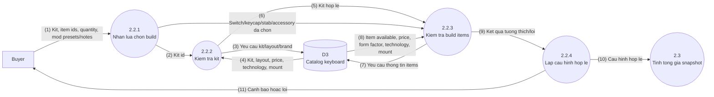
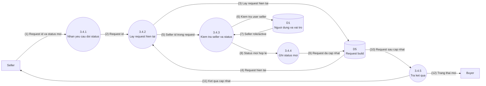
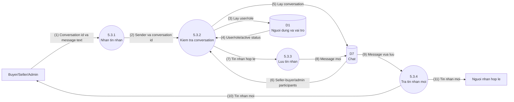

# Custom Keyboard Builder - DFD Level 2 Refactor

Tai lieu nay chi phan ra cac tien trinh Level 1 co logic du lieu phuc tap:

- `2.2 Xu ly cau hinh build`
- `3.4 Cap nhat trang thai request`
- `5.3 Luu tin nhan`

Nhung tien trinh CRUD quan tri da du ro o Level 1 va Use Cases nen khong bung tiep de tranh trung lap.

## DFD Level 2 - 2.2 Xu Ly Cau Hinh Build

### Chu Thich Luong Du Lieu

| So | Nguon | Dich | Luong du lieu |
| --- | --- | --- | --- |
| (1) | Buyer | 2.2.1 | Kit duoc chon, switch/keycap/stab/accessory, quantity, mod preset, switch mod quantity va spring weight neu la Spring swap |
| (2) | 2.2.1 | 2.2.2 | Kit id can kiem tra |
| (3) | 2.2.2 | D3 | Yeu cau lay keyboard kit, layout va brand |
| (4) | D3 | 2.2.2 | Kit available, layout/form factor, required switch quantity, technology, mount, price |
| (5) | 2.2.2 | 2.2.3 | Kit hop le lam nen tang kiem tra item |
| (6) | 2.2.1 | 2.2.3 | Danh sach build items da chon |
| (7) | 2.2.3 | D3 | Yeu cau lay switch, keycap, stabilizer va accessory |
| (8) | D3 | 2.2.3 | Available status, price va thuoc tinh can so voi kit |
| (9) | 2.2.3 | 2.2.4 | Ket qua: switch technology/mount khop kit, keycap/stab support layout, accessory target hop le, quantity hop le, Spring swap 30-76g |
| (10) | 2.2.4 | 2.3 | Cau hinh build hop le de tinh gia |
| (11) | 2.2.4 | Buyer | Canh bao hoac loi tuong thich hien tren UI |

## DFD Level 2 - 3.4 Cap Nhat Trang Thai Request

### Rule Trang Thai Request

| Trang thai hien tai | Trang thai co the chuyen | Ghi chu |
| --- | --- | --- |
| Pending | Accepted, Cancelled | Seller nhan request hoac huy. |
| Accepted | In_progress, Cancelled | Seller bat dau xu ly hoac huy. |
| In_progress | Completed, Cancelled | Seller hoan thanh hoac huy. |
| Completed | Khong chuyen tiep | Trang thai ket thuc. |
| Cancelled | Khong chuyen tiep | Trang thai ket thuc. |

## DFD Level 2 - 5.3 Luu Tin Nhan

### Chu Thich Chat

| Kiem tra | Noi dung |
| --- | --- |
| Participant | Sender phai la seller, buyer hoac admin cua conversation. |
| Cap chat | Conversation hop le la Buyer-Seller hoac Admin-Seller. |
| Buyer-Admin | Khong cho tao/guid tin nhan truc tiep Buyer-Admin. |
| Noi dung | Message text khong duoc rong. |

## Kiem Tra Can Bang Voi Level 1

| Level 1 | Level 2 |
| --- | --- |
| 2.2 Xu ly cau hinh build | 2.2.1 Nhan lua chon build; 2.2.2 Kiem tra kit; 2.2.3 Kiem tra build items; 2.2.4 Lap cau hinh hop le |
| 3.4 Cap nhat trang thai request | 3.4.1 Nhan yeu cau doi status; 3.4.2 Lay request hien tai; 3.4.3 Kiem tra seller va status; 3.4.4 Ghi status moi; 3.4.5 Tra ket qua |
| 5.3 Luu tin nhan | 5.3.1 Nhan tin nhan; 5.3.2 Kiem tra conversation; 5.3.3 Luu tin nhan; 5.3.4 Tra tin nhan moi |

## Ranh Gioi Level 2

- Level 2 khong tach case, PCB, plate thanh tien trinh rieng; cac phan nay da nam trong keyboard kit.
- Level 2 khong co seller inventory, stock hay seller price.
- Khong dua API, DTO, controller, migration hoac chi tiet bang/cot vao so do.
