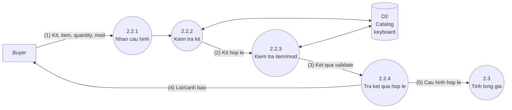
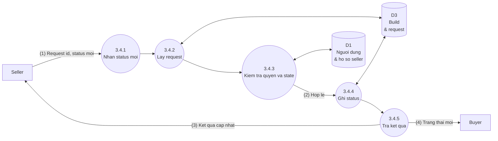
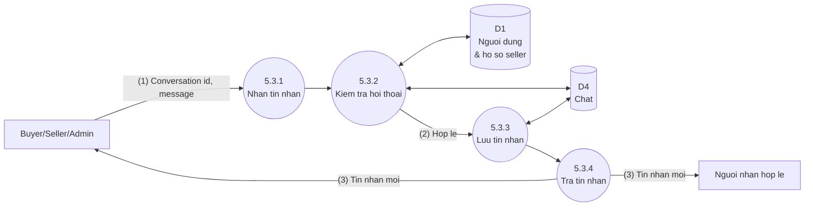

# Custom Keyboard Builder - DFD Level 2 Simplified

Tai lieu nay la ban rut gon cua `Custom_Keyboard_DFD_Level2_Refactor.md`.
Level 2 chi bung cac tien trinh co logic nghiep vu can lam ro:

- `2.2 Xu ly cau hinh build`
- `3.4 Cap nhat trang thai request`
- `5.3 Luu tin nhan`

Nhung tien trinh CRUD quan tri khong bung Level 2 trong ban nay vi da du ro o Use Cases va DFD Level 1.

## DFD Level 2 - 2.2 Xu Ly Cau Hinh Build

### Chu Thich

| So | Luong du lieu |
| --- | --- |
| (1) | Kit, switch/keycap/stabilizer/accessory, quantity, mod preset, switch mod quantity va spring weight neu la Spring swap. |
| (2) | Kit available, layout/form factor, required switch quantity, PCB technology va switch mount. |
| (3) | Ket qua kiem tra: item available, switch tech/mount khop kit, keycap/stab hop layout, so switch va mod quantity hop le. |
| (4) | Loi/canh bao hien cho Buyer neu cau hinh chua hop le. |
| (5) | Cau hinh hop le de tinh tong gia snapshot. |

## DFD Level 2 - 3.4 Cap Nhat Trang Thai Request

### Rule Trang Thai Request

| Trang thai hien tai | Trang thai co the chuyen |
| --- | --- |
| Pending | Accepted, Cancelled |
| Accepted | In_progress, Cancelled |
| In_progress | Completed, Cancelled |
| Completed | Khong chuyen tiep |
| Cancelled | Khong chuyen tiep |

### Chu Thich

| So | Luong du lieu |
| --- | --- |
| (1) | Seller gui request id va status moi. |
| (2) | Seller phai active, dung request duoc gan va status transition phai hop le. |
| (3) | Ket qua thanh cong hoac loi cho Seller. |
| (4) | Trang thai request moi de Buyer theo doi. |

## DFD Level 2 - 5.3 Luu Tin Nhan

### Chu Thich

| So | Luong du lieu |
| --- | --- |
| (1) | Sender gui conversation id va noi dung message khong rong. |
| (2) | Sender la participant cua conversation; cap chat chi la Buyer-Seller hoac Seller-Admin/Admin-Seller. |
| (3) | Tin nhan vua luu tra ve cho cac participant hop le. |

## Kiem Tra Can Bang Voi Level 1

| Level 1 | Level 2 rut gon |
| --- | --- |
| 2.2 Xu ly cau hinh build | 2.2.1 Nhan cau hinh; 2.2.2 Kiem tra kit; 2.2.3 Kiem tra item/mod; 2.2.4 Tra ket qua hop le |
| 3.4 Cap nhat trang thai request | 3.4.1 Nhan status moi; 3.4.2 Lay request; 3.4.3 Kiem tra quyen va state; 3.4.4 Ghi status; 3.4.5 Tra ket qua |
| 5.3 Luu tin nhan | 5.3.1 Nhan tin nhan; 5.3.2 Kiem tra hoi thoai; 5.3.3 Luu tin nhan; 5.3.4 Tra tin nhan |

## Ranh Gioi

- Khong co chat truc tiep Buyer-Admin.
- Khong co seller inventory, stock hay seller price.
- Khong tach case, PCB, plate thanh tien trinh rieng; cac thanh phan do nam trong keyboard kit.
