# Custom Keyboard Builder - FHD Refactor

Tai lieu nay mo ta Functional Hierarchy Diagram moi theo ERD refactor trong `Documents_Refactor`, da bo sung Device Layer de mo phong tram QC keyboard.

FHD chi dung den cap `x.x` de giu vai tro la so do phan ra chuc nang tong quan. Cac thao tac chi tiet hon duoc dua sang tai lieu Use Cases theo role.

## FHD Tong Quan

```mermaid
flowchart TD
    A["0. Custom Keyboard Builder"]

    A --> B["1. Tai khoan"]
    A --> C["2. Buyer - Tao build tu kit"]
    A --> D["3. Seller - Xu ly request"]
    A --> E["4. Admin - Quan tri he thong"]
    A --> F["5. Chat"]
    A --> G["6. Device/QC - Kiem tra keyboard"]

    B --> B1["1.1 Dang ky"]
    B --> B2["1.2 Dang nhap"]
    B --> B3["1.3 Dang xuat"]
    B --> B4["1.4 Xem profile tai khoan"]

    C --> C1["2.1 Xem dashboard buyer"]
    C --> C2["2.2 Xem danh sach build"]
    C --> C3["2.3 Tao build moi"]
    C --> C4["2.4 Chon keyboard kit"]
    C --> C5["2.5 Them linh kien vao build"]
    C --> C6["2.6 Xem canh bao tuong thich"]
    C --> C7["2.7 Xem tong gia"]
    C --> C8["2.8 Luu build"]
    C --> C9["2.9 Chon seller"]
    C --> C10["2.10 Gui request"]
    C --> C11["2.11 Theo doi request"]
    C --> C12["2.12 Luu tru build"]
    C --> C13["2.13 Dang ky tro thanh seller"]

    D --> D1["3.1 Xem dashboard seller"]
    D --> D2["3.2 Xem danh sach request"]
    D --> D3["3.3 Xem chi tiet request"]
    D --> D4["3.4 Chap nhan request"]
    D --> D5["3.5 Cap nhat dang xu ly"]
    D --> D6["3.6 Hoan thanh request"]
    D --> D7["3.7 Huy request"]
    D --> D8["3.8 Bat dau QC test"]
    D --> D9["3.9 Xem ket qua QC tung phim"]
    D --> D10["3.10 Xac nhan hoan thanh sau QC"]

    E --> E1["4.1 Xem dashboard admin"]
    E --> E2["4.2 Quan ly user"]
    E --> E3["4.3 Quan ly seller profile"]
    E --> E4["4.4 Quan ly catalog"]
    E --> E5["4.5 Xem audit log"]
    E --> E6["4.6 Duyet don xin lam seller"]

    F --> F1["5.1 Buyer chat voi seller"]
    F --> F2["5.2 Seller chat voi buyer"]
    F --> F3["5.3 Seller chat voi admin"]
    F --> F4["5.4 Admin chat voi seller"]

    G --> G1["6.1 Tao/lay tram QC"]
    G --> G2["6.2 Bat dau phien QC"]
    G --> G3["6.3 Kiem tra tin hieu phim"]
    G --> G4["6.4 Kiem tra latency"]
    G --> G5["6.5 Kiem tra do on"]
    G --> G6["6.6 Xem ket qua tung phim"]
    G --> G7["6.7 Tong hop ket qua QC"]
```

## Phan Cap Chuc Nang

### 1. Tai khoan

| Ma | Chuc nang | Mo ta |
| --- | --- | --- |
| 1.1 | Dang ky | Buyer tu tao tai khoan moi; Seller/Admin duoc quan tri qua Admin. |
| 1.2 | Dang nhap | Nguoi dung dang nhap de vao dung dashboard theo role. |
| 1.3 | Dang xuat | Nguoi dung thoat khoi phien lam viec hien tai. |
| 1.4 | Xem profile tai khoan | Buyer/Seller/Admin mo user menu goc tren phai va bam Profile settings de xem username, email, phone, role, status va user id cua chinh minh. |

### 2. Buyer - Tao build tu kit

| Ma | Chuc nang | Mo ta |
| --- | --- | --- |
| 2.1 | Xem dashboard buyer | Buyer xem tong quan build va request cua minh. |
| 2.2 | Xem danh sach build | Buyer xem cac build da tao theo kit, tong gia va trang thai. |
| 2.3 | Tao build moi | Buyer bat dau mot build moi. |
| 2.4 | Chon keyboard kit | Buyer chon kit lam nen tang build. |
| 2.5 | Them linh kien vao build | Buyer them switch, keycap, stabilizer, accessory va mod preset; mod Switch co so luong switch can mod, Spring swap co gram 30-76g. |
| 2.6 | Xem canh bao tuong thich | Buyer xem canh bao neu linh kien khong hop voi kit. |
| 2.7 | Xem tong gia | Buyer xem tong gia tam tinh cua build. |
| 2.8 | Luu build | Buyer luu cau hinh build. |
| 2.9 | Chon seller | Buyer chon seller verified de gui request. |
| 2.10 | Gui request | Buyer gui build da luu cho seller. |
| 2.11 | Theo doi request | Buyer theo doi trang thai request. |
| 2.12 | Luu tru build | Buyer an build khoi danh sach chinh khi khong con can thao tac. |
| 2.13 | Dang ky tro thanh seller | Buyer gui don (ten shop/phone/dia chi/ghi chu) xin nang cap len seller; xem trang thai don. |

### 3. Seller - Xu ly request

| Ma | Chuc nang | Mo ta |
| --- | --- | --- |
| 3.1 | Xem dashboard seller | Seller xem tong quan request duoc gui den. |
| 3.2 | Xem danh sach request | Seller xem cac request theo build, buyer, thoi gian va trang thai. |
| 3.3 | Xem chi tiet request | Seller xem cau hinh build, ghi chu va tong gia snapshot. |
| 3.4 | Chap nhan request | Seller chap nhan request dang Pending. |
| 3.5 | Cap nhat dang xu ly | Seller cap nhat request sang In_progress. |
| 3.6 | Hoan thanh request | Seller danh dau request da hoan thanh khi da xu ly xong va ket qua QC chap nhan duoc. |
| 3.7 | Huy request | Seller huy request khi khong the tiep tuc. |
| 3.8 | Bat dau QC test | Seller bat dau phien test keyboard cho request dang In_progress. |
| 3.9 | Xem ket qua QC tung phim | Seller xem ro phim nao pass/fail/warning, loi NoSignal, WrongKey, Chatter, StuckKey, HighLatency hoac TooNoisy. |
| 3.10 | Xac nhan hoan thanh sau QC | Seller chi xac nhan hoan thanh khi da co ket qua QC va khong con loi fail nghiem trong. |

### 4. Admin - Quan tri he thong

| Ma | Chuc nang | Mo ta |
| --- | --- | --- |
| 4.1 | Xem dashboard admin | Admin xem tong quan user, seller, catalog va request. |
| 4.2 | Quan ly user | Admin xem, khoa/mo va cap nhat role user. |
| 4.3 | Quan ly seller profile | Admin tao/cap nhat profile va verify/unverify seller. |
| 4.4 | Quan ly catalog | Admin quan ly brand, layout, kit, switch, keycap, stabilizer va accessory. |
| 4.5 | Xem audit log | Admin xem lich su thao tac quan trong. |
| 4.6 | Duyet don xin lam seller | Admin xem hang doi don, chap nhan (buyer -> seller da verify) hoac tu choi; ghi audit. |

### 5. Chat

| Ma | Chuc nang | Mo ta |
| --- | --- | --- |
| 5.1 | Buyer chat voi seller | Buyer trao doi voi seller gan voi request/build. |
| 5.2 | Seller chat voi buyer | Seller trao doi voi buyer trong request minh phu trach. |
| 5.3 | Seller chat voi admin | Seller trao doi voi admin ve ho so, verify hoac tai khoan. |
| 5.4 | Admin chat voi seller | Admin ho tro seller tu khu vuc quan ly seller. |

### 6. Device/QC - Kiem tra keyboard

| Ma | Chuc nang | Mo ta |
| --- | --- | --- |
| 6.1 | Tao/lay tram QC | He thong tao hoac lay device mo phong loai QC_STATION cho seller khi bat dau test. |
| 6.2 | Bat dau phien QC | He thong tao device_test_session gan voi request, seller, device va switch technology. |
| 6.3 | Kiem tra tin hieu phim | Device simulator gui du lieu tung phim: press_signal_detected, release_signal_detected, received_key, press_event_count. |
| 6.4 | Kiem tra latency | He thong luu latency_ms tung phim; phim HE can nguong chat hon, vi du <= 3ms la Pass. |
| 6.5 | Kiem tra do on | He thong luu noise_db tung phim de seller co co so chon switch it on theo yeu cau buyer. |
| 6.6 | Xem ket qua tung phim | Seller xem chinh xac phim nao bi NoSignal, WrongKey, Chatter/double click, StuckKey, HighLatency hoac TooNoisy. |
| 6.7 | Tong hop ket qua QC | He thong tong hop tested/pass/warning/fail, latency trung binh/cao nhat, do on trung binh/cao nhat va status phien QC. |

## Trang Thai Hien Thi

| Doi tuong | Trang thai | Y nghia |
| --- | --- | --- |
| User | Active | Tai khoan co the dang nhap va thao tac. |
| User | Inactive | Tai khoan bi khoa hoac tam dung. |
| Seller | Verified | Seller duoc buyer chon de gui request. |
| Seller | Unverified | Seller chua duoc nhan request. |
| Catalog item | Available | San pham hien trong flow tao build. |
| Catalog item | Hidden | San pham bi an khoi buyer. |
| Build | Draft | Build moi tao, chua luu chinh thuc. |
| Build | Saved | Build da luu va co the gui request. |
| Build | Requested | Build da duoc gui den seller. |
| Build | Archived | Build duoc an/luu tru khoi danh sach chinh. |
| Request | Pending | Buyer da gui, seller chua nhan. |
| Request | Accepted | Seller da nhan request. |
| Request | In_progress | Seller dang xu ly. |
| Request | Completed | Seller da hoan thanh. |
| Request | Cancelled | Request da bi huy. |
| Device | Active | Tram QC mo phong co the gui telemetry. |
| Device | Inactive | Tram QC khong duoc dung de tao phien test moi. |
| Device test session | Running | Phien QC dang nhan ket qua tung phim. |
| Device test session | Passed | Tat ca phim dat nguong QC. |
| Device test session | Warning | Co canh bao nhung chua co loi fail nghiem trong. |
| Device test session | Failed | Co it nhat mot phim fail. |
| Key test result | Pass | Phim nhan dung signal, release, latency va noise dat nguong. |
| Key test result | Warning | Phim co canh bao nhe, vi du latency/noise gan nguong. |
| Key test result | Fail | Phim loi NoSignal, WrongKey, Chatter, StuckKey, HighLatency hoac TooNoisy. |

## Ranh Gioi

- Khong dua `seller_inventory` vi ERD refactor da bo ton kho khoi phase nay.
- Khong the hien case, PCB, plate rieng le vi chung da duoc gom vao `keyboard_kits`.
- Khong the hien chi tiet ANSI/ISO, spacebar, shift, enter hay kich thuoc tung stabilizer.
- Khong the hien database, FK, migration, repository, service, DTO, hash password hoac audit insert noi bo.
- Chi tiet thao tac cua tung role duoc dua sang Use Cases.
- Device Layer trong phase nay la mo phong du lieu, khong nhung device that. Du lieu chinh di qua MQTT; fallback in-process chi dung khi MQTT tat/khong kha dung hoac khi test.
- Device/QC khong thay Buyer chon switch truc tiep; no bo sung bang chung de Seller xem phim loi va do on/latency truoc khi hoan thanh request.
