# Custom Keyboard Builder - Sequence Diagrams Simplified

Tai lieu nay mo ta bo **Sequence Diagram rut gon** cho toan bo du an
**Custom Keyboard Builder**.

Ly do khong ve tat ca vao mot diagram duy nhat:

- Du an co nhieu role: `Buyer`, `Seller`, `Admin`.
- Moi role co nhieu use case rieng: account, build/request, QC, chat, admin catalog, seller application, analytics.
- Neu gom het vao mot sequence diagram, so do se qua dai va kho doc.

Vi vay tai lieu nay tach theo cac luong nghiep vu chinh. Cac diagram van lien ket voi nhau va phu hop voi implementation hien tai.

---

## How To Use This Document

- Khi can trinh bay nhanh: dung `SD-S00`.
- Khi thay hoi "sequence cua ca du an dau?": dung `SD-C00`.
- Khi thay hoi tung chuc nang: dung bang `Coverage Matrix` de chi den diagram tuong ung.
- Khi can giai thich chi tiet flow: dung cac diagram `SD-S01` den `SD-S10`.

---

## SD-S00: Overall Project Sequence

Diagram nay la ban **simplified** tong quan cua ca he thong.

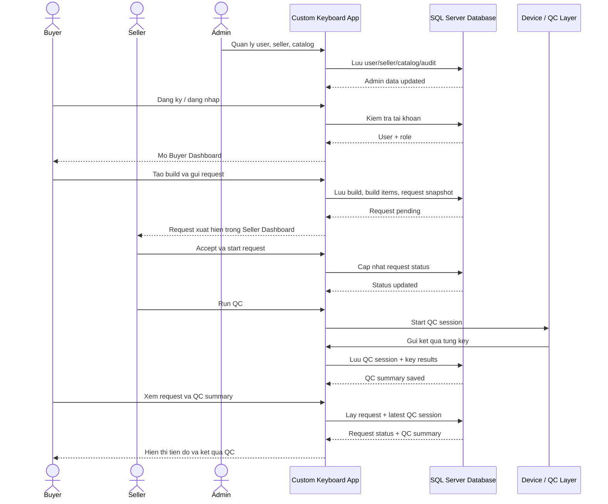

---

## SD-C00: Complete Overall Project Sequence KHONG CAN VE

Diagram nay gom cac nhom chuc nang chinh cua du an trong mot sequence lon. Muc tieu la bao phu toan bo he thong o muc vua du de bao ve truoc cau hoi tong quan.

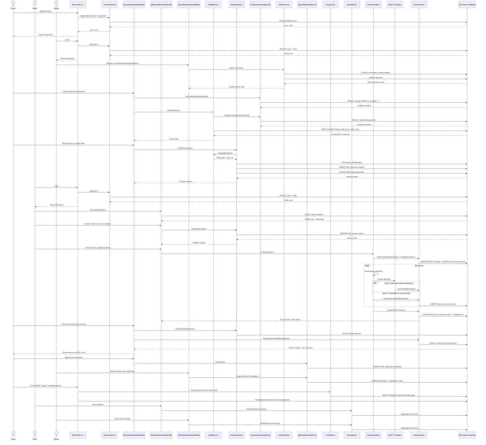

---

## Coverage Matrix

Bang nay dung de tra loi nhanh: "chuc nang nay nam o sequence diagram nao?"

| FHD | Chuc nang | Diagram bao phu |
| --- | --- | --- |
| 1.1 | Dang ky | `SD-S01` |
| 1.2 | Dang nhap | `SD-S01` |
| 1.3 | Dang xuat | `SD-S09` |
| 1.4 | Xem profile tai khoan | `SD-S09` |
| 2.1 | Xem dashboard buyer | `SD-S02`, `SD-S08` |
| 2.2 | Xem danh sach build | `SD-S02` |
| 2.3 | Tao build moi | `SD-S02` |
| 2.4 | Chon keyboard kit | `SD-S02` |
| 2.5 | Them linh kien vao build | `SD-S02` |
| 2.6 | Xem canh bao tuong thich | `SD-S02` |
| 2.7 | Xem tong gia | `SD-S02` |
| 2.8 | Luu build | `SD-S02` |
| 2.9 | Chon seller | `SD-S02` |
| 2.10 | Gui request | `SD-S02` |
| 2.11 | Theo doi request/QC summary | `SD-S03`, `SD-S04` |
| 2.12 | Luu tru build | `SD-S02` |
| 2.13 | Dang ky tro thanh seller | `SD-S06` |
| 3.1 | Xem dashboard seller | `SD-S03`, `SD-S08` |
| 3.2 | Xem danh sach request | `SD-S03` |
| 3.3 | Xem chi tiet request | `SD-S03` |
| 3.4 | Chap nhan request | `SD-S03` |
| 3.5 | Cap nhat dang xu ly | `SD-S03` |
| 3.6 | Hoan thanh request | `SD-S03` |
| 3.7 | Huy request | `SD-S03` |
| 3.8 | Bat dau QC test | `SD-S03`, `SD-S04` |
| 3.9 | Xem ket qua QC tung phim | `SD-S03`, `SD-S04` |
| 3.10 | Xac nhan hoan thanh sau QC | `SD-S03` |
| 4.1 | Xem dashboard admin | `SD-S05`, `SD-S08` |
| 4.2 | Quan ly user | `SD-S05` |
| 4.3 | Quan ly seller profile | `SD-S05` |
| 4.4 | Quan ly catalog | `SD-S05`, `SD-S10` |
| 4.5 | Xem audit log | `SD-S05` |
| 4.6 | Duyet don xin lam seller | `SD-S06` |
| 5.1 | Buyer chat voi seller | `SD-S07` |
| 5.2 | Seller chat voi buyer | `SD-S07` |
| 5.3 | Seller chat voi admin | `SD-S07` |
| 5.4 | Admin chat voi seller | `SD-S07` |
| 6.1 | Tao/lay tram QC | `SD-S04` |
| 6.2 | Bat dau phien QC | `SD-S04` |
| 6.3 | Kiem tra tin hieu phim | `SD-S04` |
| 6.4 | Kiem tra latency | `SD-S04` |
| 6.5 | Kiem tra do on | `SD-S04` |
| 6.6 | Xem ket qua tung phim | `SD-S03`, `SD-S04` |
| 6.7 | Tong hop ket qua QC | `SD-S03`, `SD-S04` |

---

## SD-S01: Account And Role Routing

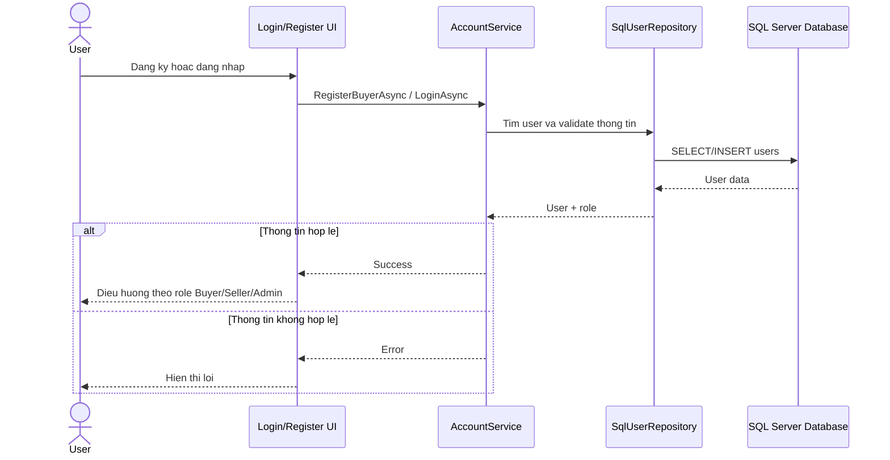

---

## SD-S02: Buyer Create Build And Send Request

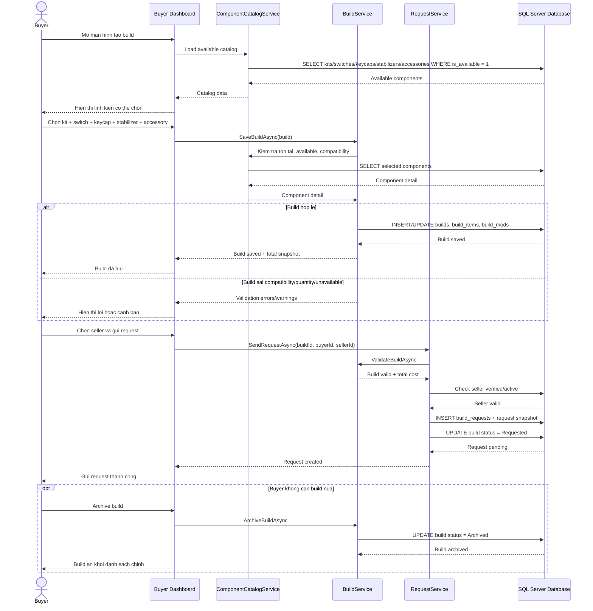

---

## SD-S03: Seller Process Request And Run QC

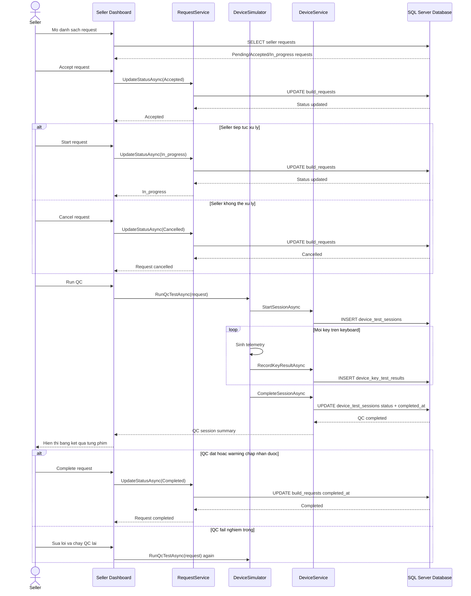

---

## SD-S04: Device QC With MQTT/Fallback

Diagram nay tach rieng vi day la phan device layer. MQTT la duong chinh, fallback ghi truc tiep khi broker/subscriber khong san sang.

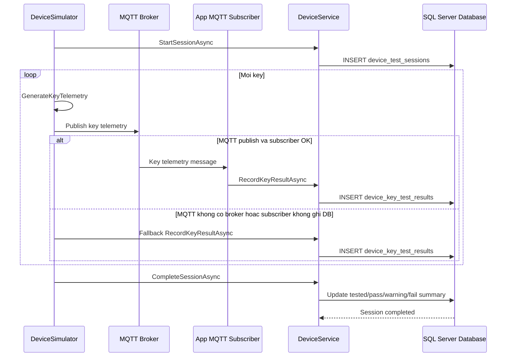

---

## SD-S05: Admin Management

Diagram nay gom user/seller/catalog/audit o muc rut gon.

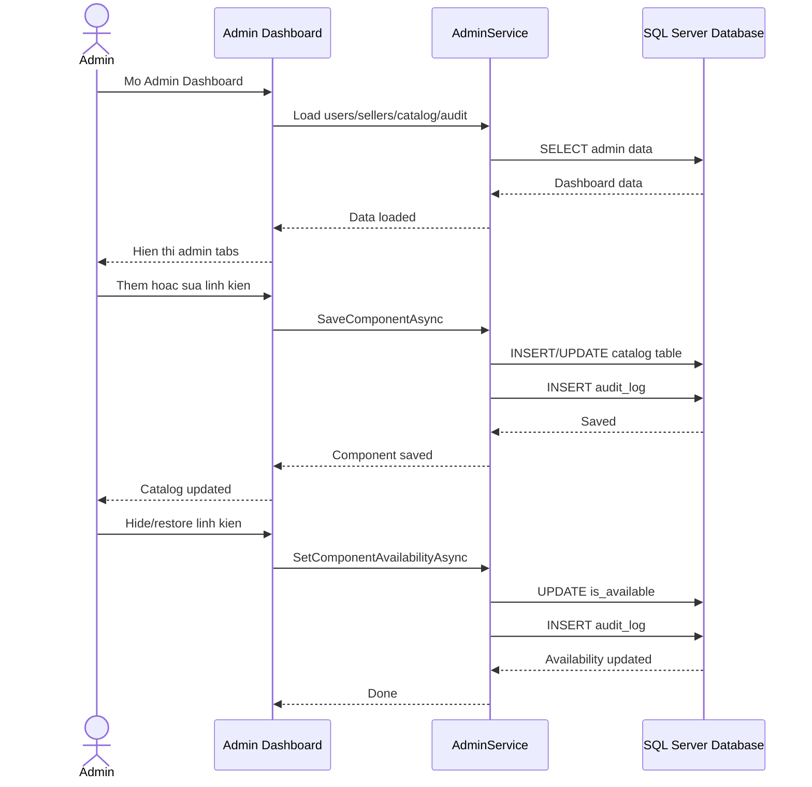

---

## SD-S06: Buyer Apply To Become Seller

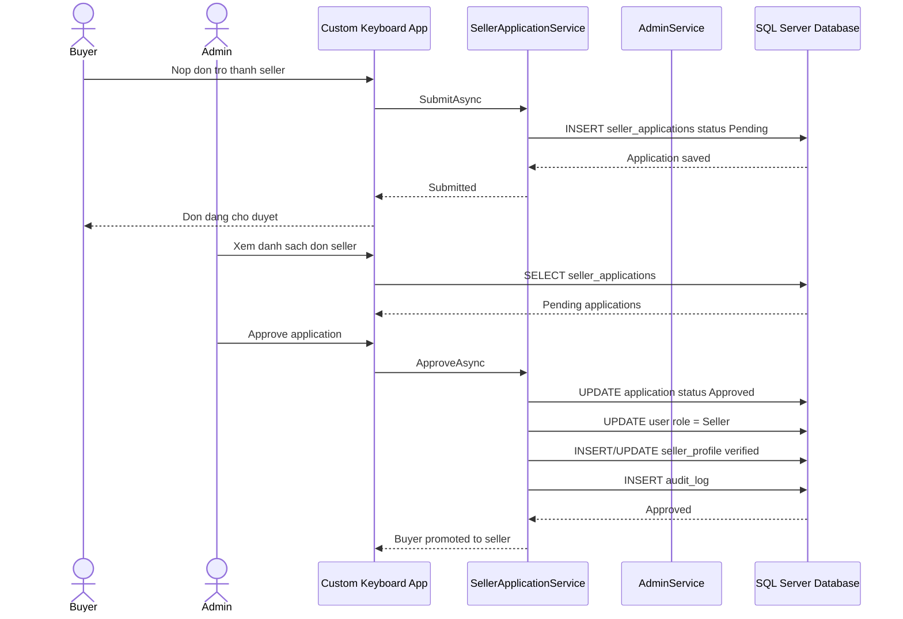

---

## SD-S07: Chat

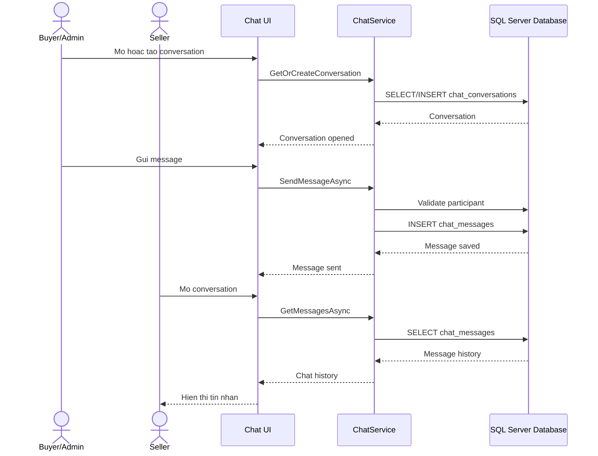

---

## SD-S08: Analytics Dashboard

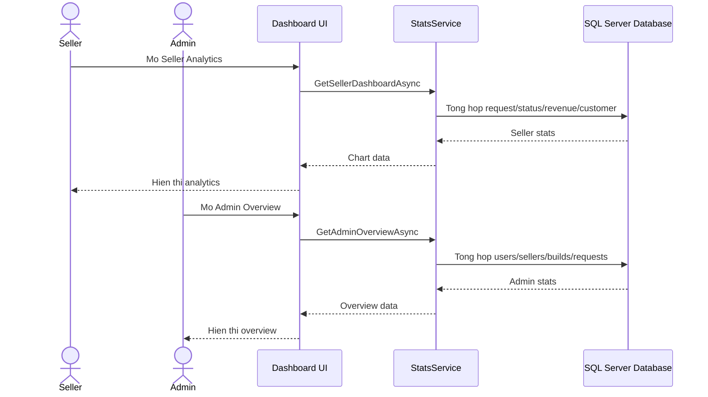

---

## SD-S09: Profile, Logout And Language Preference

Diagram nay bao phu FHD 1.3, 1.4 va tinh nang doi ngon ngu trong UI.

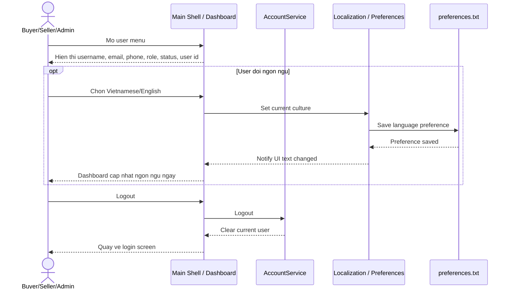

---

## SD-S10: Admin Catalog To Buyer Purchase Link

Diagram nay tra loi cau hoi quan trong: **Admin them linh kien xong Buyer co mua duoc khong?**

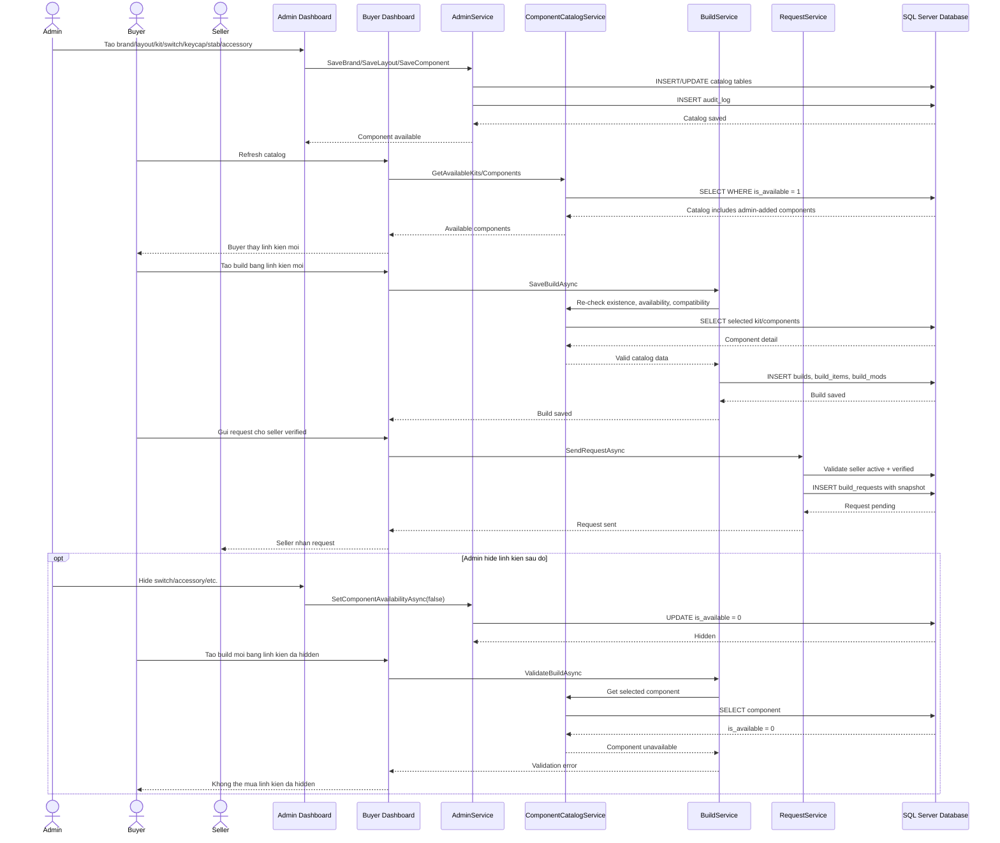

---

## Why SD-S02 And SD-S05 Are Separate

`Admin add component -> Buyer can purchase` duoc tach rieng trong `SD-S10` vi day la moi lien ket quan trong giua hai phan lon:

- Admin quan ly catalog.
- Buyer dung catalog do de tao build va gui request.

Neu gom vao diagram tong quan, chi thay "Admin quan ly catalog" va "Buyer tao build", nhung khong thay ro rang cau hoi:

> Admin them linh kien xong Buyer co that su thay va mua duoc khong?

Vi vay trong tai lieu nay:

- `SD-S00` cho cai nhin tong the ca du an.
- `SD-C00` cho sequence tong the complete hon.
- `SD-S02` mo ta Buyer build/request.
- `SD-S05` mo ta Admin management.
- `SD-S10` noi truc tiep Admin catalog -> Buyer purchase, dong thoi da duoc test bang Phase 6 verification.

---

## Sequence Diagram vs Activity Diagram

| Tieu chi | Sequence Diagram | Activity Diagram |
| --- | --- | --- |
| Muc dich | Mo ta ai goi ai theo thu tu thoi gian | Mo ta quy trinh nghiep vu va cac nhanh dieu kien |
| Tap trung vao | Actor/object/service/database giao tiep voi nhau | Cac buoc xu ly, decision, branch, loop |
| Cau hoi tra loi | "Buyer bam gui request thi service/DB nao duoc goi?" | "Neu build khong hop le thi quy trinh re nhanh the nao?" |
| Thanh phan chinh | Actor, participant, message, return, loop, alt | Action, decision, start/end, swimlane |
| Phu hop trong du an | Giai thich luong UI -> Service -> DB -> Device | Giai thich use case: tao build, gui request, QC pass/fail |

Noi ngan gon:

- **Sequence Diagram** la ban do giao tiep giua cac thanh phan trong he thong.
- **Activity Diagram** la ban do cac buoc nghiep vu va dieu kien re nhanh.
