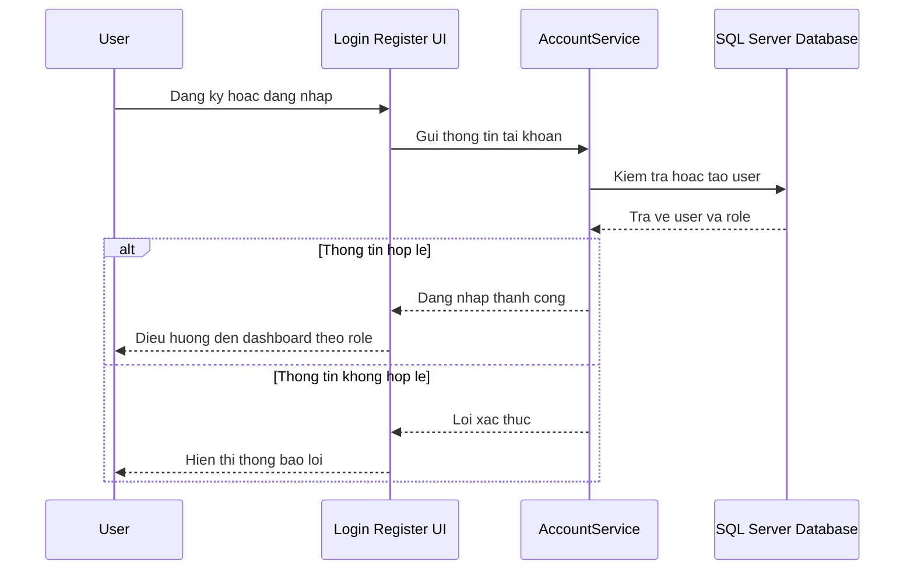
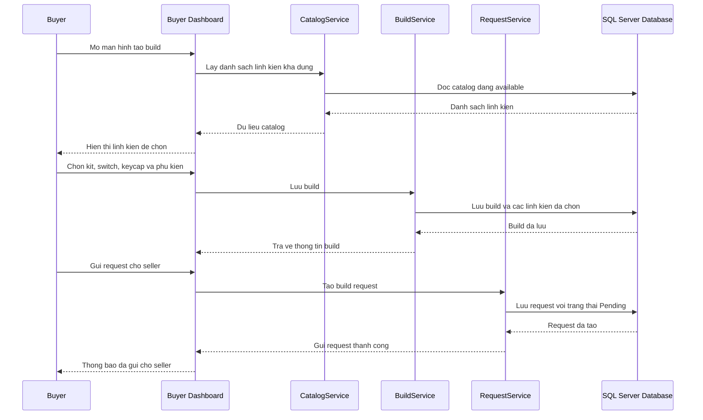
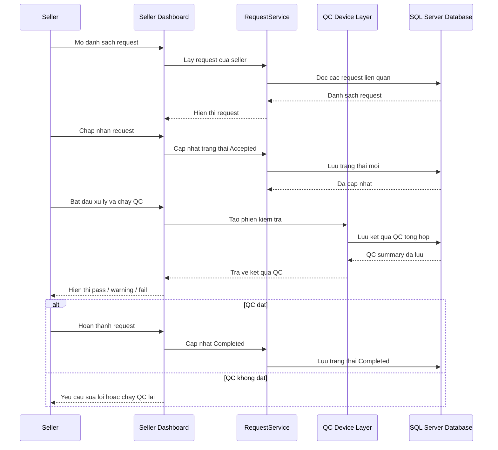
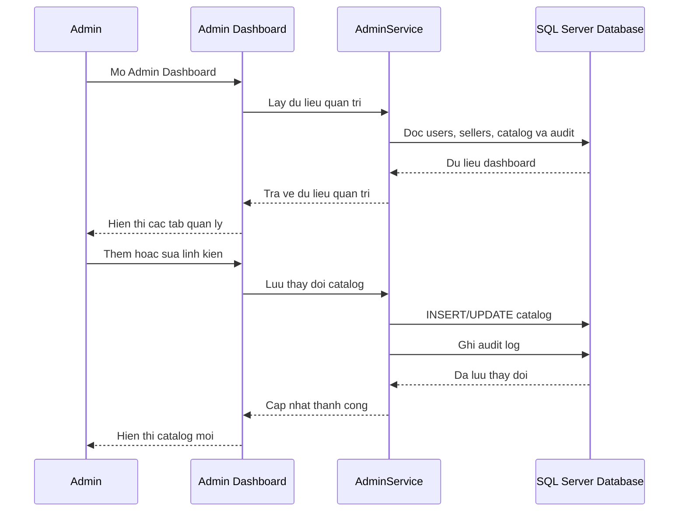
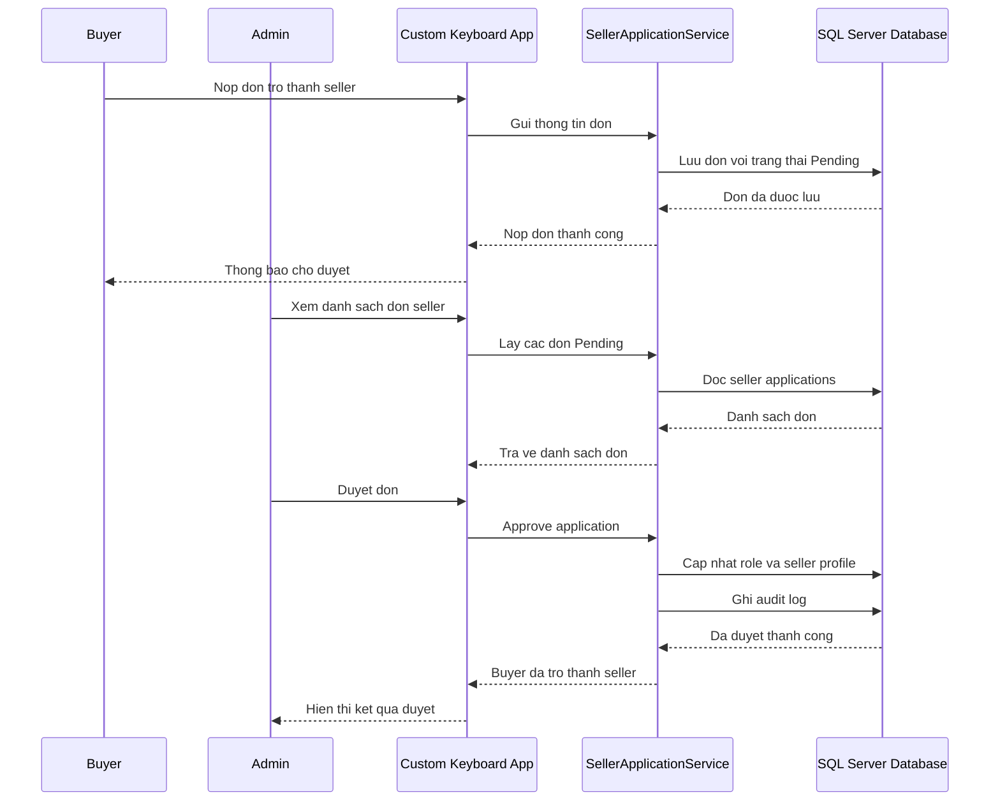
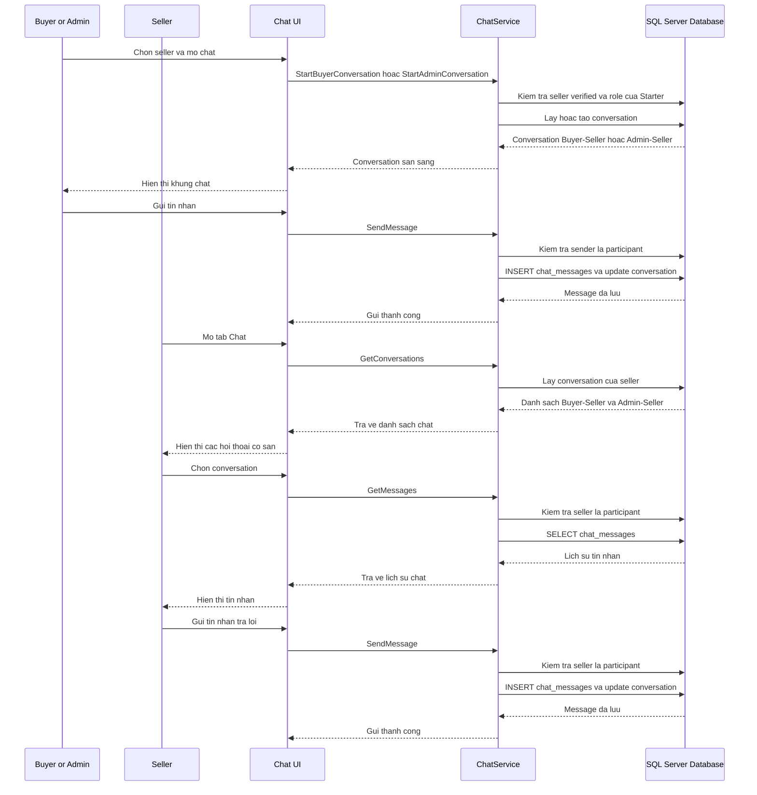

# Custom Keyboard Builder - 6 Core Sequence Diagrams

Tai lieu nay gom 6 sequence diagram rut gon de dung trong bao cao.
Muc tieu la trinh bay cac luong nghiep vu chinh, khong ve qua chi tiet cac ham noi bo.

---

## SD-R01: Account And Role Routing

---

## SD-R02: Buyer Create Build And Send Request

---

## SD-R03: Seller Process Request And QC Summary

---

## SD-R04: Admin Management

---

## SD-R05: Seller Application Approval

---

## SD-R06: Chat Between Users

