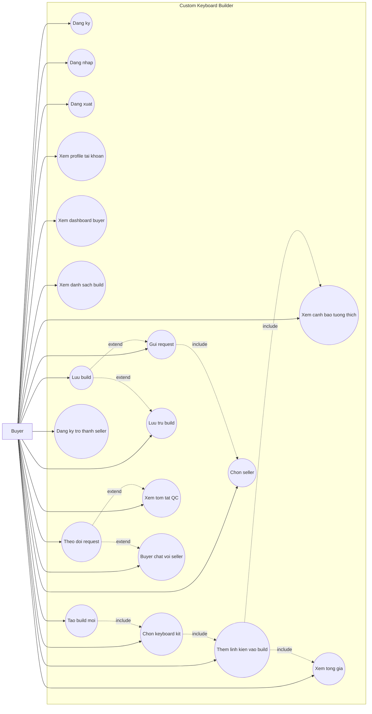
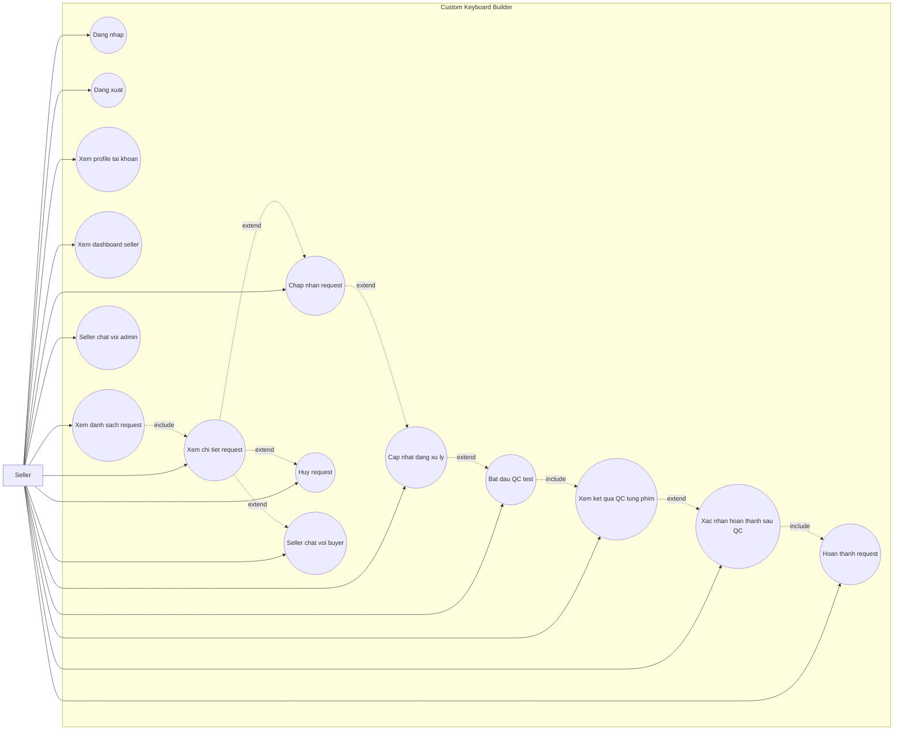
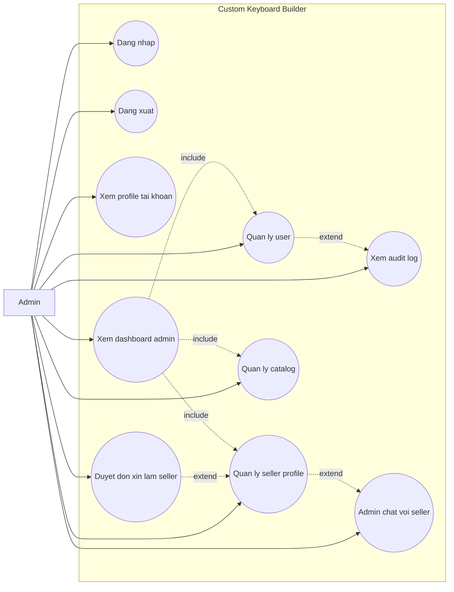
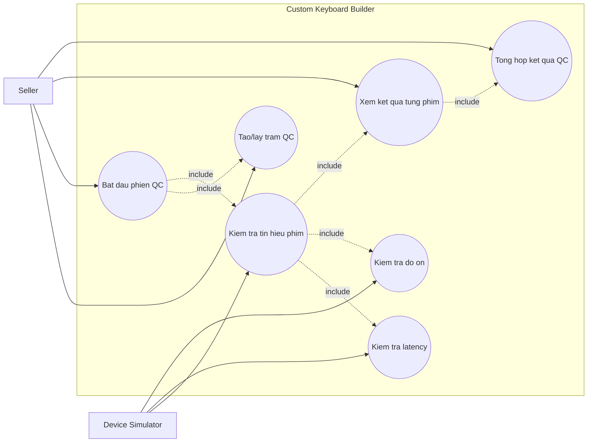

# Custom Keyboard Builder - Use Cases Refactor Theo Role Va Device Layer

Tai lieu nay mo ta use cases chi tiet cho cac role theo FHD refactor, ERD moi va Device Layer mo phong QC keyboard:

- Buyer - tao build tu keyboard kit va gui request.
- Seller - nhan, xu ly request va chay QC test truoc khi hoan thanh.
- Admin - quan tri user, seller profile va catalog.
- Device/QC - mo phong tram test keyboard, sinh ket qua tung phim.

Chat duoc gan vao role tuong ung thay vi tach thanh role rieng. Device/QC la du lieu mo phong qua MQTT hoac fallback in-process, khong nhung phan cung that trong phase nay. He thong khong co seller inventory trong phase refactor nay.

## UC-01: Buyer Tao Build Tu Kit Va Gui Request

| Muc | Noi dung |
| --- | --- |
| Actor chinh | Buyer |
| Muc tieu | Buyer dang ky/dang nhap, tao build ban phim dua tren keyboard kit, them linh kien, luu build, gui request cho seller, theo doi request, xem tom tat QC va co the nop don tro thanh seller. |
| Tien dieu kien | Buyer co tai khoan active va dang nhap. |
| Hau dieu kien | Build duoc luu; request duoc gui den seller verified; buyer co the theo doi trang thai, xem tom tat QC neu da co va chat voi seller. |

### Luong Chinh

| Buoc | Thao tac cua Buyer | Chuc nang FHD |
| --- | --- | --- |
| 1 | Buyer dang ky tai khoan neu chua co. | 1.1 |
| 2 | Buyer dang nhap vao ung dung. | 1.2 |
| 3 | Buyer xem dashboard va danh sach build da tao. | 2.1, 2.2 |
| 4 | Buyer tao build moi. | 2.3 |
| 5 | Buyer chon keyboard kit. | 2.4 |
| 6 | Buyer them switch, keycap, stabilizer package, accessory hoac mod preset vao build; neu chon Spring swap thi chon gram 30-76g va so switch can mod. | 2.5 |
| 7 | Buyer xem canh bao tuong thich neu co. | 2.6 |
| 8 | Buyer xem tong gia tam tinh. | 2.7 |
| 9 | Buyer luu build. | 2.8 |
| 10 | Buyer chon seller verified. | 2.9 |
| 11 | Buyer gui request cho seller. | 2.10 |
| 12 | Buyer theo doi trang thai request. | 2.11 |
| 13 | Neu seller da chay QC, Buyer xem tom tat QC gom so phim pass/warning/fail, latency va noise. | 2.11, 6.7 |
| 14 | Buyer co the luu tru build khong con can thao tac trong danh sach chinh. | 2.12 |
| 15 | Buyer co the nop don Dang ky tro thanh seller va xem trang thai don. | 2.13 |
| 16 | Buyer chat voi seller neu can trao doi them. | 5.1 |
| 17 | Buyer mo user menu goc tren phai de xem profile tai khoan hoac dang xuat khi ket thuc. | 1.3, 1.4 |

### Chi Tiet Nghiep Vu

| Chuc nang | Chi tiet |
| --- | --- |
| Chon keyboard kit | Kit quyet dinh layout, cong nghe PCB, switch mount va so switch can mua. |
| Them switch | Buyer chon switch va quantity; quantity phai dap ung `required_switch_quantity` cua kit. |
| Them keycap | Buyer chon keycap co form factor phu hop voi kit. |
| Them stabilizer | Buyer chon stabilizer package phu hop layout/form factor. |
| Them accessory | Buyer chon phu kien chung nhu lube, film, cable, foam hoac tool. |
| Ghi chu mod | Buyer chon mod preset theo target; mod Switch co so luong switch can mod, Spring swap co spring weight integer 30-76g; chi tiet lube/film/foam/tape them vao notes. |

### Luong Phu / Ngoai Le

| Tinh huong | Xu ly tren UI | Chuc nang FHD |
| --- | --- | --- |
| Buyer chi muon luu build | Buyer luu build va chua gui request. | 2.8 |
| Kit hoac linh kien bi an | UI khong hien san pham hidden trong flow tao build. | 2.4, 2.5 |
| Linh kien khong tuong thich | UI hien canh bao va chan luu/gui neu la loi nghiem trong. | 2.6 |
| Chua du switch | UI canh bao so switch chua dat yeu cau cua kit. | 2.6 |
| Seller chua verified | Seller khong hien trong danh sach chon. | 2.9 |
| Buyer muon doi seller | Buyer quay lai man chon seller truoc khi gui request. | 2.9 |
| Buyer muon xem tien do | Buyer mo danh sach request hoac dashboard buyer. | 2.1, 2.11 |
| Chua co ket qua QC | UI van cho Buyer theo doi request, nhung phan tom tat QC hien "chua co du lieu". | 2.11, 6.7 |
| Buyer khong con can build | Buyer luu tru build de an khoi danh sach chinh. | 2.12 |
| Buyer muon tro thanh seller | Buyer gui don voi ten shop, phone, dia chi va ghi chu; he thong hien trang thai Pending/Approved/Rejected. | 2.13 |

### Mapping FHD Cho Buyer

| Nhom | Ma FHD duoc bao phu |
| --- | --- |
| Tai khoan | 1.1, 1.2, 1.3, 1.4 |
| Buyer | 2.1, 2.2, 2.3, 2.4, 2.5, 2.6, 2.7, 2.8, 2.9, 2.10, 2.11, 2.12, 2.13 |
| Device/QC | 6.7 |
| Chat | 5.1 |

## UC-02: Seller Xu Ly Request Build

| Muc | Noi dung |
| --- | --- |
| Actor chinh | Seller |
| Muc tieu | Seller xem request duoc gui den, xu ly trang thai, chay QC test tung phim va trao doi voi buyer/admin khi can. |
| Tien dieu kien | Seller co tai khoan active, role Seller va seller profile da verified. |
| Hau dieu kien | Request duoc cap nhat dung trang thai; ket qua QC tung phim duoc luu neu seller da test; buyer co the theo doi tien do va tom tat QC. |

### Luong Chinh

| Buoc | Thao tac cua Seller | Chuc nang FHD |
| --- | --- | --- |
| 1 | Seller dang nhap vao ung dung. | 1.2 |
| 2 | Seller xem dashboard seller. | 3.1 |
| 3 | Seller xem danh sach request duoc gui den. | 3.2 |
| 4 | Seller mo chi tiet request. | 3.3 |
| 5 | Seller chap nhan request neu co the xu ly. | 3.4 |
| 6 | Seller cap nhat request sang dang xu ly. | 3.5 |
| 7 | Seller bat dau QC test khi request dang In_progress. | 3.8, 6.2 |
| 8 | He thong mo phong test tung phim: signal, latency, noise va luu ket qua. | 6.3, 6.4, 6.5, 6.6 |
| 9 | Seller xem ket qua QC tung phim de biet phim nao NoSignal, WrongKey, Chatter, StuckKey, HighLatency hoac TooNoisy. | 3.9, 6.6 |
| 10 | Seller khac phuc loi va test lai neu co fail. | 3.8, 3.9 |
| 11 | Seller xac nhan hoan thanh sau QC khi ket qua dat hoac warning chap nhan duoc. | 3.10, 3.6 |
| 12 | Seller chat voi buyer neu can lam ro build. | 5.2 |
| 13 | Seller chat voi admin neu can ho tro profile/tai khoan. | 5.3 |
| 14 | Seller mo user menu goc tren phai de xem profile tai khoan hoac dang xuat khi ket thuc. | 1.3, 1.4 |

### Luong Phu / Ngoai Le

| Tinh huong | Xu ly tren UI | Chuc nang FHD |
| --- | --- | --- |
| Seller chua co request | Dashboard va danh sach request hien trang thai rong. | 3.1, 3.2 |
| Request khong the xu ly | Seller huy request. | 3.7 |
| Seller muon xem lai cau hinh | Seller mo chi tiet request de xem kit, build items, mod notes va tong gia snapshot. | 3.3 |
| Seller chua verified | Seller khong duoc nhan request trong flow buyer. | 3.1 |
| Seller can lam ro yeu cau | Seller chat voi buyer trong request minh phu trach. | 5.2 |
| QC chua chay | UI khong nen cho xac nhan hoan thanh sau QC hoac can hien canh bao chua co ket qua QC. | 3.10, 6.7 |
| QC co phim fail | UI hien chinh xac key_code/failure_type; request giu In_progress de seller sua va test lai. | 3.9, 6.6 |
| MQTT khong kha dung | He thong dung fallback in-process de sinh/luu cung model telemetry, khong lam mat luong QC. | 6.3 |

### Mapping FHD Cho Seller

| Nhom | Ma FHD duoc bao phu |
| --- | --- |
| Tai khoan | 1.2, 1.3, 1.4 |
| Seller | 3.1, 3.2, 3.3, 3.4, 3.5, 3.6, 3.7, 3.8, 3.9, 3.10 |
| Device/QC | 6.1, 6.2, 6.3, 6.4, 6.5, 6.6, 6.7 |
| Chat | 5.2, 5.3 |

## UC-03: Admin Quan Tri He Thong

| Muc | Noi dung |
| --- | --- |
| Actor chinh | Admin |
| Muc tieu | Admin quan ly user, seller profile, catalog, audit log va duyet don xin lam seller. |
| Tien dieu kien | Admin co tai khoan active, role Admin va dang nhap. |
| Hau dieu kien | Du lieu user, seller profile, catalog hoac don xin seller duoc cap nhat; thao tac quan trong co the duoc ghi audit log. |

### Luong Chinh

| Buoc | Thao tac cua Admin | Chuc nang FHD |
| --- | --- | --- |
| 1 | Admin dang nhap vao ung dung. | 1.2 |
| 2 | Admin xem dashboard admin. | 4.1 |
| 3 | Admin quan ly user: xem danh sach, khoa/mo tai khoan, cap nhat role. | 4.2 |
| 4 | Admin quan ly seller profile: tao/cap nhat profile, verify/unverify seller. | 4.3 |
| 5 | Admin quan ly catalog: brand, layout, keyboard kit, switch, keycap, stabilizer, accessory. | 4.4 |
| 6 | Admin xem audit log khi can kiem tra lich su thao tac. | 4.5 |
| 7 | Admin duyet don xin lam seller: xem hang doi, chap nhan hoac tu choi. | 4.6 |
| 8 | Admin chat voi seller neu can ho tro. | 5.4 |
| 9 | Admin mo user menu goc tren phai de xem profile tai khoan hoac dang xuat khi ket thuc. | 1.3, 1.4 |

### Chi Tiet Nghiep Vu

| Chuc nang | Chi tiet |
| --- | --- |
| Quan ly user | Admin cap nhat active status va role Buyer/Seller/Admin. |
| Quan ly seller profile | Seller chi duoc buyer chon khi user active, role Seller va profile verified. |
| Duyet don xin seller | Khi chap nhan don, he thong doi role Buyer thanh Seller, tao/cap nhat seller profile verified va ghi audit log; khi tu choi, he thong luu ly do va trang thai Rejected. |
| Quan ly brand | Brand dung cho keyboard kit, switch, keycap va stabilizer. |
| Quan ly layout | Layout gom form factor va key count. |
| Quan ly keyboard kit | Kit gom brand, layout, PCB technology, switch mount, required switch quantity, included parts, price va availability. |
| Quan ly switch | Switch gom brand, technology, mount type, type, force, price va availability. |
| Quan ly keycap | Keycap gom brand, supported form factor, profile, material, price va availability. |
| Quan ly stabilizer | Stabilizer la package theo layout/form factor, co price va availability. |
| Quan ly accessory | Accessory gom type, name, target component, price va availability. |

### Luong Phu / Ngoai Le

| Tinh huong | Xu ly tren UI | Chuc nang FHD |
| --- | --- | --- |
| User bi khoa nham | Admin mo lai tai khoan. | 4.2 |
| Buyer can thanh seller | Admin duyet don xin lam seller; neu chap nhan thi cap role Seller, tao seller profile va verify seller. | 4.6 |
| Seller tam ngung nhan request | Admin unverify seller hoac khoa tai khoan. | 4.2, 4.3 |
| San pham catalog khong con dung | Admin an item bang `is_available = false`. | 4.4 |
| San pham catalog duoc dung lai | Admin hien item bang `is_available = true`. | 4.4 |
| Seller can ho tro | Admin mo chat voi seller tu khu vuc seller profile. | 5.4 |

### Mapping FHD Cho Admin

| Nhom | Ma FHD duoc bao phu |
| --- | --- |
| Tai khoan | 1.2, 1.3, 1.4 |
| Admin | 4.1, 4.2, 4.3, 4.4, 4.5, 4.6 |
| Chat | 5.4 |

## UC-04: Device/QC Station Kiem Tra Keyboard

| Muc | Noi dung |
| --- | --- |
| Actor chinh | Seller |
| Actor phu | Device Simulator |
| Muc tieu | Mo phong tram QC keyboard de ghi nhan ket qua tung phim: co nhan signal khong, co release khong, double click/chatter, stuck, latency va do on. |
| Tien dieu kien | Seller dang nhap, request thuoc seller va dang In_progress; build/request co thong tin kit de xac dinh total_keys va switch_technology. |
| Hau dieu kien | He thong luu device_test_session va device_key_test_results; seller xem duoc phim nao pass/warning/fail va buyer xem duoc tom tat QC. |

### Luong Chinh

| Buoc | Thao tac | Chuc nang FHD |
| --- | --- | --- |
| 1 | Seller bam Bat dau QC test tren request dang In_progress. | 3.8, 6.2 |
| 2 | He thong tao hoac lay device QC_STATION cua seller. | 6.1 |
| 3 | He thong tao session Running, gan request_id, device_id, seller_user_id, total_keys va switch_technology. | 6.2 |
| 4 | Device Simulator sinh telemetry tung phim theo key map cua layout/kit. | 6.3 |
| 5 | He thong ghi press_signal_detected, release_signal_detected, expected_key, received_key va press_event_count. | 6.3 |
| 6 | He thong ghi latency_ms, ap dung nguong chat hon cho HE switch. | 6.4 |
| 7 | He thong ghi noise_db de danh gia switch co dap ung yeu cau it on hay khong. | 6.5 |
| 8 | He thong gan result va failure_type cho tung phim. | 6.6 |
| 9 | Khi tested_keys = total_keys, he thong tong hop session Passed/Warning/Failed. | 6.7 |
| 10 | Seller xem chi tiet tung phim va quyet dinh hoan thanh hoac sua/test lai. | 3.9, 3.10 |

### Luong Phu / Ngoai Le

| Tinh huong | Xu ly tren UI / He thong | Chuc nang FHD |
| --- | --- | --- |
| Phim khong nhan signal | press_signal_detected=false, result=Fail, failure_type=NoSignal. | 6.3, 6.6 |
| Phim nhan sai key | expected_key khac received_key, result=Fail, failure_type=WrongKey. | 6.3, 6.6 |
| Phim double click/chatter | press_event_count > 1 hoac bounce_count vuot nguong sau chu ky press-release, result=Fail/Warning tuy nguong. | 6.3, 6.6 |
| Phim stuck | release_signal_detected=false, is_stuck=true, result=Fail, failure_type=StuckKey. | 6.3, 6.6 |
| Phim HE latency cao | latency_ms > nguong, result=Warning hoac Fail voi failure_type=HighLatency. | 6.4, 6.6 |
| Switch qua on | noise_db > nguong, result=Warning hoac Fail voi failure_type=TooNoisy. | 6.5, 6.6 |
| Chua du total_keys | Session giu Running, chua tong hop Passed/Warning/Failed. | 6.7 |
| MQTT khong kha dung | He thong dung fallback in-process, van luu cung cau truc du lieu. | 6.3 |

### Mapping FHD Cho Device/QC

| Nhom | Ma FHD duoc bao phu |
| --- | --- |
| Seller | 3.8, 3.9, 3.10 |
| Device/QC | 6.1, 6.2, 6.3, 6.4, 6.5, 6.6, 6.7 |

## Bang Doi Chieu FHD

| Ma FHD | Chuc nang | Use case bao phu |
| --- | --- | --- |
| 1.1 | Dang ky | UC-01 |
| 1.2 | Dang nhap | UC-01, UC-02, UC-03 |
| 1.3 | Dang xuat | UC-01, UC-02, UC-03 |
| 1.4 | Xem profile tai khoan | UC-01, UC-02, UC-03 |
| 2.1 | Xem dashboard buyer | UC-01 |
| 2.2 | Xem danh sach build | UC-01 |
| 2.3 | Tao build moi | UC-01 |
| 2.4 | Chon keyboard kit | UC-01 |
| 2.5 | Them linh kien vao build | UC-01 |
| 2.6 | Xem canh bao tuong thich | UC-01 |
| 2.7 | Xem tong gia | UC-01 |
| 2.8 | Luu build | UC-01 |
| 2.9 | Chon seller | UC-01 |
| 2.10 | Gui request | UC-01 |
| 2.11 | Theo doi request | UC-01 |
| 2.12 | Luu tru build | UC-01 |
| 2.13 | Dang ky tro thanh seller | UC-01 |
| 3.1 | Xem dashboard seller | UC-02 |
| 3.2 | Xem danh sach request | UC-02 |
| 3.3 | Xem chi tiet request | UC-02 |
| 3.4 | Chap nhan request | UC-02 |
| 3.5 | Cap nhat dang xu ly | UC-02 |
| 3.6 | Hoan thanh request | UC-02 |
| 3.7 | Huy request | UC-02 |
| 3.8 | Bat dau QC test | UC-02, UC-04 |
| 3.9 | Xem ket qua QC tung phim | UC-02, UC-04 |
| 3.10 | Xac nhan hoan thanh sau QC | UC-02, UC-04 |
| 4.1 | Xem dashboard admin | UC-03 |
| 4.2 | Quan ly user | UC-03 |
| 4.3 | Quan ly seller profile | UC-03 |
| 4.4 | Quan ly catalog | UC-03 |
| 4.5 | Xem audit log | UC-03 |
| 4.6 | Duyet don xin lam seller | UC-03 |
| 5.1 | Buyer chat voi seller | UC-01 |
| 5.2 | Seller chat voi buyer | UC-02 |
| 5.3 | Seller chat voi admin | UC-02 |
| 5.4 | Admin chat voi seller | UC-03 |
| 6.1 | Tao/lay tram QC | UC-04 |
| 6.2 | Bat dau phien QC | UC-04 |
| 6.3 | Kiem tra tin hieu phim | UC-04 |
| 6.4 | Kiem tra latency | UC-04 |
| 6.5 | Kiem tra do on | UC-04 |
| 6.6 | Xem ket qua tung phim | UC-02, UC-04 |
| 6.7 | Tong hop ket qua QC | UC-01, UC-04 |

## Ranh Gioi

- Khong co use case quan ly inventory/stock trong phase nay.
- Khong co use case chon case, PCB, plate rieng le; cac phan nay nam trong keyboard kit.
- Khong co use case chat truc tiep Buyer-Admin.
- Khong mo ta API, database, FK, service validation, migration hoac DTO.
- Device/QC trong phase nay la mo phong du lieu; khong co use case ket noi ESP32, HID reader, microphone hay phan cung that.
- MQTT la transport chinh cho telemetry mo phong; fallback in-process chi dung khi MQTT tat/khong kha dung hoac khi test.
