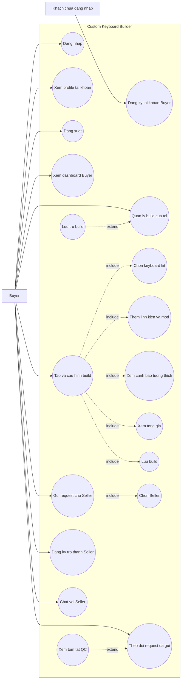
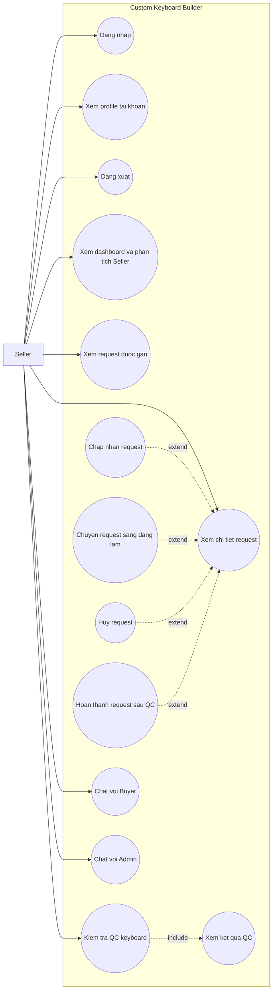
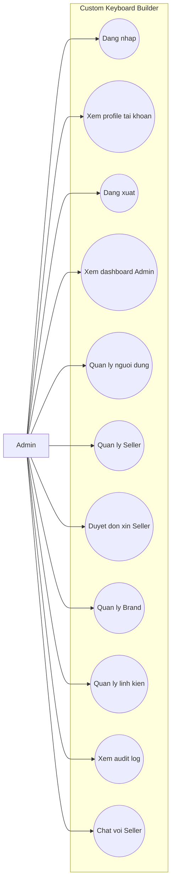

# Custom Keyboard Builder - Use Cases Nghiep Vu Theo Role

Tai lieu nay mo ta use cases o muc nghiep vu de dua vao bao cao du an. Pham vi chi gom cac chuc nang chinh ma nguoi dung thao tac theo role:

- Khach chua dang nhap: dang ky tai khoan Buyer.
- Buyer: tao build, gui request, theo doi request, xem tom tat QC, chat voi Seller va dang ky tro thanh Seller.
- Seller: tiep nhan request, cap nhat tien do, kiem tra QC keyboard, hoan thanh/huy request, xem phan tich va chat.
- Admin: quan ly nguoi dung, Seller, don xin Seller, catalog, audit log va chat voi Seller.

Cac chi tiet trien khai he thong khong duoc trinh bay nhu use case nghiep vu. QC duoc xem la chuc nang nghiep vu cua Seller: Seller kiem tra keyboard, xem ket qua, sua/test lai neu chua dat va hoan thanh request khi du dieu kien.

## Quy Uoc Include / Extend

| Quan he | Cach dung trong tai lieu nay |
| --- | --- |
| `include` | Use case A bat buoc phai thuc hien use case B moi hoan thanh dung nghiep vu. |
| `extend` | Use case B chi xay ra khi co dieu kien hoac lua chon phu trong use case A. |
| Khong noi quan he | Hai use case doc lap, chi cung thuoc mot role hoac cung man hinh UI. |

## UC-01: Buyer Tao Build Va Gui Request

| Muc | Noi dung |
| --- | --- |
| Actor chinh | Buyer |
| Actor phu | Khach chua dang nhap chi tham gia use case Dang ky tai khoan Buyer. |
| Muc tieu | Buyer tao build ban phim, luu build, gui request cho Seller, theo doi tien do va trao doi khi can. |
| Tien dieu kien | Buyer co tai khoan active va dang nhap. Rieng Dang ky tai khoan Buyer khong yeu cau dang nhap. |
| Hau dieu kien | Build duoc luu; request duoc gui den Seller hop le; Buyer co the theo doi trang thai va xem tom tat QC neu da co. |

### Cac Chuc Nang Chinh Cua Buyer

| Use case | Mo ta nghiep vu |
| --- | --- |
| Dang ky tai khoan Buyer | Khach tao tai khoan moi voi role Buyer mac dinh. |
| Dang nhap / Dang xuat / Xem profile | Buyer truy cap he thong, xem thong tin ca nhan va ket thuc phien lam viec. |
| Xem dashboard Buyer | Buyer xem tong quan workflow va trang thai lam viec. |
| Quan ly build cua toi | Buyer xem danh sach build da luu, mo lai build hoac luu tru build khong con dung. |
| Tao va cau hinh build | Buyer chon kit, them linh kien/mod, xem canh bao, xem tong gia va luu build. |
| Gui request cho Seller | Buyer chon Seller phu hop va gui request build da luu. |
| Theo doi request da gui | Buyer xem trang thai request va thong tin QC neu Seller da kiem tra. |
| Dang ky tro thanh Seller | Buyer nop don xin nang cap vai tro thanh Seller. |
| Chat voi Seller | Buyer trao doi voi Seller ve build/request. |

### Luong Chinh

| Buoc | Thao tac cua Buyer | Chuc nang FHD |
| --- | --- | --- |
| 0 | Neu chua co tai khoan, khach chua dang nhap dang ky tai khoan Buyer. | 1.1 |
| 1 | Buyer dang nhap vao he thong. | 1.2 |
| 2 | Buyer xem dashboard Buyer. | 2.1 |
| 3 | Buyer quan ly danh sach build da luu. | 2.2, 2.12 |
| 4 | Buyer tao va cau hinh build moi: chon kit, them linh kien/mod, xem canh bao va xem tong gia. | 2.3, 2.4, 2.5, 2.6, 2.7 |
| 5 | Buyer luu build. | 2.8 |
| 6 | Buyer chon Seller verified va gui request. | 2.9, 2.10 |
| 7 | Buyer theo doi request da gui. | 2.11 |
| 8 | Neu request da co QC, Buyer xem tom tat QC read-only. | 6.7 |
| 9 | Buyer chat voi Seller khi can lam ro yeu cau. | 5.1 |
| 10 | Buyer co the nop don dang ky tro thanh Seller. | 2.13 |
| 11 | Buyer xem profile hoac dang xuat khi ket thuc. | 1.3, 1.4 |

### Luong Phu / Ngoai Le

| Tinh huong | Xu ly nghiep vu | Chuc nang FHD |
| --- | --- | --- |
| Buyer chi muon luu build | Buyer luu build va chua gui request. | 2.8 |
| Build chua hop le | He thong hien canh bao/loi; Buyer can dieu chinh truoc khi luu hoac gui request. | 2.6 |
| Seller chua verified | Seller khong nam trong danh sach de Buyer chon. | 2.9 |
| Chua co ket qua QC | Buyer van theo doi request, phan tom tat QC hien chua co du lieu. | 2.11, 6.7 |
| Buyer khong con can build | Buyer luu tru build de an khoi danh sach chinh. | 2.12 |
| Don Seller dang Pending | Buyer xem trang thai don, khong nop trung don Pending. | 2.13 |

### Mapping Buyer

| Use case nghiep vu | Ma FHD duoc bao phu |
| --- | --- |
| Dang ky tai khoan Buyer | 1.1 |
| Dang nhap / Dang xuat / Xem profile | 1.2, 1.3, 1.4 |
| Xem dashboard Buyer | 2.1 |
| Quan ly build cua toi | 2.2, 2.12 |
| Tao va cau hinh build | 2.3, 2.4, 2.5, 2.6, 2.7, 2.8 |
| Gui request cho Seller | 2.9, 2.10 |
| Theo doi request da gui | 2.11 |
| Xem tom tat QC | 6.7 |
| Dang ky tro thanh Seller | 2.13 |
| Chat voi Seller | 5.1 |

## UC-02: Seller Xu Ly Request Va Kiem Tra QC

| Muc | Noi dung |
| --- | --- |
| Actor chinh | Seller |
| Muc tieu | Seller tiep nhan request build, cap nhat tien do, kiem tra QC keyboard va hoan thanh hoac huy request theo trang thai hop le. |
| Tien dieu kien | Seller co tai khoan active, role Seller, profile verified va request thuoc Seller dang nhap. |
| Hau dieu kien | Request duoc cap nhat dung trang thai; ket qua QC duoc ghi nhan o muc dat/canh bao/khong dat; Buyer co the theo doi tien do va tom tat QC. |

### Cac Chuc Nang Chinh Cua Seller

| Use case | Mo ta nghiep vu |
| --- | --- |
| Dang nhap / Dang xuat / Xem profile | Seller truy cap he thong, xem thong tin tai khoan va ket thuc phien lam viec. |
| Xem dashboard va phan tich Seller | Seller xem KPI, don dang xu ly, doanh thu/don va thong tin tong quan. |
| Xem request duoc gan | Seller xem danh sach request Buyer gui den minh. |
| Xem chi tiet request | Seller xem cau hinh build, ghi chu, tong gia snapshot va thong tin lien quan. |
| Chap nhan request | Seller nhan xu ly request moi. |
| Chuyen request sang dang lam | Seller cap nhat request sang trang thai dang xu ly. |
| Kiem tra QC keyboard | Seller kiem tra keyboard truoc khi ban giao. |
| Xem ket qua QC | Seller xem QC dat, canh bao hoac khong dat de quyet dinh sua/test lai. |
| Hoan thanh request sau QC | Seller hoan thanh request khi QC dat hoac canh bao chap nhan duoc. |
| Huy request | Seller huy request khi khong the tiep tuc xu ly theo trang thai hop le. |
| Chat voi Buyer | Seller trao doi voi Buyer ve request/build. |
| Chat voi Admin | Seller trao doi voi Admin khi can ho tro. |

### Luong Chinh

| Buoc | Thao tac cua Seller | Chuc nang FHD |
| --- | --- | --- |
| 1 | Seller dang nhap vao he thong. | 1.2 |
| 2 | Seller xem dashboard va phan tich Seller. | 3.1 |
| 3 | Seller xem danh sach request duoc gan. | 3.2 |
| 4 | Seller mo chi tiet request. | 3.3 |
| 5 | Seller chap nhan request moi neu co the xu ly. | 3.4 |
| 6 | Seller chuyen request sang trang thai dang lam. | 3.5 |
| 7 | Seller kiem tra QC keyboard cho request dang lam. | 3.8 |
| 8 | Seller xem ket qua QC. | 3.9 |
| 9 | Neu QC chua dat, Seller sua loi va kiem tra lai. | 3.8, 3.9 |
| 10 | Neu QC dat hoac canh bao chap nhan duoc, Seller hoan thanh request. | 3.10, 3.6 |
| 11 | Seller chat voi Buyer/Admin khi can trao doi them. | 5.2, 5.3 |
| 12 | Seller xem profile hoac dang xuat khi ket thuc. | 1.3, 1.4 |

### Luong Phu / Ngoai Le

| Tinh huong | Xu ly nghiep vu | Chuc nang FHD |
| --- | --- | --- |
| Seller chua co request | Dashboard va danh sach request hien trang thai rong. | 3.1, 3.2 |
| Request moi Pending | Seller co the chap nhan hoac huy request. | 3.4, 3.7 |
| Request da Accepted | Seller co the chuyen sang dang lam hoac huy. | 3.5, 3.7 |
| Request dang In_progress | Seller co the kiem tra QC, huy request hoac hoan thanh neu QC hop le. | 3.6, 3.7, 3.8, 3.9, 3.10 |
| QC chua chay | Seller chua duoc hoan thanh request. | 3.10 |
| QC khong dat | Request giu trang thai dang lam de Seller sua va kiem tra lai. | 3.8, 3.9 |
| QC dat canh bao | Seller xem canh bao; neu chap nhan duoc thi co the hoan thanh, neu khong thi sua/test lai. | 3.9, 3.10 |
| Request da Completed hoac Cancelled | Seller chi xem lai thong tin, khong cap nhat trang thai tiep. | 3.6, 3.7 |

### Mapping Seller

| Use case nghiep vu | Ma FHD duoc bao phu |
| --- | --- |
| Dang nhap / Dang xuat / Xem profile | 1.2, 1.3, 1.4 |
| Xem dashboard va phan tich Seller | 3.1 |
| Xem request duoc gan | 3.2 |
| Xem chi tiet request | 3.3 |
| Chap nhan request | 3.4 |
| Chuyen request sang dang lam | 3.5 |
| Hoan thanh request sau QC | 3.6, 3.10 |
| Huy request | 3.7 |
| Kiem tra QC keyboard | 3.8 |
| Xem ket qua QC | 3.9 |
| Chat voi Buyer | 5.2 |
| Chat voi Admin | 5.3 |

## UC-03: Admin Quan Tri He Thong

| Muc | Noi dung |
| --- | --- |
| Actor chinh | Admin |
| Muc tieu | Admin quan tri nguoi dung, Seller, don xin Seller, catalog, audit log va ho tro Seller qua chat. |
| Tien dieu kien | Admin co tai khoan active, role Admin va dang nhap. |
| Hau dieu kien | Du lieu user, Seller, catalog hoac don xin Seller duoc cap nhat dung nghiep vu; thao tac quan trong co the duoc ghi nhan de tra cuu. |

### Cac Chuc Nang Chinh Cua Admin

| Use case | Mo ta nghiep vu |
| --- | --- |
| Dang nhap / Dang xuat / Xem profile | Admin truy cap he thong, xem tai khoan va ket thuc phien lam viec. |
| Xem dashboard Admin | Admin xem KPI, doanh thu/don, user, Seller va tong quan he thong. |
| Quan ly nguoi dung | Admin xem danh sach user, doi role, khoa hoac mo khoa tai khoan. |
| Quan ly Seller | Admin cap nhat seller profile, verify hoac unverify Seller. |
| Duyet don xin Seller | Admin chap nhan hoac tu choi don Buyer xin tro thanh Seller. |
| Quan ly Brand | Admin tao, cap nhat hoac xoa brand neu hop le. |
| Quan ly linh kien | Admin quan ly kit, switch, keycap, stabilizer va accessory. |
| Xem audit log | Admin xem lich su thao tac quan trong. |
| Chat voi Seller | Admin trao doi voi Seller khi can ho tro. |

### Luong Chinh

| Buoc | Thao tac cua Admin | Chuc nang FHD |
| --- | --- | --- |
| 1 | Admin dang nhap vao he thong. | 1.2 |
| 2 | Admin xem dashboard Admin. | 4.1 |
| 3 | Admin quan ly nguoi dung: doi role, khoa hoac mo khoa tai khoan. | 4.2 |
| 4 | Admin quan ly Seller: cap nhat ho so, verify hoac unverify. | 4.3 |
| 5 | Admin duyet don xin Seller: chap nhan hoac tu choi. | 4.6 |
| 6 | Admin quan ly Brand. | 4.4 |
| 7 | Admin quan ly linh kien/catalog. | 4.4 |
| 8 | Admin xem audit log khi can tra cuu lich su thao tac. | 4.5 |
| 9 | Admin chat voi Seller khi can ho tro. | 5.4 |
| 10 | Admin xem profile hoac dang xuat khi ket thuc. | 1.3, 1.4 |

### Luong Phu / Ngoai Le

| Tinh huong | Xu ly nghiep vu | Chuc nang FHD |
| --- | --- | --- |
| User bi khoa nham | Admin mo khoa tai khoan. | 4.2 |
| Admin dang thao tac tren tai khoan cua chinh minh | He thong chan cac thao tac nguy hiem nhu tu khoa minh hoac bo role Admin cua minh. | 4.2 |
| Seller tam ngung nhan request | Admin unverify Seller hoac khoa tai khoan Seller. | 4.2, 4.3 |
| Buyer xin tro thanh Seller | Admin xem don, chap nhan de cap role Seller va tao/cap nhat seller profile, hoac tu choi voi ghi chu. | 4.6, 4.3 |
| Brand/linh kien dang duoc su dung | Admin khong xoa cung neu bi rang buoc; co the an/khoi phuc item neu phu hop. | 4.4 |
| Can kiem tra lich su | Admin mo audit log de xem thao tac da ghi nhan. | 4.5 |

### Mapping Admin

| Use case nghiep vu | Ma FHD duoc bao phu |
| --- | --- |
| Dang nhap / Dang xuat / Xem profile | 1.2, 1.3, 1.4 |
| Xem dashboard Admin | 4.1 |
| Quan ly nguoi dung | 4.2 |
| Quan ly Seller | 4.3 |
| Duyet don xin Seller | 4.6 |
| Quan ly Brand | 4.4 |
| Quan ly linh kien | 4.4 |
| Xem audit log | 4.5 |
| Chat voi Seller | 5.4 |

## Bang Kiem Tra Include / Extend

| Pham vi | Quan he | Ly do dung |
| --- | --- | --- |
| Buyer | `Tao va cau hinh build` include `Chon keyboard kit`, `Them linh kien va mod`, `Xem canh bao tuong thich`, `Xem tong gia`, `Luu build` | Day la cac buoc bat buoc de tao mot build hop le va co the luu. |
| Buyer | `Gui request cho Seller` include `Chon Seller` | Gui request luon can Seller nhan request. |
| Buyer | `Luu tru build` extend `Quan ly build cua toi` | Luu tru chi la lua chon phu khi Buyer khong con can build. |
| Buyer | `Xem tom tat QC` extend `Theo doi request da gui` | Tom tat QC chi hien khi Seller da co ket qua QC. |
| Seller | `Chap nhan request`, `Chuyen request sang dang lam`, `Huy request`, `Hoan thanh request sau QC` extend `Xem chi tiet request` | Cac hanh dong nay chi xuat hien theo trang thai request va lua chon cua Seller. |
| Seller | `Kiem tra QC keyboard` include `Xem ket qua QC` | Sau khi kiem tra QC, Seller can xem ket qua de quyet dinh sua/test lai hoac hoan thanh. |
| Admin | Khong can include/extend chinh trong diagram | Cac chuc nang Admin doc lap theo nghiep vu; audit log va chat la entry point rieng, khong nen ep thanh include/extend ky thuat. |

## Bang Tong Hop Theo Role

| Role | Use cases nghiep vu day du |
| --- | --- |
| Khach chua dang nhap | Dang ky tai khoan Buyer |
| Buyer | Dang nhap; Xem profile tai khoan; Dang xuat; Xem dashboard Buyer; Quan ly build cua toi; Tao va cau hinh build; Gui request cho Seller; Theo doi request da gui; Xem tom tat QC; Dang ky tro thanh Seller; Chat voi Seller |
| Seller | Dang nhap; Xem profile tai khoan; Dang xuat; Xem dashboard va phan tich Seller; Xem request duoc gan; Xem chi tiet request; Chap nhan request; Chuyen request sang dang lam; Kiem tra QC keyboard; Xem ket qua QC; Hoan thanh request sau QC; Huy request; Chat voi Buyer; Chat voi Admin |
| Admin | Dang nhap; Xem profile tai khoan; Dang xuat; Xem dashboard Admin; Quan ly nguoi dung; Quan ly Seller; Duyet don xin Seller; Quan ly Brand; Quan ly linh kien; Xem audit log; Chat voi Seller |

## Ranh Gioi Bao Cao Use Case

- Khong tach thanh phan ho tro QC thanh role rieng trong bao cao nghiep vu.
- Khong dua chi tiet trien khai ky thuat vao use case diagram.
- Khong co use case quan ly inventory/stock trong phase nay.
- Khong co use case chon case, PCB, plate rieng le; cac phan nay nam trong keyboard kit.
- Khong co use case chat truc tiep Buyer-Admin.
- QC duoc trinh bay o muc nghiep vu: Seller kiem tra keyboard, xem ket qua, sua/test lai neu chua dat, va hoan thanh request khi du dieu kien.
