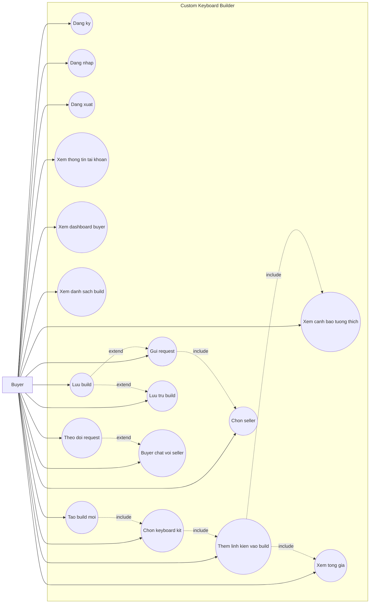
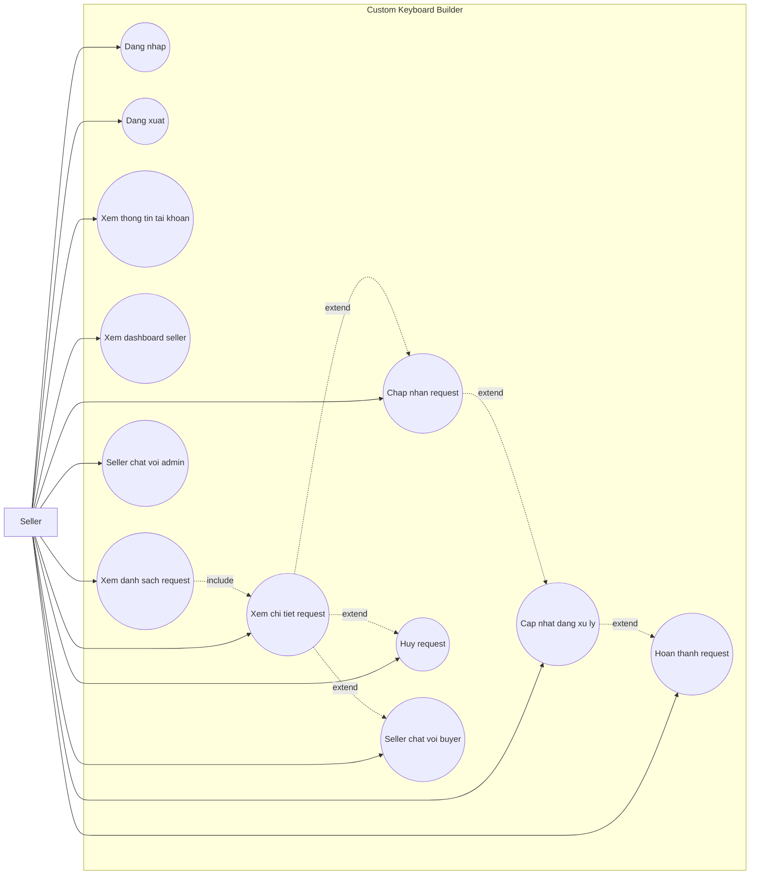
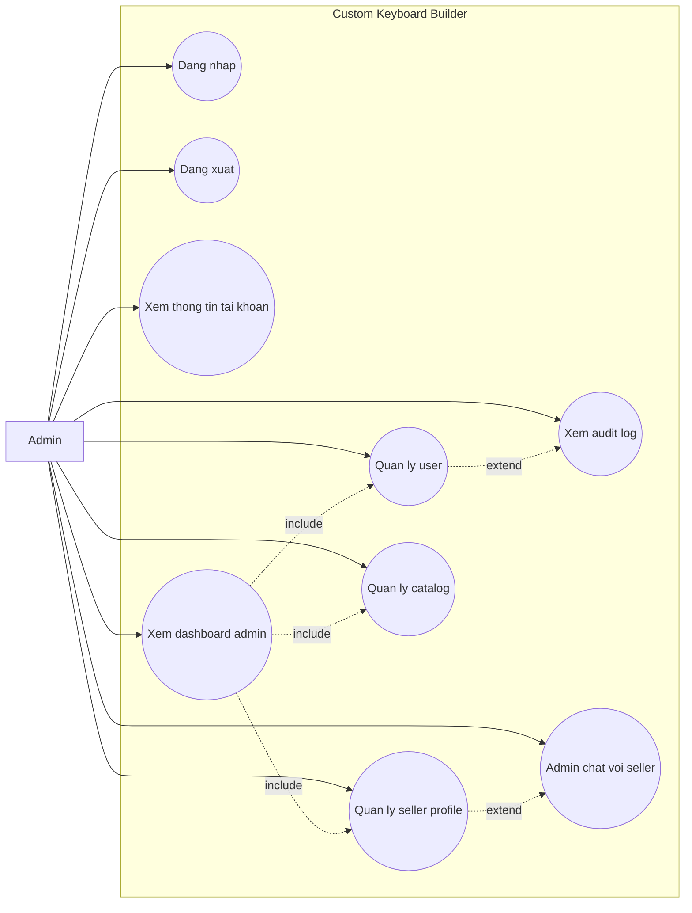

# Custom Keyboard Builder - Use Cases Refactor Theo 3 Role

Tai lieu nay mo ta use cases chi tiet cho 3 nhom role theo FHD refactor va ERD moi:

- Buyer - tao build tu keyboard kit va gui request.
- Seller - nhan va xu ly request.
- Admin - quan tri user, seller profile va catalog.

Chat duoc gan vao role tuong ung thay vi tach thanh role rieng. He thong khong co seller inventory trong phase refactor nay.

## UC-01: Buyer Tao Build Tu Kit Va Gui Request

| Muc | Noi dung |
| --- | --- |
| Actor chinh | Buyer |
| Muc tieu | Buyer tao build ban phim dua tren keyboard kit, them linh kien, luu build va gui request cho seller. |
| Tien dieu kien | Buyer co tai khoan active va dang nhap. |
| Hau dieu kien | Build duoc luu; request duoc gui den seller verified; buyer co the theo doi trang thai va chat voi seller. |

### Luong Chinh

| Buoc | Thao tac cua Buyer | Chuc nang FHD |
| --- | --- | --- |
| 1 | Buyer dang ky tai khoan neu chua co. | 1.1 |
| 2 | Buyer dang nhap vao ung dung. | 1.2 |
| 3 | Buyer xem dashboard va danh sach build da tao. | 2.1, 2.2 |
| 4 | Buyer tao build moi. | 2.3 |
| 5 | Buyer chon keyboard kit. | 2.4 |
| 6 | Buyer them switch, keycap, stabilizer package, accessory hoac mod note vao build. | 2.5 |
| 7 | Buyer xem canh bao tuong thich neu co. | 2.6 |
| 8 | Buyer xem tong gia tam tinh. | 2.7 |
| 9 | Buyer luu build. | 2.8 |
| 10 | Buyer chon seller verified. | 2.9 |
| 11 | Buyer gui request cho seller. | 2.10 |
| 12 | Buyer theo doi trang thai request. | 2.11 |
| 13 | Buyer co the luu tru build khong con can thao tac trong danh sach chinh. | 2.12 |
| 14 | Buyer chat voi seller neu can trao doi them. | 5.1 |
| 15 | Buyer xem thong tin tai khoan hoac dang xuat khi ket thuc. | 1.3, 1.4 |

### Chi Tiet Nghiep Vu

| Chuc nang | Chi tiet |
| --- | --- |
| Chon keyboard kit | Kit quyet dinh layout, cong nghe PCB, switch mount va so switch can mua. |
| Them switch | Buyer chon switch va quantity; quantity phai dap ung `required_switch_quantity` cua kit. |
| Them keycap | Buyer chon keycap co form factor phu hop voi kit. |
| Them stabilizer | Buyer chon stabilizer package phu hop layout/form factor. |
| Them accessory | Buyer chon phu kien chung nhu lube, film, cable, foam hoac tool. |
| Ghi chu mod | Buyer nhap yeu cau mod don gian trong notes, khong tach spring weight/lube type chi tiet. |

### Luong Phu / Ngoai Le

| Tinh huong | Xu ly tren UI | Chuc nang FHD |
| --- | --- | --- |
| Buyer chi muon luu build | Buyer luu build va chua gui request. | 2.8 |
| Kit hoac linh kien bi an | UI khong hien san pham hidden trong flow tao build. | 2.4, 2.5 |
| Linh kien khong tuong thich | UI hien canh bao va chan luu/gui neu la loi nghiem trong. | 2.6 |
| Chua du switch | UI canh bao so switch chua dat yeu cau cua kit. | 2.6 |
| Seller chua verified | Seller khong hien trong danh sach chon. | 2.9 |
| Buyer muon doi seller | Buyer quay lai man chon seller truoc khi gui request. | 2.9 |
| Buyer muon xem tien do | Buyer mo danh sach request hoac dashboard buyer. | 2.1, 2.11 |
| Buyer khong con can build | Buyer luu tru build de an khoi danh sach chinh. | 2.12 |

### Mapping FHD Cho Buyer

| Nhom | Ma FHD duoc bao phu |
| --- | --- |
| Tai khoan | 1.1, 1.2, 1.3, 1.4 |
| Buyer | 2.1, 2.2, 2.3, 2.4, 2.5, 2.6, 2.7, 2.8, 2.9, 2.10, 2.11, 2.12 |
| Chat | 5.1 |

## UC-02: Seller Xu Ly Request Build

| Muc | Noi dung |
| --- | --- |
| Actor chinh | Seller |
| Muc tieu | Seller xem request duoc gui den, xu ly trang thai va trao doi voi buyer/admin khi can. |
| Tien dieu kien | Seller co tai khoan active, role Seller va seller profile da verified. |
| Hau dieu kien | Request duoc cap nhat dung trang thai; buyer co the theo doi tien do. |

### Luong Chinh

| Buoc | Thao tac cua Seller | Chuc nang FHD |
| --- | --- | --- |
| 1 | Seller dang nhap vao ung dung. | 1.2 |
| 2 | Seller xem dashboard seller. | 3.1 |
| 3 | Seller xem danh sach request duoc gui den. | 3.2 |
| 4 | Seller mo chi tiet request. | 3.3 |
| 5 | Seller chap nhan request neu co the xu ly. | 3.4 |
| 6 | Seller cap nhat request sang dang xu ly. | 3.5 |
| 7 | Seller hoan thanh request khi xu ly xong. | 3.6 |
| 8 | Seller chat voi buyer neu can lam ro build. | 5.2 |
| 9 | Seller chat voi admin neu can ho tro profile/tai khoan. | 5.3 |
| 10 | Seller xem thong tin tai khoan hoac dang xuat khi ket thuc. | 1.3, 1.4 |

### Luong Phu / Ngoai Le

| Tinh huong | Xu ly tren UI | Chuc nang FHD |
| --- | --- | --- |
| Seller chua co request | Dashboard va danh sach request hien trang thai rong. | 3.1, 3.2 |
| Request khong the xu ly | Seller huy request. | 3.7 |
| Seller muon xem lai cau hinh | Seller mo chi tiet request de xem kit, build items, mod notes va tong gia snapshot. | 3.3 |
| Seller chua verified | Seller khong duoc nhan request trong flow buyer. | 3.1 |
| Seller can lam ro yeu cau | Seller chat voi buyer trong request minh phu trach. | 5.2 |

### Mapping FHD Cho Seller

| Nhom | Ma FHD duoc bao phu |
| --- | --- |
| Tai khoan | 1.2, 1.3, 1.4 |
| Seller | 3.1, 3.2, 3.3, 3.4, 3.5, 3.6, 3.7 |
| Chat | 5.2, 5.3 |

## UC-03: Admin Quan Tri He Thong

| Muc | Noi dung |
| --- | --- |
| Actor chinh | Admin |
| Muc tieu | Admin quan ly user, seller profile, catalog va xem audit log. |
| Tien dieu kien | Admin co tai khoan active, role Admin va dang nhap. |
| Hau dieu kien | Du lieu user, seller profile hoac catalog duoc cap nhat; thao tac quan trong co the duoc ghi audit log. |

### Luong Chinh

| Buoc | Thao tac cua Admin | Chuc nang FHD |
| --- | --- | --- |
| 1 | Admin dang nhap vao ung dung. | 1.2 |
| 2 | Admin xem dashboard admin. | 4.1 |
| 3 | Admin quan ly user: xem danh sach, khoa/mo tai khoan, cap nhat role. | 4.2 |
| 4 | Admin quan ly seller profile: tao/cap nhat profile, verify/unverify seller. | 4.3 |
| 5 | Admin quan ly catalog: brand, layout, keyboard kit, switch, keycap, stabilizer, accessory. | 4.4 |
| 6 | Admin xem audit log khi can kiem tra lich su thao tac. | 4.5 |
| 7 | Admin chat voi seller neu can ho tro. | 5.4 |
| 8 | Admin xem thong tin tai khoan hoac dang xuat khi ket thuc. | 1.3, 1.4 |

### Chi Tiet Nghiep Vu

| Chuc nang | Chi tiet |
| --- | --- |
| Quan ly user | Admin cap nhat active status va role Buyer/Seller/Admin. |
| Quan ly seller profile | Seller chi duoc buyer chon khi user active, role Seller va profile verified. |
| Quan ly brand | Brand dung cho keyboard kit, switch, keycap va stabilizer. |
| Quan ly layout | Layout gom form factor va key count. |
| Quan ly keyboard kit | Kit gom brand, layout, PCB technology, switch mount, required switch quantity, included parts, price va availability. |
| Quan ly switch | Switch gom brand, technology, mount type, type, force, price va availability. |
| Quan ly keycap | Keycap gom brand, supported form factor, profile, material, price va availability. |
| Quan ly stabilizer | Stabilizer la package theo layout/form factor, co price va availability. |
| Quan ly accessory | Accessory gom type, name, target component, price va availability. |

### Luong Phu / Ngoai Le

| Tinh huong | Xu ly tren UI | Chuc nang FHD |
| --- | --- | --- |
| User bi khoa nham | Admin mo lai tai khoan. | 4.2 |
| Buyer can thanh seller | Admin cap role Seller, tao seller profile va verify seller. | 4.2, 4.3 |
| Seller tam ngung nhan request | Admin unverify seller hoac khoa tai khoan. | 4.2, 4.3 |
| San pham catalog khong con dung | Admin an item bang `is_available = false`. | 4.4 |
| San pham catalog duoc dung lai | Admin hien item bang `is_available = true`. | 4.4 |
| Seller can ho tro | Admin mo chat voi seller tu khu vuc seller profile. | 5.4 |

### Mapping FHD Cho Admin

| Nhom | Ma FHD duoc bao phu |
| --- | --- |
| Tai khoan | 1.2, 1.3, 1.4 |
| Admin | 4.1, 4.2, 4.3, 4.4, 4.5 |
| Chat | 5.4 |

## Bang Doi Chieu FHD

| Ma FHD | Chuc nang | Use case bao phu |
| --- | --- | --- |
| 1.1 | Dang ky | UC-01 |
| 1.2 | Dang nhap | UC-01, UC-02, UC-03 |
| 1.3 | Dang xuat | UC-01, UC-02, UC-03 |
| 1.4 | Xem thong tin tai khoan | UC-01, UC-02, UC-03 |
| 2.1 | Xem dashboard buyer | UC-01 |
| 2.2 | Xem danh sach build | UC-01 |
| 2.3 | Tao build moi | UC-01 |
| 2.4 | Chon keyboard kit | UC-01 |
| 2.5 | Them linh kien vao build | UC-01 |
| 2.6 | Xem canh bao tuong thich | UC-01 |
| 2.7 | Xem tong gia | UC-01 |
| 2.8 | Luu build | UC-01 |
| 2.9 | Chon seller | UC-01 |
| 2.10 | Gui request | UC-01 |
| 2.11 | Theo doi request | UC-01 |
| 2.12 | Luu tru build | UC-01 |
| 3.1 | Xem dashboard seller | UC-02 |
| 3.2 | Xem danh sach request | UC-02 |
| 3.3 | Xem chi tiet request | UC-02 |
| 3.4 | Chap nhan request | UC-02 |
| 3.5 | Cap nhat dang xu ly | UC-02 |
| 3.6 | Hoan thanh request | UC-02 |
| 3.7 | Huy request | UC-02 |
| 4.1 | Xem dashboard admin | UC-03 |
| 4.2 | Quan ly user | UC-03 |
| 4.3 | Quan ly seller profile | UC-03 |
| 4.4 | Quan ly catalog | UC-03 |
| 4.5 | Xem audit log | UC-03 |
| 5.1 | Buyer chat voi seller | UC-01 |
| 5.2 | Seller chat voi buyer | UC-02 |
| 5.3 | Seller chat voi admin | UC-02 |
| 5.4 | Admin chat voi seller | UC-03 |

## Ranh Gioi

- Khong co use case quan ly inventory/stock trong phase nay.
- Khong co use case chon case, PCB, plate rieng le; cac phan nay nam trong keyboard kit.
- Khong co use case chat truc tiep Buyer-Admin.
- Khong mo ta API, database, FK, service validation, migration hoac DTO.
