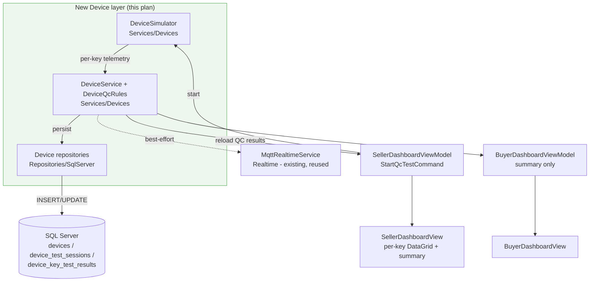

# Device Layer Implementation Plan (Keyboard QC Station)

> Kế hoạch triển khai tầng `Device` cho dự án **Custom Keyboard Builder**.
> Nguồn yêu cầu: `Documents_Refactor/IoT_Device_Layer_Simulation_Guide.md`.
> Tài liệu này ánh xạ đề xuất trong guide vào **kiến trúc thực tế** của codebase và mô tả
> các bước có thể thực thi trực tiếp mà không cần đọc lại toàn bộ source.

---

## 1. Overview & Scope

Thêm một tầng `Device` để **mô phỏng trạm QC kiểm tra keyboard** sau khi seller lắp build.
Không cần thiết bị vật lý — `DeviceSimulator` sinh dữ liệu test từng phím gồm:

- **Signal test** — phím có nhận tín hiệu press/release đúng không (NoSignal / WrongKey / Chatter / StuckKey).
- **Latency test** — độ trễ; ngưỡng **chặt hơn cho HE switch** (gaming/rapid trigger).
- **Noise test** — độ ồn (dB), đối chiếu yêu cầu "im lặng" của buyer.

### Nguyên tắc kiến trúc

- **SQL Server là source of truth.** Mọi kết quả test phải được lưu DB.
- **In-process simulation là đường mặc định** — `DeviceSimulator` gọi thẳng `DeviceService`, demo được mà không cần broker.
- **MQTT là realtime best-effort (tùy chọn)** — tái sử dụng tầng `Realtime` sẵn có; nếu không có broker thì publish no-op, không ảnh hưởng dữ liệu đã lưu.

### In scope (theo guide §15)

- Bảng `devices`, `device_test_sessions`, `device_key_test_results`.
- Simulator sinh data; service áp dụng rule pass/fail; UI tóm tắt QC cho seller/buyer.
- MQTT chỉ để demo realtime (tùy chọn).

### Out of scope

- Kết nối keyboard vật lý / đọc HID-USB / micro thật / robot bấm phím / AI chọn switch phức tạp.

---

## 2. Vị trí trong kiến trúc hiện tại

Dự án là **WPF (`net10.0-windows`), MVVM, SQL Server, KHÔNG dùng DI container** — mọi thứ wire thủ công trong `MainWindow.xaml.cs`. Tầng Device tái sử dụng nguyên các pattern sau:

| Thành phần guide | Ánh xạ vào codebase | Pattern tái sử dụng |
| --- | --- | --- |
| Bảng DB | `Database/SqlServer/CreateSchema_Refactor.sql` | snake_case, idempotent drop→create→index |
| Model | `Models/Devices/` (`Custom_keyboard.Models.Devices`) | POCO; enum lưu `VARCHAR` |
| Repository | `Repositories/IDeviceRepository.cs` + `Repositories/SqlServer/` | ADO.NET thuần như `SqlRequestRepository` |
| Service + rule | `Services/Devices/` | interface + `sealed` impl, async, best-effort realtime sau khi ghi DB (như `RequestService`) |
| Simulator | `Services/Devices/DeviceSimulator.cs` | `Task.Run(..., CancellationToken.None)` như `MqttRealtimeService` |
| Realtime | `Realtime/` (đã có MQTTnet) | `IRealtimeNotifier`/`IRealtimeSubscriber`/`MqttRealtimeService`/`MqttSettings` |
| UI | `ViewModels/SellerDashboardViewModel.cs`, `Views/SellerDashboardView.xaml`, buyer tương ứng | `ViewModelBase`, `AsyncRelayCommand`, DataGrid |
| Màu trạng thái | `Converters/StatusConverters.cs` | `StatusToBrushConverter` |
| Localization | `Localization/AppStrings.cs` | cặp (vi,en) + `{loc:Tr Key}` / `Tr(...)` |

### Shape of the change



**Thứ tự triển khai (mỗi phase build trên phase trước):**
**Schema → Models/Enums → Repositories (+SqlTableNames) → Rules+Service → Simulator → MainWindow wiring → UI/Localization.**

---

## 3. Phase 1 — Database

**File:** `Database/SqlServer/CreateSchema_Refactor.sql` (script idempotent, DB `CustomKeyboard_Refactor`).

> ⚠️ Script này **destructive**: nó drop toàn bộ 18 bảng theo thứ tự ngược FK rồi tạo lại. Thêm bảng mới phải đặt đúng vị trí trong cả khối DROP lẫn CREATE; chạy lại sẽ reset + reseed.

### 3.1 Thêm vào khối DROP (đầu file, vì 3 bảng này là leaf — drop trước `chat_messages`)

```sql
DROP TABLE IF EXISTS device_key_test_results;
DROP TABLE IF EXISTS device_test_sessions;
DROP TABLE IF EXISTS devices;
-- ... các DROP hiện có (chat_messages, chat_conversations, ...) giữ nguyên bên dưới
```

### 3.2 Thêm CREATE TABLE (sau `build_requests`, trước/đan xen khối chat — miễn sau `users` & `build_requests`)

```sql
-- ===========================================================================
-- devices  (trạm QC của seller)
-- ===========================================================================
CREATE TABLE devices (
    device_id        VARCHAR(50)  PRIMARY KEY,        -- vd DEV_{Guid:N}
    seller_user_id   INT          NOT NULL,
    device_name      NVARCHAR(100) NOT NULL,
    device_type      VARCHAR(50)  NOT NULL,           -- KEY_SIGNAL_TESTER / LATENCY_TESTER / NOISE_SENSOR
    is_active        BIT          NOT NULL DEFAULT 1,
    last_seen_at     DATETIME2    NULL,
    created_at       DATETIME2    NOT NULL DEFAULT SYSUTCDATETIME(),
    CONSTRAINT FK_devices_seller FOREIGN KEY (seller_user_id) REFERENCES users(user_id),
    CONSTRAINT CK_devices_type CHECK (device_type IN ('KEY_SIGNAL_TESTER','LATENCY_TESTER','NOISE_SENSOR'))
);
GO

-- ===========================================================================
-- device_test_sessions  (một phiên QC cho một request)
-- ===========================================================================
CREATE TABLE device_test_sessions (
    session_id         VARCHAR(50) PRIMARY KEY,        -- vd QCSESS_{Guid:N}
    request_id         VARCHAR(50) NOT NULL,
    device_id          VARCHAR(50) NOT NULL,
    seller_user_id     INT         NOT NULL,
    switch_technology  VARCHAR(50) NULL,               -- Mechanical / HE
    total_keys         INT         NOT NULL,
    tested_keys        INT         NOT NULL,
    passed_keys        INT         NOT NULL,
    warning_keys       INT         NOT NULL,
    failed_keys        INT         NOT NULL,
    average_latency_ms DECIMAL(8,2) NULL,
    max_latency_ms     DECIMAL(8,2) NULL,
    average_noise_db   DECIMAL(8,2) NULL,
    max_noise_db       DECIMAL(8,2) NULL,
    status             VARCHAR(20) NOT NULL,           -- Running / Passed / Warning / Failed
    started_at         DATETIME2   NOT NULL DEFAULT SYSUTCDATETIME(),
    completed_at       DATETIME2   NULL,
    CONSTRAINT FK_dts_request FOREIGN KEY (request_id) REFERENCES build_requests(request_id),
    CONSTRAINT FK_dts_device  FOREIGN KEY (device_id)  REFERENCES devices(device_id),
    CONSTRAINT FK_dts_seller  FOREIGN KEY (seller_user_id) REFERENCES users(user_id),
    CONSTRAINT CK_dts_status CHECK (status IN ('Running','Passed','Warning','Failed'))
);
GO

-- ===========================================================================
-- device_key_test_results  (kết quả từng phím — bảng chi tiết chính)
-- ===========================================================================
CREATE TABLE device_key_test_results (
    key_test_id             BIGINT IDENTITY(1,1) PRIMARY KEY,
    session_id              VARCHAR(50) NOT NULL,
    request_id              VARCHAR(50) NOT NULL,
    device_id               VARCHAR(50) NOT NULL,
    key_code                VARCHAR(30) NOT NULL,
    expected_key            VARCHAR(30) NOT NULL,
    received_key            VARCHAR(30) NULL,
    press_signal_detected   BIT         NOT NULL,
    latency_ms              DECIMAL(8,2) NULL,
    press_event_count       INT         NOT NULL,
    bounce_count            INT         NULL,           -- null khi chưa đủ chu kỳ press-release (vd StuckKey)
    release_signal_detected BIT         NOT NULL,
    hold_duration_ms        INT         NULL,
    is_stuck                BIT         NOT NULL,
    noise_db                DECIMAL(8,2) NULL,
    result                  VARCHAR(20) NOT NULL,       -- Pass / Warning / Fail
    failure_type            VARCHAR(30) NULL,           -- NoSignal / WrongKey / Chatter / StuckKey / HighLatency / TooNoisy
    failure_reason          NVARCHAR(255) NULL,
    recorded_at             DATETIME2   NOT NULL DEFAULT SYSUTCDATETIME(),
    CONSTRAINT FK_dktr_session FOREIGN KEY (session_id) REFERENCES device_test_sessions(session_id),
    CONSTRAINT CK_dktr_result CHECK (result IN ('Pass','Warning','Fail'))
);
GO
```

### 3.3 Thêm vào khối CREATE INDEX (cuối file)

```sql
CREATE INDEX IX_devices_seller ON devices(seller_user_id);
CREATE INDEX IX_dts_request ON device_test_sessions(request_id);
CREATE INDEX IX_dts_device ON device_test_sessions(device_id);
CREATE INDEX IX_dts_seller_status ON device_test_sessions(seller_user_id, status);
CREATE INDEX IX_dktr_session ON device_key_test_results(session_id);
CREATE INDEX IX_dktr_request ON device_key_test_results(request_id);
GO
```

### 3.4 (Tùy chọn) Mở rộng catalog & build requirement

Đánh dấu **OPTIONAL** — không cần cho luồng QC lõi, có thể làm sau:

- `switches`: thêm `noise_profile VARCHAR(20)`, `expected_latency_ms DECIMAL(8,2)`, `is_he BIT`, `actuation_type VARCHAR(50)` (guide §11 — hỗ trợ seller gợi ý switch theo yêu cầu).
- `builds` (hoặc bảng riêng): `switch_selection_mode`, `preferred_switch_profile`, `preferred_noise_level`, `preferred_latency_level`, `requires_he_switch`, `switch_requirement_note` (guide §8.4 — buyer để seller tự chọn switch).

---

## 4. Phase 2 — Models & Enums

**Thư mục:** `Models/Devices/`, namespace `Custom_keyboard.Models.Devices`. POCO theo phong cách `Models/Builds/BuildRequest.cs` (PascalCase ↔ snake_case cột).

### Enums (`Models/Enums/`, lưu `VARCHAR`)

| Enum | Giá trị |
| --- | --- |
| `DeviceType` | `KEY_SIGNAL_TESTER`, `LATENCY_TESTER`, `NOISE_SENSOR` |
| `KeyTestResult` | `Pass`, `Warning`, `Fail` |
| `KeyFailureType` | `NoSignal`, `WrongKey`, `Chatter`, `StuckKey`, `HighLatency`, `TooNoisy` |
| `TestSessionStatus` | `Running`, `Passed`, `Warning`, `Failed` |

> Lưu ý `DeviceType` có gạch dưới: dùng `[Description]` hoặc map thủ công khi ToString/parse để khớp giá trị DB, hoặc theo cách `GetEnumValue<T>` đã tolerant gạch dưới (giống `RequestStatus.In_progress`).

### Model classes

**`Device.cs`**
```
DeviceId (string) · SellerUserId (int) · DeviceName (string) · DeviceType (DeviceType)
IsActive (bool) · LastSeenAt (DateTime?) · CreatedAt (DateTime)
```

**`DeviceTestSession.cs`**
```
SessionId · RequestId · DeviceId · SellerUserId · SwitchTechnology (string?)
TotalKeys · TestedKeys · PassedKeys · WarningKeys · FailedKeys (int)
AverageLatencyMs · MaxLatencyMs · AverageNoiseDb · MaxNoiseDb (decimal?)
Status (TestSessionStatus) · StartedAt (DateTime) · CompletedAt (DateTime?)
```

**`DeviceKeyTestResult.cs`** — ánh xạ JSON guide §6:
```
KeyTestId (long) · SessionId · RequestId · DeviceId · KeyCode · ExpectedKey
ReceivedKey (string?) · PressSignalDetected (bool) · LatencyMs (decimal?)
PressEventCount (int) · BounceCount (int?) · ReleaseSignalDetected (bool)
HoldDurationMs (int?) · IsStuck (bool) · NoiseDb (decimal?)
SwitchTechnology (string?) · Result (KeyTestResult) · FailureType (KeyFailureType?)
FailureReason (string?) · RecordedAt (DateTime)
```

Các trường nullable bám đúng guide: ví dụ `BounceCount = null` và `LatencyMs/HoldDurationMs = null` khi NoSignal; `BounceCount = null` khi StuckKey (chưa đủ chu kỳ press-release).

---

## 5. Phase 3 — Repositories

**Interfaces** trong `Repositories/`, **impl** trong `Repositories/SqlServer/`. Theo đúng idiom của `SqlRequestRepository`: ctor nhận `ISqlConnectionFactory`, mở `await using var connection = _connectionFactory.CreateConnection(); await connection.OpenAsync(ct);`, dùng `command.AddParameter(...)` và các extension đọc reader (`GetStringValue`, `GetIntValue`, `GetDecimalValue`, `GetBoolValue`, `GetDateTimeValue`, `GetNullableXxx`, `GetEnumValue<T>`) từ `SqlRepositoryHelpers.cs`. Upsert dùng `IF EXISTS … UPDATE … ELSE INSERT`. Sinh PK kiểu `$"DEV_{Guid.NewGuid():N}"`, `$"QCSESS_{Guid.NewGuid():N}"`.

| Interface | Methods chính |
| --- | --- |
| `IDeviceRepository` | `SaveAsync(Device)` (upsert), `GetBySellerAsync(int sellerUserId)`, `GetByIdAsync(string deviceId)` |
| `IDeviceTestSessionRepository` | `SaveAsync(DeviceTestSession)` (upsert summary), `GetByRequestAsync(string requestId)`, `GetByIdAsync(string sessionId)` |
| `IDeviceKeyTestResultRepository` | `InsertAsync(DeviceKeyTestResult)` (INSERT, IDENTITY), `GetBySessionAsync(string sessionId)` |

**`Data/SqlServer/SqlTableNames.cs`** — thêm:
```csharp
// Device
public const string Devices = "devices";
public const string DeviceTestSessions = "device_test_sessions";
public const string DeviceKeyTestResults = "device_key_test_results";
```

---

## 6. Phase 4 — Rule Engine + Service

**Thư mục:** `Services/Devices/`.

### 6.1 `DeviceQcRules` (static, thuần — không I/O)

Áp dụng ngưỡng guide §5, trả về `(KeyTestResult, KeyFailureType?, string? reason)` cho mỗi phím telemetry:

- **Signal:** `press_signal_detected = false` → Fail/`NoSignal`; `received_key != expected_key` → Fail/`WrongKey`; `release_signal_detected = false` hoặc `is_stuck`/`hold_duration_ms > stuck_threshold` → Fail/`StuckKey`; `bounce_count >= 1` (≥2 press event/chu kỳ) → Fail/`Chatter`.
- **Latency:** Mechanical — `<=10` Pass, `<=20` Warning, `>20` Fail; **HE** — `<=3` Pass, `<=6` Warning, `>6` Fail/`HighLatency`.
- **Noise:** nếu buyer yêu cầu silent — `<=45` Pass, `<=55` Warning, `>55` Fail/`TooNoisy`; nếu không yêu cầu — noise chỉ là tham khảo/warning, **không** fail build.
- Ưu tiên kết luận: StuckKey trước Chatter khi thiếu release.

Tham số hóa ngưỡng (stuck_threshold_ms, mode HE/Mechanical, buyer noise requirement) qua đối số/`record` config để dễ test.

### 6.2 `IDeviceService` / `DeviceService` (`sealed`, async)

Phụ thuộc: 3 device repository + (tùy chọn) `IRealtimeNotifier`/telemetry notifier. Tương tự `RequestService`, gọi realtime **sau khi** ghi DB (best-effort, không throw).

- `RecordKeyResultAsync(telemetry)` — gọi `DeviceQcRules`, dựng `DeviceKeyTestResult`, `InsertAsync`.
- `CompleteSessionAsync(sessionId)` — tổng hợp từ `GetBySessionAsync`: `tested/passed/warning/failed`, `average/max latency & noise`, và `status` theo guide §7 (có phím Fail ⇒ `Failed`; không Fail nhưng có Warning ⇒ `Warning`; còn lại ⇒ `Passed`; thêm điều kiện silent/HE nếu buyer yêu cầu). Upsert session.

---

## 7. Phase 5 — Device Simulator

**File:** `Services/Devices/DeviceSimulator.cs`. Chạy fire-and-forget `Task.Run(async () => {...}, CancellationToken.None)` như `MqttRealtimeService`.

### Input (guide §10.1)
`requestId`, `sellerUserId`, `deviceId`, `required_switch_quantity` (layout), `switchTechnology` (Mechanical/HE), `buyerNoiseRequirement`, `buyerLatencyRequirement`.

### Logic
1. Sinh layout phím từ `required_switch_quantity` (guide §10.2 — không cần layout thật, đủ số phím khớp kit).
2. Mỗi phím: random signal/latency/noise theo phân phối guide §10.3–10.5 (dùng `System.Random`), keyed theo switchTechnology + yêu cầu buyer; chèn outlier theo tỉ lệ để demo các loại fail.
3. Emit telemetry từng phím → `DeviceService.RecordKeyResultAsync`, rồi `CompleteSessionAsync`.

### Transport
- **(a) Mặc định — in-process:** gọi thẳng `DeviceService`. Demo được không cần broker.
- **(b) Tùy chọn — MQTT:** publish lên `keyboard/device/{deviceId}/request/{requestId}/key-test` và `.../session-summary` (guide §9), tái dùng `MQTTnet`/`MqttSettings`. Định nghĩa cặp `IDeviceTelemetryPublisher`/`IDeviceTelemetrySubscriber` mô phỏng `IRealtimeNotifier`/`IRealtimeSubscriber`; có `NullDeviceTelemetryPublisher` no-op khi tắt.

---

## 8. Phase 6 — Wiring (`MainWindow.xaml.cs`)

Thêm vào khối manual-DI hiện có (sau `requestRepository`/`requestService`), giữ nguyên phong cách:

```csharp
var deviceRepository = new SqlDeviceRepository(connectionFactory);
var deviceSessionRepository = new SqlDeviceTestSessionRepository(connectionFactory);
var deviceKeyResultRepository = new SqlDeviceKeyTestResultRepository(connectionFactory);
var deviceService = new DeviceService(
    deviceRepository,
    deviceSessionRepository,
    deviceKeyResultRepository,
    realtimeService);               // best-effort realtime, tái dùng instance sẵn có
var deviceSimulator = new DeviceSimulator(deviceService);
```

Truyền `deviceService` (+ `deviceSimulator`) vào `MainShellViewModel` → seller/buyer dashboard VM cần dùng. Không cần thêm teardown (simulator/service stateless; MQTT đã dispose qua `realtimeService.DisposeAsync()` ở `Closed`).

---

## 9. Phase 7 — UI & Localization

### Seller (`ViewModels/SellerDashboardViewModel.cs` + `Views/SellerDashboardView.xaml`)

- Thêm `StartQcTestCommand = new AsyncRelayCommand(_ => StartQcTestAsync(), _ => CanStartQc())`, enable khi `SelectedRequest?.Status == RequestStatus.In_progress` (đặt cạnh `StartProgressCommand`).
- `StartQcTestAsync` gọi `deviceSimulator` cho request đang chọn rồi reload kết quả vào VM.
- **QC summary card:** tested/passed/warning/failed, avg/max latency, avg/max noise, status.
- **Per-key DataGrid** mô phỏng `SellerRequestsGrid` sẵn có, cột theo guide §12:
  `Key · Press · Release · Press events · Bounce · Latency · Stuck · Result · Failure type · Reason`.
  Bind `ObservableCollection<DeviceKeyTestResult>`.

### Buyer (`ViewModels/BuyerDashboardViewModel.cs` + `Views/BuyerDashboardView.xaml`)

- Chỉ tóm tắt (guide §12): `65/68 keys passed`, avg latency, noise profile, status. Không lộ chi tiết kỹ thuật.

### Converters & Localization

- `Converters/StatusConverters.cs` — mở rộng `StatusToBrushConverter`: `Pass`/`Passed` → `SuccessBrush`, `Warning` → `WarningBrush`, `Fail`/`Failed` → `DangerBrush`, `Running` → `InfoBrush`.
- `Localization/AppStrings.cs` — thêm cặp (vi,en) `QcTest_*` (vd `QcTest_Title`, `QcTest_Start`, `QcTest_Passed`, `QcTest_Failed`, `QcTest_PerKey`, `QcTest_Summary`, các header cột). Dùng `{loc:Tr QcTest_...}` trong XAML, `Tr(...)`/`TrFormat(...)` trong VM.

---

## 10. Verification

- **Build:** `dotnet build Custom_keyboard.csproj` sau mỗi phase (target `net10.0-windows`, WPF — cần host Windows/SDK).
- **DB:** chạy lại `Database/SqlServer/CreateSchema_Refactor.sql` trên `CustomKeyboard_Refactor`; xác nhận 3 bảng mới + FK + index được tạo (idempotent).
- **Logic (không cần UI):** theo harness fake-repository trong `Phase6Verification/Program.cs`, test `DeviceQcRules` với 6 ví dụ guide §6.1–6.6 (Pass, NoSignal, HighLatency, Chatter, StuckKey, WrongKey), assert đúng `KeyTestResult`/`KeyFailureType`; test rule tổng kết §7 (có Fail ⇒ Failed; chỉ Warning ⇒ Warning).
- **End-to-end:** chạy app, seller chọn request `In_progress`, bấm **Start QC Test** → grid từng phím + summary hiển thị và rows ghi vào `device_key_test_results`; buyer thấy bản tóm tắt. Đường MQTT chỉ verify khi có broker; không có broker thì publish no-op như tầng realtime hiện tại.

### Build-order checklist

- [ ] Phase 1 — Schema (3 bảng + drop + index) ✅ DB tạo lại sạch
- [ ] Phase 2 — Models + Enums ✅ build
- [ ] Phase 3 — Repositories + `SqlTableNames` ✅ build
- [ ] Phase 4 — `DeviceQcRules` + `DeviceService` ✅ unit test §6/§7
- [ ] Phase 5 — `DeviceSimulator` (in-process; MQTT optional) ✅ build
- [ ] Phase 6 — Wiring `MainWindow.xaml.cs` ✅ app khởi động
- [ ] Phase 7 — UI seller/buyer + converter + localization ✅ end-to-end

---

## 11. Quyết định thiết kế

- **In-process là mặc định, MQTT là add-on tùy chọn** — demo được không cần broker, khớp guide §9 và hợp đồng best-effort của tầng realtime.
- **Tên cột FK bám schema thực** (`seller_user_id`, `request_id`, `device_id`) thay vì tên lỏng trong guide — DDL ráp vào sạch.
- **Cột mở rộng `switches`/`builds` (guide §8.4, §11) để OPTIONAL** — luồng QC lõi ship trước, gợi ý switch theo yêu cầu làm sau.
