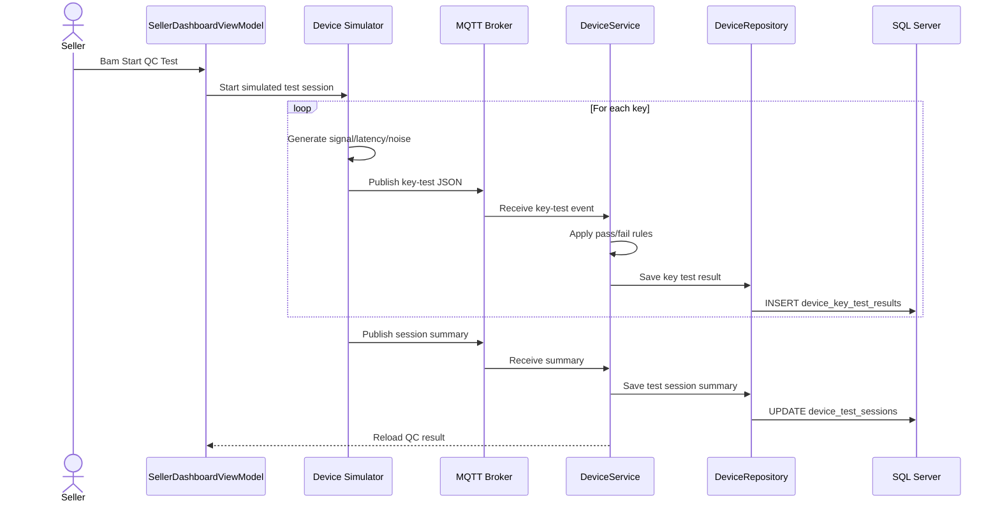
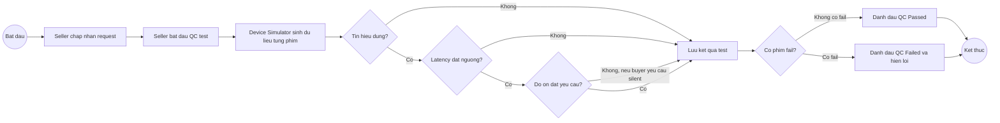

# Custom Keyboard Builder - IoT Device Layer Simulation Guide

Tai lieu nay de xuat cach them tang `Device` vao du an Custom Keyboard Builder ma khong can nhung thiet bi that. Muc tieu la mo phong tram test keyboard/switch cua seller, sinh du lieu IoT gia lap, kiem tra tin hieu phim, do tre, do on, va ho tro seller chon switch phu hop voi yeu cau cua buyer.

## 1. Muc Tieu

Them mot tang `Device` de mo phong cac thiet bi kiem tra keyboard sau khi seller lap build:

- Kiem tra tung switch/phim co nhan tin hieu hay khong.
- Do latency cua tung phim.
- Ap dung nguong latency chat hon cho switch HE.
- Do do on cua switch/phim khi test.
- Sinh du lieu QC tu dong, khong can device vat ly.
- Luu ket qua test vao database de buyer/seller theo doi.
- Ho tro truong hop buyer khong chon switch cu the, ma yeu cau seller chon switch theo tieu chi nhu em, it tieng on, khong tieng.

## 2. Vi Tri Cua Device Layer Trong Kien Truc

Kien truc hien tai:

```text
WPF View
  -> ViewModel
  -> Service
  -> Repository
  -> SQL Server
```

De xuat sau khi them Device Layer:

```text
WPF View
  -> ViewModel
  -> Service
  -> Repository
  -> SQL Server

Device Simulator
  -> MQTT broker
  -> DeviceService
  -> DeviceRepository
  -> SQL Server
```

Trong do:

- `Device Simulator`: chuong trinh gia lap tram test keyboard.
- `DeviceService`: xu ly logic nhan telemetry, validate, tinh pass/fail.
- `DeviceRepository`: luu device, test session, test result vao SQL.
- `SQL Server`: van la source of truth.
- MQTT la transport chinh de Device Simulator gui telemetry vao app. In-process simulation chi nen dung lam fallback cho unit test/demo cuc nhanh, khong phai huong tich hop chinh.

## 3. Cac Loai Device Gia Lap

Nen chia thanh 3 loai device de de giai thich trong bao cao:

| Device | Vai tro |
| --- | --- |
| `KEY_SIGNAL_TESTER` | Kiem tra phim co nhan tin hieu dung hay khong. |
| `LATENCY_TESTER` | Do do tre cua phim/switch. |
| `NOISE_SENSOR` | Do do on khi bam phim. |

Co the gom 3 loai tren vao mot tram test:

```text
Keyboard QC Station
  - signal tester
  - latency tester
  - noise sensor
```

Ten device demo:

```text
QC-STATION-01
```

## 4. Luong Nghiep Vu De Xuat

### 4.1 Buyer Chon Switch Cu The

Neu buyer da chon switch khi tao build:

```text
Buyer tao build
Buyer chon kit + switch + keycap + stabilizer
Buyer gui request cho seller
Seller chap nhan request
Seller bat dau QC test
Device Simulator test tung phim
He thong luu ket qua pass/fail/latency/noise
Seller xem ket qua QC
Buyer xem tien do/kq tom tat
```

### 4.2 Buyer Khong Chon Switch, Muon Seller Tu Chon Theo Yeu Cau

Neu buyer khong muon tu chon switch, buyer co the nhap yeu cau:

```text
"Muon switch em, khong on, latency thap"
"Can keyboard van phong yen tinh"
"Can HE switch cho gaming, latency duoi 3ms"
```

He thong co the luu thanh `switch_requirement`:

```text
preferred_noise_level = Silent
preferred_latency_profile = Low
allow_seller_recommend_switch = true
switch_technology_preference = HE
```

Seller xem yeu cau va chon switch phu hop tu catalog. Sau do Device Simulator test va sinh ket qua de xac nhan switch/build dat yeu cau.

## 5. Tieu Chi Test Switch/Phim

### 5.1 Signal Test

Muc tieu: kiem tra phim co gui tin hieu dung hay khong.

Moi phim co:

| Truong | Y nghia |
| --- | --- |
| `expected_key` | Phim du kien test, vi du `A`, `Space`, `Enter`. |
| `received_key` | Tin hieu thuc te nhan duoc. |
| `press_signal_detected` | Co nhan duoc tin hieu press/down khi bam phim hay khong. |
| `press_event_count` | So press/down event nhan duoc trong mot lan test phim. Gia tri binh thuong la 1. |
| `bounce_count` | So press/down event phu ngoai y muon da bi ghi nhan nhu key press that trong mot chu ky press-release, tinh bang `press_event_count - 1` khi release hop le. |
| `release_signal_detected` | Co nhan duoc tin hieu release/up khi nha phim hay khong. |
| `hold_duration_ms` | Thoi gian phim bi giu active trong mot lan test. |
| `is_stuck` | Phim co bi ket tin hieu hay khong. |
| `result` | `Pass`, `Warning`, hoac `Fail`. |

Luu y: tin hieu phim nen tach thanh 2 pha: press/down va release/up. `press_signal_detected` tra loi "bam co nhan khong", con `release_signal_detected` tra loi "nha phim co nhan khong". Mot phim bi stuck thuong la press pass nhung release fail. Khi `release_signal_detected = false`, he thong nen uu tien ket luan `StuckKey`; `bounce_count` nen de `null` hoac xem la not evaluated, vi chua co mot chu ky press-release hoan chinh de ket luan double click.

`bounce_count` khong phai key repeat khi nguoi dung giu phim. Key repeat la hanh vi lap ky tu do OS/firmware sau mot khoang delay. Chatter/double click trong QC la nhieu press/down event ngoai y muon xay ra rat nhanh trong mot lan bam-nha. Vi vay simulator nen dem `press_event_count` trong mot chu ky press-release; neu `press_event_count = 1` thi `bounce_count = 0`, neu `press_event_count = 2` thi `bounce_count = 1` va da du de xem la double click/chatter fail.

Rule de xuat:

```text
Pass:
- press_signal_detected = true
- received_key = expected_key
- press_event_count = 1
- bounce_count = 0
- release_signal_detected = true
- hold_duration_ms <= stuck_threshold_ms
- is_stuck = false

Fail neu mot trong cac dieu kien sau xay ra:
- press_signal_detected = false
- received_key khac expected_key
- bounce_count >= 1
- release_signal_detected = false
- hold_duration_ms > stuck_threshold_ms
- is_stuck = true
```

### 5.2 Latency Test

Muc tieu: do do tre tu luc nhan phim den luc tin hieu duoc ghi nhan.

Voi keyboard thuong:

```text
Good: <= 10ms
Warning: > 10ms va <= 20ms
Fail: > 20ms
```

Voi HE switch, kiem tra chat hon:

```text
Good: <= 3ms
Warning: > 3ms va <= 6ms
Fail: > 6ms
```

Ly do: HE switch thuong duoc buyer chon vi gaming, rapid trigger, actuation nhanh, nen latency can duoc danh gia nghiem hon switch co hoc binh thuong.

### 5.3 Noise Test

Muc tieu: do do on khi bam phim/switch.

Co the chia muc:

```text
Silent: <= 45 dB
Quiet: > 45 dB va <= 55 dB
Normal: > 55 dB va <= 65 dB
Loud: > 65 dB va <= 75 dB
Too loud: > 75 dB
```

Neu buyer yeu cau "khong on" hoac "khong tieng":

```text
Pass: average_noise_db <= 45
Warning: > 45 va <= 55
Fail: > 55
```

Neu buyer khong co yeu cau do on:

```text
Noise chi nen la thong tin tham khao hoac warning, khong nen fail build.
```

## 6. Ket Qua Test Tung Phim

He thong khong chi nen luu ket qua tong kieu `65/68 phim pass`. Ket qua tong chi dung de hien thi nhanh. Du lieu quan trong phai la ket qua chi tiet tung phim, de seller biet chinh xac phim nao loi va loi gi.

Moi phim phai co mot record rieng:

```json
{
  "sessionId": "QC-SESSION-001",
  "requestId": "REQ001",
  "deviceId": "QC-STATION-01",
  "keyCode": "A",
  "expectedKey": "A",
  "receivedKey": "A",
  "pressSignalDetected": true,
  "latencyMs": 2.4,
  "pressEventCount": 1,
  "bounceCount": 0,
  "releaseSignalDetected": true,
  "holdDurationMs": 85,
  "isStuck": false,
  "noiseDb": 42.8,
  "switchTechnology": "HE",
  "result": "Pass",
  "failureType": null,
  "failureReason": null,
  "recordedAt": "2026-06-17T10:30:00Z"
}
```

### 6.1 Vi Du Pass

Phim `A` nhan dung tin hieu, latency dat nguong HE, khong bi double click/chatter:

```json
{
  "sessionId": "QC-SESSION-001",
  "requestId": "REQ001",
  "deviceId": "QC-STATION-01",
  "keyCode": "A",
  "expectedKey": "A",
  "receivedKey": "A",
  "pressSignalDetected": true,
  "latencyMs": 2.4,
  "pressEventCount": 1,
  "bounceCount": 0,
  "releaseSignalDetected": true,
  "holdDurationMs": 85,
  "isStuck": false,
  "noiseDb": 42.8,
  "switchTechnology": "HE",
  "result": "Pass",
  "failureType": null,
  "failureReason": null,
  "recordedAt": "2026-06-17T10:30:00Z"
}
```

### 6.2 Vi Du No Signal

Phim `S` khong nhan tin hieu:

```json
{
  "sessionId": "QC-SESSION-001",
  "requestId": "REQ001",
  "deviceId": "QC-STATION-01",
  "keyCode": "S",
  "expectedKey": "S",
  "receivedKey": null,
  "pressSignalDetected": false,
  "latencyMs": null,
  "pressEventCount": 0,
  "bounceCount": null,
  "releaseSignalDetected": false,
  "holdDurationMs": null,
  "isStuck": false,
  "noiseDb": 43.1,
  "switchTechnology": "HE",
  "result": "Fail",
  "failureType": "NoSignal",
  "failureReason": "No signal detected",
  "recordedAt": "2026-06-17T10:30:02Z"
}
```

### 6.3 Vi Du Latency Fail

Phim `Space` co nhan tin hieu nhung latency vuot nguong HE:

```json
{
  "sessionId": "QC-SESSION-001",
  "requestId": "REQ001",
  "deviceId": "QC-STATION-01",
  "keyCode": "Space",
  "expectedKey": "Space",
  "receivedKey": "Space",
  "pressSignalDetected": true,
  "latencyMs": 7.2,
  "pressEventCount": 1,
  "bounceCount": 0,
  "releaseSignalDetected": true,
  "holdDurationMs": 90,
  "isStuck": false,
  "noiseDb": 48.5,
  "switchTechnology": "HE",
  "result": "Fail",
  "failureType": "HighLatency",
  "failureReason": "HE switch latency exceeded 6ms",
  "recordedAt": "2026-06-17T10:30:05Z"
}
```

### 6.4 Vi Du Double Click / Chatter

Phim `D` bi double click/chatter, mot lan bam nhung bi ghi nhan nhieu lan:

```json
{
  "sessionId": "QC-SESSION-001",
  "requestId": "REQ001",
  "deviceId": "QC-STATION-01",
  "keyCode": "D",
  "expectedKey": "D",
  "receivedKey": "D",
  "pressSignalDetected": true,
  "latencyMs": 2.8,
  "pressEventCount": 5,
  "bounceCount": 4,
  "releaseSignalDetected": true,
  "holdDurationMs": 88,
  "isStuck": false,
  "noiseDb": 44.2,
  "switchTechnology": "HE",
  "result": "Fail",
  "failureType": "Chatter",
  "failureReason": "Key triggered multiple times in one press",
  "recordedAt": "2026-06-17T10:30:07Z"
}
```

### 6.5 Vi Du Stuck Key

Phim `LeftShift` bi ket, tin hieu van giu sau khi da nha phim:

Trong vi du nay device nhan duoc press signal nhung khong nhan duoc release signal, nen `pressSignalDetected = true`, `releaseSignalDetected = false`, `holdDurationMs` vuot nguong va `isStuck = true`. Luc nay `bounceCount` nen de `null` hoac "not evaluated", vi chua co chu ky press-release hoan chinh de ket luan double click.

```json
{
  "sessionId": "QC-SESSION-001",
  "requestId": "REQ001",
  "deviceId": "QC-STATION-01",
  "keyCode": "LeftShift",
  "expectedKey": "LeftShift",
  "receivedKey": "LeftShift",
  "pressSignalDetected": true,
  "latencyMs": 3.1,
  "pressEventCount": 1,
  "bounceCount": null,
  "releaseSignalDetected": false,
  "holdDurationMs": 2500,
  "isStuck": true,
  "noiseDb": 46.0,
  "switchTechnology": "HE",
  "result": "Fail",
  "failureType": "StuckKey",
  "failureReason": "Key remained active after release",
  "recordedAt": "2026-06-17T10:30:09Z"
}
```

### 6.6 Vi Du Wrong Key

Phim `Q` duoc test nhung device nhan ve `W`, co the do loi mapping, matrix, hoac loi lap rap:

```json
{
  "sessionId": "QC-SESSION-001",
  "requestId": "REQ001",
  "deviceId": "QC-STATION-01",
  "keyCode": "Q",
  "expectedKey": "Q",
  "receivedKey": "W",
  "pressSignalDetected": true,
  "latencyMs": 2.6,
  "pressEventCount": 1,
  "bounceCount": 0,
  "releaseSignalDetected": true,
  "holdDurationMs": 82,
  "isStuck": false,
  "noiseDb": 43.9,
  "switchTechnology": "HE",
  "result": "Fail",
  "failureType": "WrongKey",
  "failureReason": "Received key did not match expected key",
  "recordedAt": "2026-06-17T10:30:11Z"
}
```

### 6.7 Danh Sach Failure Type Nen Dung

Nen chuan hoa loai loi de UI loc va hien thi de hon:

| Failure type | Y nghia |
| --- | --- |
| `NoSignal` | Bam phim nhung khong co tin hieu. |
| `WrongKey` | Tin hieu nhan duoc khac phim dang test. |
| `Chatter` | Mot lan bam bi nhan thanh nhieu lan, double click. |
| `StuckKey` | Phim bi ket, tin hieu khong nha. |
| `HighLatency` | Tin hieu co nhan nhung do tre vuot nguong. |
| `TooNoisy` | Do on vuot yeu cau cua buyer, dac biet voi yeu cau silent. |

Bang chi tiet nay moi la bang chinh de seller sua loi. Bang summary chi lay so lieu tu bang chi tiet.

## 7. Ket Qua Tong Ket Test Session

Sau khi test xong toan bo keyboard:

```json
{
  "sessionId": "QC-SESSION-001",
  "requestId": "REQ001",
  "deviceId": "QC-STATION-01",
  "totalKeys": 68,
  "testedKeys": 68,
  "passedKeys": 65,
  "warningKeys": 2,
  "failedKeys": 1,
  "averageLatencyMs": 2.7,
  "maxLatencyMs": 7.2,
  "averageNoiseDb": 44.6,
  "maxNoiseDb": 58.4,
  "status": "Failed",
  "startedAt": "2026-06-17T10:29:30Z",
  "completedAt": "2026-06-17T10:31:00Z"
}
```

Rule tong ket:

```text
Passed:
- failedKeys = 0
- neu buyer yeu cau silent thi averageNoiseDb <= nguong cho phep
- neu switch HE thi averageLatencyMs va maxLatencyMs dat nguong HE

Warning:
- failedKeys = 0
- co warningKeys > 0

Failed:
- failedKeys > 0
```

## 8. De Xuat Database

### 8.1 `devices`

```text
device_id              VARCHAR(50) PRIMARY KEY
seller_user_id          INT NOT NULL
device_name             NVARCHAR(100) NOT NULL
device_type             VARCHAR(50) NOT NULL
is_active               BIT NOT NULL
last_seen_at            DATETIME2 NULL
created_at              DATETIME2 NOT NULL
```

### 8.2 `device_test_sessions`

```text
session_id              VARCHAR(50) PRIMARY KEY
request_id              VARCHAR(50) NOT NULL
device_id               VARCHAR(50) NOT NULL
seller_user_id           INT NOT NULL
switch_technology        VARCHAR(50) NULL
total_keys               INT NOT NULL
tested_keys              INT NOT NULL
passed_keys              INT NOT NULL
warning_keys             INT NOT NULL
failed_keys              INT NOT NULL
average_latency_ms       DECIMAL(8,2) NULL
max_latency_ms           DECIMAL(8,2) NULL
average_noise_db         DECIMAL(8,2) NULL
max_noise_db             DECIMAL(8,2) NULL
status                   VARCHAR(20) NOT NULL
started_at               DATETIME2 NOT NULL
completed_at             DATETIME2 NULL
```

### 8.3 `device_key_test_results`

```text
key_test_id             BIGINT IDENTITY PRIMARY KEY
session_id              VARCHAR(50) NOT NULL
request_id              VARCHAR(50) NOT NULL
device_id               VARCHAR(50) NOT NULL
key_code                VARCHAR(30) NOT NULL
expected_key            VARCHAR(30) NOT NULL
received_key            VARCHAR(30) NULL
press_signal_detected         BIT NOT NULL
latency_ms              DECIMAL(8,2) NULL
press_event_count       INT NOT NULL
bounce_count            INT NULL
release_signal_detected        BIT NOT NULL
hold_duration_ms        INT NULL
is_stuck                BIT NOT NULL
noise_db                DECIMAL(8,2) NULL
result                  VARCHAR(20) NOT NULL
failure_type            VARCHAR(30) NULL
failure_reason          NVARCHAR(255) NULL
recorded_at             DATETIME2 NOT NULL
```

### 8.4 Mo Rong Cho Build Requirement

Neu muon cho buyer khong chon switch ma de seller chon theo yeu cau, co the them vao `builds` hoac bang rieng:

```text
switch_selection_mode       VARCHAR(20) -- BuyerSelected / SellerRecommended
preferred_switch_profile    VARCHAR(50) -- Silent / Gaming / Balanced / Office
preferred_noise_level       VARCHAR(20) -- Silent / Quiet / Normal
preferred_latency_level     VARCHAR(20) -- Strict / Low / Normal
requires_he_switch          BIT
switch_requirement_note     NVARCHAR(500)
```

## 9. MQTT Topic De Xuat

### 9.0 Transport Chinh

Transport chinh cho tang Device la MQTT:

```text
Device Simulator -> MQTT Broker -> WPF App Subscriber -> DeviceService -> SQL Server
```

Trong phase mo phong nay khong dung HTTP hay WebSocket lam kenh chinh:

- HTTP phu hop khi co backend Web API rieng, nhung du an hien tai la WPF desktop + SQL Server.
- WebSocket phu hop cho client-server realtime UI, nhung IoT telemetry dang theo mo hinh publish/subscribe nen MQTT hop hon.
- MQTT phu hop voi topic theo device/request, nhe, de mo phong, va trung voi tang `Realtime` hien co cua du an.

SQL Server van la source of truth. MQTT chi dam nhan viec van chuyen event realtime; sau khi app nhan du lieu, ket qua test phai duoc luu vao database.

### 9.1 Device Gui Ket Qua Tung Phim

Device publish moi ket qua key-test len topic:

```text
keyboard/device/{deviceId}/request/{requestId}/key-test
```

### 9.2 Device Gui Tong Ket Session

Device publish tong ket session len topic:

```text
keyboard/device/{deviceId}/request/{requestId}/session-summary
```

### 9.3 App Yeu Cau Device Bat Dau Test

Neu can demo app dieu khien simulator, app publish len topic:

```text
keyboard/device/{deviceId}/request/{requestId}/start-test
```

Trong phien ban mo phong, app co the khong can publish `start-test`; seller bam nut trong UI thi `DeviceSimulator` tu sinh data theo request duoc chon.

## 10. Cach Sinh Data Gia Lap

### 10.1 Input Can Co

Simulator can biet:

- `requestId`
- `sellerUserId`
- `deviceId`
- `layout` hoac `required_switch_quantity`
- `switchTechnology`: Mechanical / HE
- `buyerNoiseRequirement`: Silent / Quiet / Normal
- `buyerLatencyRequirement`: Strict / Low / Normal

### 10.2 Sinh Layout Phim

Neu build co `required_switch_quantity = 68`, simulator sinh 68 phim mau.

Vi du:

```text
Esc, 1, 2, 3, 4, 5, 6, 7, 8, 9, 0, Backspace,
Tab, Q, W, E, R, T, Y, U, I, O, P,
Caps, A, S, D, F, G, H, J, K, L, Enter,
Shift, Z, X, C, V, B, N, M, Shift,
Ctrl, Win, Alt, Space, Alt, Fn, Menu, Ctrl
```

Khong can dung layout that 100%, chi can so luong phim khop voi kit de demo logic QC.

### 10.3 Sinh Signal

Ti le de xuat:

```text
signal pass: 94% - 98%
no signal: 1% - 3%
wrong key: 0% - 1%
stuck key: 0% - 1%
chatter warning/fail: 1% - 3%
```

### 10.4 Sinh Latency

Voi switch mechanical:

```text
latencyMs random tu 5 den 18
mot so it outlier tu 20 den 35
```

Voi HE switch:

```text
latencyMs random tu 1.0 den 3.5
mot so it outlier tu 4 den 8
```

Rule HE:

```text
<= 3ms: Pass
> 3ms va <= 6ms: Warning
> 6ms: Fail
```

### 10.5 Sinh Noise

Neu buyer yeu cau silent:

```text
noiseDb random tu 35 den 48
mot so it outlier tu 55 den 65
```

Neu buyer yeu cau normal:

```text
noiseDb random tu 50 den 68
```

Neu switch clicky/loud:

```text
noiseDb random tu 65 den 82
```

## 11. Ho Tro Seller Chon Switch Theo Yeu Cau

Them logic goi y switch:

```text
Buyer yeu cau:
- Khong on
- Latency thap
- Co the dung HE

He thong loc catalog:
- switch.noise_profile = Silent hoac Quiet
- switch.technology = HE neu buyer can gaming/latency rat thap
- switch.is_available = true
- switch phu hop kit technology/mount
```

Vi du ket qua goi y:

```text
Recommended switch:
- Lekker HE Silent 45g
- Reason: HE technology, expected latency <= 3ms, quiet profile, compatible with selected kit.
```

Neu du lieu switch hien tai chua co `noise_profile` va `expected_latency_ms`, co the them sau:

```text
switches.noise_profile        VARCHAR(20) -- Silent / Quiet / Normal / Loud
switches.expected_latency_ms  DECIMAL(8,2)
switches.is_he                BIT
switches.actuation_type       VARCHAR(50)
```

## 12. UI De Xuat

### Seller Dashboard

Trong chi tiet request:

```text
QC Device
- Device: QC-STATION-01
- Test status: Running / Passed / Failed
- Tested keys: 68/68
- Passed: 65
- Warning: 2
- Failed: 1
- Avg latency: 2.7ms
- Max latency: 7.2ms
- Avg noise: 44.6dB
- Max noise: 58.4dB
```

Bang chi tiet:

```text
Key       | Press | Release | Press events | Bounce | Latency | Stuck | Result | Failure type | Reason
A         | OK    | OK      | 1            | 0      | 2.4ms   | No    | Pass   |              |
S         | Fail  | Fail    | 0            | -      | -       | No    | Fail   | NoSignal     | No press signal detected
D         | OK    | OK      | 5            | 4      | 2.8ms   | No    | Fail   | Chatter      | Extra press events in one press-release cycle
LeftShift | OK    | Fail    | 1            | -      | 3.1ms   | Yes   | Fail   | StuckKey     | Release signal not detected
Space     | OK    | OK      | 1            | 0      | 7.2ms   | No    | Fail   | HighLatency  | HE latency exceeded 6ms
```

### Buyer Dashboard

Chi nen hien tom tat:

```text
Build QC:
- Testing completed
- 65/68 keys passed
- 1 key failed
- Avg latency: 2.7ms
- Noise profile: Quiet
```

Khong can hien qua nhieu ky thuat neu buyer khong can.

## 13. Sequence Diagram



## 14. Activity Diagram Tom Tat



## 15. Pham Vi Nen Lam Cho Do An

Nen lam:

- Them tai lieu Device Layer.
- Them bang device/test session/key result.
- Them simulator sinh data.
- Them service xu ly rule pass/fail.
- Them UI tom tat QC trong seller/buyer dashboard.
- Dung MQTT neu muon demo realtime.

Chua can lam:

- Ket noi keyboard vat ly that.
- Doc HID/USB real key event.
- Do am thanh bang microphone that.
- Robot bam phim tu dong.
- AI chon switch phuc tap.

## 16. Cach Trinh Bay Trong Bao Cao

Co the mo ta ngan gon:

> He thong duoc bo sung tang Device de mo phong tram kiem tra keyboard sau lap rap. Device Simulator sinh du lieu test tung phim bao gom tin hieu nhan phim, do tre, chatter/stuck key va do on. Voi HE switch, he thong ap dung nguong latency chat hon, vi nhom switch nay huong den gaming va rapid trigger. Neu buyer yeu cau keyboard yen tinh, he thong dung du lieu noise profile va ket qua do dB de ho tro seller chon switch phu hop, dong thoi xac nhan build sau khi test. Toan bo du lieu IoT duoc luu vao SQL Server; MQTT chi dong vai tro realtime best-effort.

## 17. Ket Luan

Huong tich hop IoT phu hop nhat voi du an la mo phong `Keyboard QC Station`. Tang Device khong thay doi luong chinh cua Buyer/Seller/Admin, ma bo sung chat luong va tinh thuc te cho flow seller xu ly request:

```text
Build request -> Seller lap build -> Device test phim/switch -> Luu QC result -> Buyer theo doi ket qua
```

Trong do:

- Signal test quyet dinh phim co hoat dong hay khong.
- Latency test dac biet quan trong voi HE switch, nguong de xuat la 3ms cho pass tot.
- Noise test dung de danh gia yeu cau keyboard yen tinh.
- Data duoc sinh gia lap nen de demo, de test, va khong phu thuoc thiet bi vat ly.
